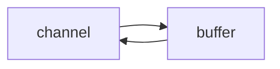

> 本套netty知识点为黑马程序员-netty的学习记录：[传送门](https://www.bilibili.com/video/BV1py4y1E7oA/?vd_source=fa704bb6a5b4c24699d6dde3e3cad6d2)


> non-blocking io 非阻塞 IO

## 三大组件

### Channel & Buffer

channel 有一点类似于 stream，它就是读写数据的**双向通道**，可以从 channel 将数据读入 buffer，也可以将 buffer 的数据写入 channel，而之前的 stream 要么是输入，要么是输出，channel 比 stream 更为底层



**常见的Channel有以下四种**，其中`FileChannel`主要用于文件传输，其余三种用于网络通信

* `FileChannel`
* `DatagramChannel`
* `SocketChannel`
* `ServerSocketChannel`


**Buffer有以下几种**，其中使用较多的是ByteBuffer

* `ByteBuffer`
  * `MappedByteBuffer`
  * `DirectByteBuffer`
  * `HeapByteBuffer`
* `ShortBuffer`
* `IntBuffer`
* `LongBuffer`
* `FloatBuffer`
* `DoubleBuffer`
* `CharBuffer`


### Selector

selector 单从字面意思不好理解，需要结合服务器的设计演化来理解它的用途

在使用Selector之前，处理socket连接还有以下两种方法

**使用多线程技术**

为每个连接分别开辟一个线程，分别去处理对应的socke连接

```mermaid
graph TD
subgraph 多线程版
t1(thread) --> s1(socket1)
t2(thread) --> s2(socket2)
t3(thread) --> s3(socket3)
end
```

这种方法存在以下几个问题

- 内存占用高
  - 每个线程都需要占用一定的内存，当连接较多时，会开辟大量线程，导致占用大量内存
- 线程上下文切换成本高
- 只适合连接数少的场景
  - 连接数过多，会导致创建很多线程，从而出现问题

**使用线程池技术**

使用线程池，让线程池中的线程去处理连接

```mermaid
graph TD
subgraph 线程池版
t4(thread) --> s4(socket1)
t5(thread) --> s5(socket2)
t4(thread) -.-> s6(socket3)
t5(thread) -.-> s7(socket4)
end
```

这种方法存在以下几个问题

- 阻塞模式下，线程仅能处理一个连接
  - 线程池中的线程获取任务（task）后，只有当其执行完任务之后（断开连接后），才会去获取并执行下一个任务
  - 若socket连接一直未断开，则其对应的线程无法处理其他socket连接
- 仅适合短连接场景
  - 短连接即建立连接发送请求并响应后就立即断开，使得线程池中的线程可以快速处理其他连接

**使用选择器**

**selector 的作用就是配合一个线程来管理多个 channel（fileChannel因为是阻塞式的，所以无法使用selector）**，获取这些 channel 上发生的**事件**，这些 channel 工作在**非阻塞模式**下，不会让线程吊死在一个 channel 上。当一个channel中没有执行任务时，可以去执行其他channel中的任务。**适合连接数特别多，但流量低的场景**（low traffic）

```mermaid
graph TD
subgraph selector 版
thread --> selector
selector --> c1(channel)
selector --> c2(channel)
selector --> c3(channel)
end
```

若事件未就绪，调用 `selector` 的 `select()` 方法会阻塞线程，直到 `channel` 发生了读写就绪事件。这些事件就绪后，`select` 方法就会返回这些事件交给 `thread` 来处理

### ByteBuffer

#### 使用方式

1. 向 buffer 写入数据，例如调用 `channel.read(buffer)`
2. 调用 `flip()` 切换至`读模式`
   - **flip会使得buffer中的limit变为position，position变为0**
3. 从 buffer 读取数据，例如调用 buffer.get()
4. 调用 `clear()` 或者`compact()`切换至`写模式`
   - 调用clear()方法时**position=0，limit变为capacity**
   - 调用compact()方法时，**会将缓冲区中的未读数据压缩到缓冲区前面**
5. 重复以上步骤

#### 使用案例

有一普通文本文件 data.txt，内容为

```txt
1234567890abcd
```

使用 `FileChannel` 来读取文件内容

```java
@Slf4j
public class ChannelDemo1 {
    public static void main(String[] args) {
        try (RandomAccessFile file = new RandomAccessFile("helloword/data.txt", "rw")) {
            FileChannel channel = file.getChannel();
            ByteBuffer buffer = ByteBuffer.allocate(10);
            do {
                // 向 buffer 写入
                int len = channel.read(buffer);
                log.debug("读到字节数：{}", len);
                if (len == -1) {
                    break;
                }
                // 切换 buffer 读模式
                buffer.flip();
                while(buffer.hasRemaining()) {
                    log.debug("{}", (char)buffer.get());
                }
                // 切换 buffer 写模式
                buffer.clear();
            } while (true);
        } catch (IOException e) {
            e.printStackTrace();
        }
    }
}
```

输出

```
10:39:03 [DEBUG] [main] c.i.n.ChannelDemo1 - 读到字节数：10
10:39:03 [DEBUG] [main] c.i.n.ChannelDemo1 - 1
10:39:03 [DEBUG] [main] c.i.n.ChannelDemo1 - 2
10:39:03 [DEBUG] [main] c.i.n.ChannelDemo1 - 3
10:39:03 [DEBUG] [main] c.i.n.ChannelDemo1 - 4
10:39:03 [DEBUG] [main] c.i.n.ChannelDemo1 - 5
10:39:03 [DEBUG] [main] c.i.n.ChannelDemo1 - 6
10:39:03 [DEBUG] [main] c.i.n.ChannelDemo1 - 7
10:39:03 [DEBUG] [main] c.i.n.ChannelDemo1 - 8
10:39:03 [DEBUG] [main] c.i.n.ChannelDemo1 - 9
10:39:03 [DEBUG] [main] c.i.n.ChannelDemo1 - 0
10:39:03 [DEBUG] [main] c.i.n.ChannelDemo1 - 读到字节数：4
10:39:03 [DEBUG] [main] c.i.n.ChannelDemo1 - a
10:39:03 [DEBUG] [main] c.i.n.ChannelDemo1 - b
10:39:03 [DEBUG] [main] c.i.n.ChannelDemo1 - c
10:39:03 [DEBUG] [main] c.i.n.ChannelDemo1 - d
10:39:03 [DEBUG] [main] c.i.n.ChannelDemo1 - 读到字节数：-1
```

#### 核心属性

字节缓冲区的父类Buffer中有几个核心属性，如下

```java
// Invariants: mark <= position <= limit <= capacity
private int mark = -1;
private int position = 0;
private int limit;
private int capacity;
```

- **capacity**：缓冲区的容量。通过构造函数赋予，一旦设置，无法更改
- **limit**：缓冲区的界限。位于limit 后的数据不可读写。缓冲区的限制不能为负，并且**不能大于其容量**
- **position**：**下一个**读写位置的索引。缓冲区的位置不能为负，并且**不能大于limit**
- **mark**：记录当前position的值。**position被改变后，可以通过调用reset() 方法恢复到mark的位置**。

以上四个属性必须满足以下要求

**mark <= position <= limit <= capacity**

一开始


写模式下，position 是写入位置，limit 等于容量，下图表示写入了 4 个字节后的状态


flip 动作发生后，position 切换为读取位置，limit 切换为读取限制


读取 4 个字节后，状态


clear 动作发生后，状态


compact 方法，是把未读完的部分向前压缩，然后切换至写模式


>  **clear() VS compact()**
> clear只是对position、limit、mark进行重置，而compact在对position进行设置，以及limit、mark进行重置的同时，还涉及到数据在内存中拷贝（会调用`arraycopy`）。**所以compact比clear更耗性能。**但compact能保存你未读取的数据，将新数据追加到为读取的数据之后；而clear则不行，若你调用了clear，则未读取的数据就无法再读取到了
>
> **所以需要根据情况来判断使用哪种方法进行模式切换**

#### ByteBuffer 常见方法

##### 分配空间

可以使用 allocate 方法为 ByteBuffer 分配空间，其它 buffer 类也有该方法

```java
Bytebuffer buf = ByteBuffer.allocate(16);
```

##### 向 buffer 写入数据

有两种办法

* 调用 channel 的 read 方法
* 调用 buffer 自己的 put 方法

```java
int readBytes = channel.read(buf);
```

和

```java
buf.put((byte)127);
```


##### 从 buffer 读取数据

同样有两种办法

* 调用 channel 的 write 方法
* 调用 buffer 自己的 get 方法

```java
int writeBytes = channel.write(buf);
```

和

```java
byte b = buf.get();
```

get 方法会让 position 读指针向后走，如果想重复读取数据

* 可以调用 rewind 方法将 position 重新置为 0
* 或者**调用 get(int i) 方法获取索引 i 的内容，它不会移动读指针**

##### mark 和 reset

mark 是在读取时，做一个标记，即使 position 改变，只要调用 reset 就能回到 mark 的位置

> **注意**
>
> rewind 和 flip 都会清除 mark 位置

#### 方法调用及演示

需要先导入netty依赖

```xml
<dependency>
  <groupId>io.netty</groupId>
  <artifactId>netty-all</artifactId>
  <version>4.1.51.Final</version>
</dependency>
```


##### 💡 调试工具类

```java
public class ByteBufferUtil {
    private static final char[] BYTE2CHAR = new char[256];
    private static final char[] HEXDUMP_TABLE = new char[256 * 4];
    private static final String[] HEXPADDING = new String[16];
    private static final String[] HEXDUMP_ROWPREFIXES = new String[65536 >>> 4];
    private static final String[] BYTE2HEX = new String[256];
    private static final String[] BYTEPADDING = new String[16];

    static {
        final char[] DIGITS = "0123456789abcdef".toCharArray();
        for (int i = 0; i < 256; i++) {
            HEXDUMP_TABLE[i << 1] = DIGITS[i >>> 4 & 0x0F];
            HEXDUMP_TABLE[(i << 1) + 1] = DIGITS[i & 0x0F];
        }

        int i;

        // Generate the lookup table for hex dump paddings
        for (i = 0; i < HEXPADDING.length; i++) {
            int padding = HEXPADDING.length - i;
            StringBuilder buf = new StringBuilder(padding * 3);
            for (int j = 0; j < padding; j++) {
                buf.append("   ");
            }
            HEXPADDING[i] = buf.toString();
        }

        // Generate the lookup table for the start-offset header in each row (up to 64KiB).
        for (i = 0; i < HEXDUMP_ROWPREFIXES.length; i++) {
            StringBuilder buf = new StringBuilder(12);
            buf.append(NEWLINE);
            buf.append(Long.toHexString(i << 4 & 0xFFFFFFFFL | 0x100000000L));
            buf.setCharAt(buf.length() - 9, '|');
            buf.append('|');
            HEXDUMP_ROWPREFIXES[i] = buf.toString();
        }

        // Generate the lookup table for byte-to-hex-dump conversion
        for (i = 0; i < BYTE2HEX.length; i++) {
            BYTE2HEX[i] = ' ' + StringUtil.byteToHexStringPadded(i);
        }

        // Generate the lookup table for byte dump paddings
        for (i = 0; i < BYTEPADDING.length; i++) {
            int padding = BYTEPADDING.length - i;
            StringBuilder buf = new StringBuilder(padding);
            for (int j = 0; j < padding; j++) {
                buf.append(' ');
            }
            BYTEPADDING[i] = buf.toString();
        }

        // Generate the lookup table for byte-to-char conversion
        for (i = 0; i < BYTE2CHAR.length; i++) {
            if (i <= 0x1f || i >= 0x7f) {
                BYTE2CHAR[i] = '.';
            } else {
                BYTE2CHAR[i] = (char) i;
            }
        }
    }

    /**
     * 打印所有内容
     * @param buffer
     */
    public static void debugAll(ByteBuffer buffer) {
        int oldlimit = buffer.limit();
        buffer.limit(buffer.capacity());
        StringBuilder origin = new StringBuilder(256);
        appendPrettyHexDump(origin, buffer, 0, buffer.capacity());
        System.out.println("+--------+-------------------- all ------------------------+----------------+");
        System.out.printf("position: [%d], limit: [%d]\n", buffer.position(), oldlimit);
        System.out.println(origin);
        buffer.limit(oldlimit);
    }

    /**
     * 打印可读取内容
     * @param buffer
     */
    public static void debugRead(ByteBuffer buffer) {
        StringBuilder builder = new StringBuilder(256);
        appendPrettyHexDump(builder, buffer, buffer.position(), buffer.limit() - buffer.position());
        System.out.println("+--------+-------------------- read -----------------------+----------------+");
        System.out.printf("position: [%d], limit: [%d]\n", buffer.position(), buffer.limit());
        System.out.println(builder);
    }

    private static void appendPrettyHexDump(StringBuilder dump, ByteBuffer buf, int offset, int length) {
        if (isOutOfBounds(offset, length, buf.capacity())) {
            throw new IndexOutOfBoundsException(
                    "expected: " + "0 <= offset(" + offset + ") <= offset + length(" + length
                            + ") <= " + "buf.capacity(" + buf.capacity() + ')');
        }
        if (length == 0) {
            return;
        }
        dump.append(
                "         +-------------------------------------------------+" +
                        NEWLINE + "         |  0  1  2  3  4  5  6  7  8  9  a  b  c  d  e  f |" +
                        NEWLINE + "+--------+-------------------------------------------------+----------------+");

        final int startIndex = offset;
        final int fullRows = length >>> 4;
        final int remainder = length & 0xF;

        // Dump the rows which have 16 bytes.
        for (int row = 0; row < fullRows; row++) {
            int rowStartIndex = (row << 4) + startIndex;

            // Per-row prefix.
            appendHexDumpRowPrefix(dump, row, rowStartIndex);

            // Hex dump
            int rowEndIndex = rowStartIndex + 16;
            for (int j = rowStartIndex; j < rowEndIndex; j++) {
                dump.append(BYTE2HEX[getUnsignedByte(buf, j)]);
            }
            dump.append(" |");

            // ASCII dump
            for (int j = rowStartIndex; j < rowEndIndex; j++) {
                dump.append(BYTE2CHAR[getUnsignedByte(buf, j)]);
            }
            dump.append('|');
        }

        // Dump the last row which has less than 16 bytes.
        if (remainder != 0) {
            int rowStartIndex = (fullRows << 4) + startIndex;
            appendHexDumpRowPrefix(dump, fullRows, rowStartIndex);

            // Hex dump
            int rowEndIndex = rowStartIndex + remainder;
            for (int j = rowStartIndex; j < rowEndIndex; j++) {
                dump.append(BYTE2HEX[getUnsignedByte(buf, j)]);
            }
            dump.append(HEXPADDING[remainder]);
            dump.append(" |");

            // Ascii dump
            for (int j = rowStartIndex; j < rowEndIndex; j++) {
                dump.append(BYTE2CHAR[getUnsignedByte(buf, j)]);
            }
            dump.append(BYTEPADDING[remainder]);
            dump.append('|');
        }

        dump.append(NEWLINE +
                "+--------+-------------------------------------------------+----------------+");
    }

    private static void appendHexDumpRowPrefix(StringBuilder dump, int row, int rowStartIndex) {
        if (row < HEXDUMP_ROWPREFIXES.length) {
            dump.append(HEXDUMP_ROWPREFIXES[row]);
        } else {
            dump.append(NEWLINE);
            dump.append(Long.toHexString(rowStartIndex & 0xFFFFFFFFL | 0x100000000L));
            dump.setCharAt(dump.length() - 9, '|');
            dump.append('|');
        }
    }

    public static short getUnsignedByte(ByteBuffer buffer, int index) {
        return (short) (buffer.get(index) & 0xFF);
    }
}
```

##### 调用ByteBuffer的方法

```java
public class TestByteBuffer {
    public static void main(String[] args) {
        ByteBuffer buffer = ByteBuffer.allocate(10);
        // 向buffer中写入1个字节的数据
        buffer.put((byte)97);
        // 使用工具类，查看buffer状态
        ByteBufferUtil.debugAll(buffer);

        // 向buffer中写入4个字节的数据
        buffer.put(new byte[]{98, 99, 100, 101});
        ByteBufferUtil.debugAll(buffer);

        // 获取数据
        buffer.flip();
        ByteBufferUtil.debugAll(buffer);
        System.out.println(buffer.get());
        System.out.println(buffer.get());
        ByteBufferUtil.debugAll(buffer);

        // 使用compact切换模式
        buffer.compact();
        ByteBufferUtil.debugAll(buffer);

        // 再次写入
        buffer.put((byte)102);
        buffer.put((byte)103);
        ByteBufferUtil.debugAll(buffer);
    }
}

```

运行结果

```
// 向缓冲区写入了一个字节的数据，此时postition为1
+--------+-------------------- all ------------------------+----------------+
position: [1], limit: [10]
         +-------------------------------------------------+
         |  0  1  2  3  4  5  6  7  8  9  a  b  c  d  e  f |
+--------+-------------------------------------------------+----------------+
|00000000| 61 00 00 00 00 00 00 00 00 00                   |a.........      |
+--------+-------------------------------------------------+----------------+

// 向缓冲区写入四个字节的数据，此时position为5
+--------+-------------------- all ------------------------+----------------+
position: [5], limit: [10]
         +-------------------------------------------------+
         |  0  1  2  3  4  5  6  7  8  9  a  b  c  d  e  f |
+--------+-------------------------------------------------+----------------+
|00000000| 61 62 63 64 65 00 00 00 00 00                   |abcde.....      |
+--------+-------------------------------------------------+----------------+

// 调用flip切换模式，此时position为0，表示从第0个数据开始读取
+--------+-------------------- all ------------------------+----------------+
position: [0], limit: [5]
         +-------------------------------------------------+
         |  0  1  2  3  4  5  6  7  8  9  a  b  c  d  e  f |
+--------+-------------------------------------------------+----------------+
|00000000| 61 62 63 64 65 00 00 00 00 00                   |abcde.....      |
+--------+-------------------------------------------------+----------------+
// 读取两个字节的数据             
97
98
            
// position变为2             
+--------+-------------------- all ------------------------+----------------+
position: [2], limit: [5]
         +-------------------------------------------------+
         |  0  1  2  3  4  5  6  7  8  9  a  b  c  d  e  f |
+--------+-------------------------------------------------+----------------+
|00000000| 61 62 63 64 65 00 00 00 00 00                   |abcde.....      |
+--------+-------------------------------------------------+----------------+
             
// 调用compact切换模式，此时position及其后面的数据被压缩到ByteBuffer前面去了
// 此时position为3，会覆盖之前的数据             
+--------+-------------------- all ------------------------+----------------+
position: [3], limit: [10]
         +-------------------------------------------------+
         |  0  1  2  3  4  5  6  7  8  9  a  b  c  d  e  f |
+--------+-------------------------------------------------+----------------+
|00000000| 63 64 65 64 65 00 00 00 00 00                   |cdede.....      |
+--------+-------------------------------------------------+----------------+
             
// 再次写入两个字节的数据，之前的 0x64 0x65 被覆盖         
+--------+-------------------- all ------------------------+----------------+
position: [5], limit: [10]
         +-------------------------------------------------+
         |  0  1  2  3  4  5  6  7  8  9  a  b  c  d  e  f |
+--------+-------------------------------------------------+----------------+
|00000000| 63 64 65 66 67 00 00 00 00 00                   |cdefg.....      |
+--------+-------------------------------------------------+----------------+

```

##### 调用ByteBuffer的分配内存的方法

```java
public class TestByteBufferAllocate {
    public static void main(String[] args) {
        ByteBuffer allocate = ByteBuffer.allocate(10);
        ByteBuffer allocateDirect = ByteBuffer.allocateDirect(10);
        System.out.println(allocate.getClass()); // class java.nio.HeapByteBuffer 堆内存中的对象，所以收到垃圾(GC)回收的影响；读写效率相对不高；
        System.out.println(allocateDirect.getClass()); // class java.nio.DirectByteBuffer 直接内存(系统内存)里面的对象，不会受到垃圾回收的影响；读写效率比较高，会少一次的复制拷贝；分配时的效率比较低，并且容易出现内存泄露，需要手动释放内存
    }
}
```

#### 字符串与 ByteBuffer 互转

##### 方法一

**编码**：字符串调用getByte方法获得byte数组，将byte数组放入ByteBuffer中

**解码**：**先调用ByteBuffer的flip方法，然后通过StandardCharsets的decoder方法解码**

```java
public class Translate {
    public static void main(String[] args) {
        // 准备两个字符串
        String str1 = "hello";
        String str2 = "";


        ByteBuffer buffer1 = ByteBuffer.allocate(16);
        // 通过字符串的getByte方法获得字节数组，放入缓冲区中
        buffer1.put(str1.getBytes());
        ByteBufferUtil.debugAll(buffer1);

        // 将缓冲区中的数据转化为字符串
        // 切换模式
        buffer1.flip();
        
        // 通过StandardCharsets解码，获得CharBuffer，再通过toString获得字符串
        str2 = StandardCharsets.UTF_8.decode(buffer1).toString();
        System.out.println(str2);
        ByteBufferUtil.debugAll(buffer1);
    }
}
```

运行结果

```
+--------+-------------------- all ------------------------+----------------+
position: [5], limit: [16]
         +-------------------------------------------------+
         |  0  1  2  3  4  5  6  7  8  9  a  b  c  d  e  f |
+--------+-------------------------------------------------+----------------+
|00000000| 68 65 6c 6c 6f 00 00 00 00 00 00 00 00 00 00 00 |hello...........|
+--------+-------------------------------------------------+----------------+
hello
+--------+-------------------- all ------------------------+----------------+
position: [5], limit: [5]
         +-------------------------------------------------+
         |  0  1  2  3  4  5  6  7  8  9  a  b  c  d  e  f |
+--------+-------------------------------------------------+----------------+
|00000000| 68 65 6c 6c 6f 00 00 00 00 00 00 00 00 00 00 00 |hello...........|
+--------+-------------------------------------------------+----------------+
```

##### 方法二

**编码**：通过StandardCharsets的encode方法获得ByteBuffer，此时获得的ByteBuffer为读模式，无需通过flip切换模式

**解码**：通过StandardCharsets的decoder方法解码

```java
public class Translate {
    public static void main(String[] args) {
        // 准备两个字符串
        String str1 = "hello";
        String str2 = "";

        // 通过StandardCharsets的encode方法获得ByteBuffer
        // 此时获得的ByteBuffer为读模式，无需通过flip切换模式
        ByteBuffer buffer1 = StandardCharsets.UTF_8.encode(str1);
        ByteBufferUtil.debugAll(buffer1);

        // 将缓冲区中的数据转化为字符串
        // 通过StandardCharsets解码，获得CharBuffer，再通过toString获得字符串
        str2 = StandardCharsets.UTF_8.decode(buffer1).toString();
        System.out.println(str2);
        ByteBufferUtil.debugAll(buffer1);
    }
}
```

运行结果

```
+--------+-------------------- all ------------------------+----------------+
position: [0], limit: [5]
         +-------------------------------------------------+
         |  0  1  2  3  4  5  6  7  8  9  a  b  c  d  e  f |
+--------+-------------------------------------------------+----------------+
|00000000| 68 65 6c 6c 6f                                  |hello           |
+--------+-------------------------------------------------+----------------+
hello
+--------+-------------------- all ------------------------+----------------+
position: [5], limit: [5]
         +-------------------------------------------------+
         |  0  1  2  3  4  5  6  7  8  9  a  b  c  d  e  f |
+--------+-------------------------------------------------+----------------+
|00000000| 68 65 6c 6c 6f                                  |hello           |
+--------+-------------------------------------------------+----------------+
```

#### ⚠️ Buffer 的线程安全

> Buffer 是**非线程安全的**

#### ByteBuffer分散读集中写

##### 分散读

```java
public class TestScatteringRead {
    public static void main(String[] args) {
        // 获取channel的两种方式 1. 通过输入输出流getChannel；2. 通过RandomAccessFile.getChannel()获取
        try (FileChannel channel = new RandomAccessFile("word1.txt", "r").getChannel()) {
            ByteBuffer allocate0 = ByteBuffer.allocate(3);
            ByteBuffer allocate1 = ByteBuffer.allocate(3);
            ByteBuffer allocate2 = ByteBuffer.allocate(5);

            // 将通道(channel)中的数据依次读入缓存区中
            channel.read(new ByteBuffer[]{allocate0, allocate1, allocate2});
            // 切换缓冲区读写模式
            allocate0.flip();
            allocate1.flip();
            allocate2.flip();

            ByteBufferUtil.debugAll(allocate0);
            ByteBufferUtil.debugAll(allocate1);
            ByteBufferUtil.debugAll(allocate2);

        } catch (IOException e) {
        }
    }
}
```

##### 集中写

```java
public class TestGatheringWrite {
    public static void main(String[] args) {
        // 将指定字符串转换为bytebuffer
        ByteBuffer buffer1 = StandardCharsets.UTF_8.encode("hello");
        ByteBuffer buffer2 = StandardCharsets.UTF_8.encode("word");
        ByteBuffer buffer3 = StandardCharsets.UTF_8.encode("李雷");

        // 获取到文件对应的通道
        try (FileChannel channel = new RandomAccessFile("word2.txt", "rw").getChannel()) {
            // 将缓冲区中的数据写入通道中
            channel.write(new ByteBuffer[]{buffer1, buffer2, buffer3});
        } catch (IOException e) {
        }
    }
}
```

#### 粘(黏)包与半包

##### 现象

网络上有多条数据发送给服务端，数据之间使用 `\n` 进行分隔
但由于某种原因这些数据在接收时，被进行了重新组合，例如原始数据有3条为

- `Hello,world\n`
- `I’m Nyima\n`
- `How are you?\n`

变成了下面的两个 byteBuffer (粘包，半包)

- `Hello,world\nI’m Nyima\nHo`
- `w are you?\n`

##### 出现原因

**粘包**

发送方在发送数据时，并不是一条一条地发送数据，而是**将数据整合在一起**，当数据达到一定的数量后再一起发送。这就会导致多条信息被放在一个缓冲区中被一起发送出去

**半包**

接收方的缓冲区的大小是有限的，当接收方的缓冲区满了以后，就需要**将信息截断**，等缓冲区空了以后再继续放入数据。这就会发生一段完整的数据最后被截断的现象

##### 解决办法

- 通过get(index)方法遍历ByteBuffer，遇到分隔符时进行处理。

  > **注意：**get(index)不会改变position的值

  - 记录该段数据长度，以便于申请对应大小的缓冲区
  - 将缓冲区的数据通过get()方法写入到target中

- 调用**compact方法**切换模式，因为缓冲区中可能还有未读的数据

```java
public class ByteBufferDemo {
    public static void main(String[] args) {
        ByteBuffer buffer = ByteBuffer.allocate(32);
        // 模拟粘包+半包
        buffer.put("Hello,world\nI'm Nyima\nHo".getBytes());
        // 调用split函数处理
        split(buffer);
        buffer.put("w are you?\n".getBytes());
        split(buffer);
    }

    private static void split(ByteBuffer buffer) {
        // 切换为读模式
        buffer.flip();
        for(int i = 0; i < buffer.limit(); i++) {

            // 遍历寻找分隔符
            // get(i)不会移动position
            if (buffer.get(i) == '\n') {
                // 缓冲区长度
                int length = i+1-buffer.position();
                ByteBuffer target = ByteBuffer.allocate(length);
                // 将前面的内容写入target缓冲区
                for(int j = 0; j < length; j++) {
                    // 将buffer中的数据写入target中
                    target.put(buffer.get());
                }
                // 打印查看结果
                ByteBufferUtil.debugAll(target);
            }
        }
        // 切换为写模式，但是缓冲区可能未读完，这里需要使用compact
        buffer.compact();
    }
}

```

运行结果

```
+--------+-------------------- all ------------------------+----------------+
position: [12], limit: [12]
         +-------------------------------------------------+
         |  0  1  2  3  4  5  6  7  8  9  a  b  c  d  e  f |
+--------+-------------------------------------------------+----------------+
|00000000| 48 65 6c 6c 6f 2c 77 6f 72 6c 64 0a             |Hello,world.    |
+--------+-------------------------------------------------+----------------+
+--------+-------------------- all ------------------------+----------------+
position: [10], limit: [10]
         +-------------------------------------------------+
         |  0  1  2  3  4  5  6  7  8  9  a  b  c  d  e  f |
+--------+-------------------------------------------------+----------------+
|00000000| 49 27 6d 20 4e 79 69 6d 61 0a                   |I'm Nyima.      |
+--------+-------------------------------------------------+----------------+
+--------+-------------------- all ------------------------+----------------+
position: [13], limit: [13]
         +-------------------------------------------------+
         |  0  1  2  3  4  5  6  7  8  9  a  b  c  d  e  f |
+--------+-------------------------------------------------+----------------+
|00000000| 48 6f 77 20 61 72 65 20 79 6f 75 3f 0a          |How are you?.   |
+--------+-------------------------------------------------+----------------+
```

## 文件编程

### FileChannel

#### ⚠️ FileChannel 工作模式

> FileChannel 只能工作在阻塞模式下，所以无法搭配Selector

#### 获取

不能直接打开 `FileChannel`，**必须**通过 `FileInputStream`、`FileOutputStream` 或者 `RandomAccessFile` 来获取 `FileChannel`，它们都有 `getChannel` 方法

* 通过 `FileInputStream` 获取的 channel **只能读**
* 通过 `FileOutputStream` 获取的 channel **只能写**
* 通过 `RandomAccessFile` 是否能读写**根据构造 `RandomAccessFile` 时的读写模式决定**

#### 读取

通过 `FileInputStream` 获取channel，通过read方法将数据写入到`ByteBuffer`中

read方法的返回值表示读到了多少字节，若读到了文件末尾则返回-1

```java
int readBytes = channel.read(buffer);
```

**可根据返回值判断是否读取完毕**

```java
while(channel.read(buffer) > 0) {
    // 进行对应操作
    ...
}
```


#### 写入

因为channel也是有大小的，所以 write 方法并不能保证一次将 buffer 中的内容全部写入 channel。必须**需要按照以下规则进行写入**

写入的正确姿势如下， `SocketChannel`

```java
ByteBuffer buffer = ...;
buffer.put(...); // 存入数据
buffer.flip();   // 切换读模式

// 通过hasRemaining()方法查看缓冲区中是否还有数据未写入到通道中
while(buffer.hasRemaining()) {
    channel.write(buffer);
}
```

在 while 中调用 `channel.write` 是因为 write 方法并不能保证一次将 buffer 中的内容全部写入 channel

#### 关闭

通道需要close，一般情况通过try-with-resource进行关闭，**最好使用以下方法获取stream以及channel，避免某些原因使得资源未被关闭**

调用了 `FileInputStream`、`FileOutputStream` 或者 `RandomAccessFile` 的 close 方法会间接地调用 channel 的 close 方法

```java
public class TestChannel {
    public static void main(String[] args) throws IOException {
        try (FileInputStream fis = new FileInputStream("stu.txt");
             FileOutputStream fos = new FileOutputStream("student.txt");
             FileChannel inputChannel = fis.getChannel();
             FileChannel outputChannel = fos.getChannel()) {
            
            // 执行对应操作
            ...
                
        }
    }
}
```

#### 位置

**position**

channel也拥有一个保存读取数据位置的属性，即position

```java
long pos = channel.position();
```

可以通过position(int pos)设置channel中position的值

```java
long newPos = ...;
channel.position(newPos);
```

设置当前位置时，如果设置为文件的末尾

* 这时读取会返回 -1 
* 这时写入，会追加内容，但要注意如果 position 超过了文件末尾，再写入时在新内容和原末尾之间会有空洞（00）

#### 大小

使用 size 方法获取文件的大小

#### 强制写入

操作系统出于性能的考虑，会将数据缓存，不是立刻写入磁盘，而是等到缓存满了以后将所有数据一次性的写入磁盘。可以调用 **force(true)** 方法将文件内容和元数据（文件的权限等信息）立刻写入磁盘

### 两个Channel传输数据

#### transferTo方法

使用`transferTo`方法可以快速、高效地将一个`channel`中的数据传输到另一个`channel`中，但**一次只能传输2G的内容**

`transferTo`底层使用了零拷贝技术

```java
public class TestChannel {
    public static void main(String[] args){
        try (FileInputStream fis = new FileInputStream("stu.txt");
             FileOutputStream fos = new FileOutputStream("student.txt");
             FileChannel inputChannel = fis.getChannel();
             FileChannel outputChannel = fos.getChannel()) {
            // 参数：inputChannel的起始位置，传输数据的大小，目的channel
            // 返回值为传输的数据的字节数
            // transferTo一次只能传输2G的数据
            inputChannel.transferTo(0, inputChannel.size(), outputChannel);
        } catch (IOException e) {
            e.printStackTrace();
        }
    }
}
```

当传输的文件**大于2G**时，需要使用以下方法进行多次传输

```java
public class TestChannel {
    public static void main(String[] args){
        try (FileInputStream fis = new FileInputStream("stu.txt");
             FileOutputStream fos = new FileOutputStream("student.txt");
             FileChannel inputChannel = fis.getChannel();
             FileChannel outputChannel = fos.getChannel()) {
            long size = inputChannel.size();
            long capacity = inputChannel.size();
            // 分多次传输
            while (capacity > 0) {
                // transferTo返回值为传输了的字节数
                capacity -= inputChannel.transferTo(size-capacity, capacity, outputChannel);
            }
        } catch (IOException e) {
            e.printStackTrace();
        }
    }
}
```

### Path与Paths

jdk7 引入了 Path 和 Paths 类

* Path 用来表示文件路径
* Paths 是工具类，用来获取 Path 实例

```java
Path source = Paths.get("1.txt"); // 相对路径 使用 user.dir 环境变量来定位 1.txt

Path source = Paths.get("d:\\1.txt"); // 绝对路径 代表了  d:\1.txt

Path source = Paths.get("d:/1.txt"); // 绝对路径 同样代表了  d:\1.txt

Path projects = Paths.get("d:\\data", "projects"); // 代表了  d:\data\projects
```

* `.` 代表了当前路径
* `..` 代表了上一级路径

例如目录结构如下

```
d:
	|- data
		|- projects
			|- a
			|- b
```

代码

```java
Path path = Paths.get("d:\\data\\projects\\a\\..\\b");
System.out.println(path);
System.out.println(path.normalize()); // 正常化路径会去除 . 以及 ..
```

输出结果为

```
d:\data\projects\a\..\b
d:\data\projects\b
```

### Files

#### 查找

检查文件是否存在

```java
Path path = Paths.get("helloword/data.txt");
System.out.println(Files.exists(path));
```

#### 创建

创建**一级目录**

```java
Path path = Paths.get("helloword/d1");
Files.createDirectory(path);
```

* 如果目录已存在，会抛异常 `FileAlreadyExistsException`
* 不能一次创建多级目录，否则会抛异常 `NoSuchFileException`

创建**多级目录用**

```java
Path path = Paths.get("helloword/d1/d2");
Files.createDirectories(path);
```

#### 拷贝及移动

**拷贝文件**

```java
Path source = Paths.get("helloword/data.txt");
Path target = Paths.get("helloword/target.txt");

Files.copy(source, target);
```

* 如果文件已存在，会抛异常 `FileAlreadyExistsException`

如果希望用 `source` 覆盖掉 `target`，需要用 `StandardCopyOption` 来控制

```java
Files.copy(source, target, StandardCopyOption.REPLACE_EXISTING);
```


移动文件

```java
Path source = Paths.get("helloword/data.txt");
Path target = Paths.get("helloword/data.txt");

Files.move(source, target, StandardCopyOption.ATOMIC_MOVE);
```

* **`StandardCopyOption.ATOMIC_MOVE` 保证文件移动的原子性**

删除文件

```java
Path target = Paths.get("helloword/target.txt");

Files.delete(target);
```

* 如果文件不存在，会抛异常 `NoSuchFileException`

删除目录

```java
Path target = Paths.get("helloword/d1");

Files.delete(target);
```

* 如果**目录还有内容**，会抛异常 `DirectoryNotEmptyException`

#### 遍历

可以**使用Files工具类中的walkFileTree(Path, FileVisitor)方法**，其中需要传入两个参数

- `Path`：文件起始路径
- `FileVisitor`：文件访问器，使用访问者模式
  - 接口的实现类`SimpleFileVisitor`有四个方法：
    - `preVisitDirectory`：访问目录前的操作
    - `visitFile`：访问文件的操作
    - `visitFileFailed`：访问文件失败时的操作
    - `postVisitDirectory`：访问目录后的操作

遍历目录文件

```java
public class TestWalkFileTree {
    public static void main(String[] args) throws IOException {
        Path path = Paths.get("D:\\JDK 8");
        // 文件目录数目
        AtomicInteger dirCount = new AtomicInteger();
        // 文件数目
        AtomicInteger fileCount = new AtomicInteger();
        Files.walkFileTree(path, new SimpleFileVisitor<Path>(){
            @Override
            public FileVisitResult preVisitDirectory(Path dir, BasicFileAttributes attrs) throws IOException {
                System.out.println("===>"+dir);
                // 增加文件目录数
                dirCount.incrementAndGet();
                return super.preVisitDirectory(dir, attrs);
            }

            @Override
            public FileVisitResult visitFile(Path file, BasicFileAttributes attrs) throws IOException {
                System.out.println(file);
                // 增加文件数
                fileCount.incrementAndGet();
                return super.visitFile(file, attrs);
            }
        });
        // 打印数目
        System.out.println("文件目录数:"+dirCount.get());
        System.out.println("文件数:"+fileCount.get());
    }
}
```

运行结果如下

```
...
===>D:\JDK 8\lib\security\policy\unlimited
D:\JDK 8\lib\security\policy\unlimited\local_policy.jar
D:\JDK 8\lib\security\policy\unlimited\US_export_policy.jar
D:\JDK 8\lib\security\trusted.libraries
D:\JDK 8\lib\sound.properties
D:\JDK 8\lib\tzdb.dat
D:\JDK 8\lib\tzmappings
D:\JDK 8\LICENSE
文件目录数:23
文件数:280
```

统计 jar 的数目

```java
Path path = Paths.get("C:\\Program Files\\Java\\jdk1.8.0_91");
AtomicInteger fileCount = new AtomicInteger();
Files.walkFileTree(path, new SimpleFileVisitor<Path>(){
    @Override
    public FileVisitResult visitFile(Path file, BasicFileAttributes attrs) 
        throws IOException {
        if (file.toFile().getName().endsWith(".jar")) {
            fileCount.incrementAndGet();
        }
        return super.visitFile(file, attrs);
    }
});
System.out.println(fileCount); // 724
```


删除多级目录

```java
Path path = Paths.get("d:\\a");
Files.walkFileTree(path, new SimpleFileVisitor<Path>(){
    @Override
    public FileVisitResult visitFile(Path file, BasicFileAttributes attrs) 
        throws IOException {
        Files.delete(file);
        return super.visitFile(file, attrs);
    }

    @Override
    public FileVisitResult postVisitDirectory(Path dir, IOException exc) 
        throws IOException {
        Files.delete(dir);
        return super.postVisitDirectory(dir, exc);
    }
});
```

> ⚠️ 删除很危险
>
> 删除是危险操作，确保要递归删除的文件夹没有重要内容

拷贝多级目录

```java
long start = System.currentTimeMillis();
String source = "D:\\Snipaste-1.16.2-x64";
String target = "D:\\Snipaste-1.16.2-x64aaa";

Files.walk(Paths.get(source)).forEach(path -> {
    try {
        String targetName = path.toString().replace(source, target);
        // 是目录
        if (Files.isDirectory(path)) {
            Files.createDirectory(Paths.get(targetName));
        }
        // 是普通文件
        else if (Files.isRegularFile(path)) {
            Files.copy(path, Paths.get(targetName));
        }
    } catch (IOException e) {
        e.printStackTrace();
    }
});
long end = System.currentTimeMillis();
System.out.println(end - start);
```

## 网络编程

### 阻塞

- 阻塞模式下，相关方法都会导致线程暂停
  - `ServerSocketChannel.accept` 会在**没有连接建立时**让线程暂停
  - `SocketChannel.read` 会在**通道中没有数据可读时**让线程暂停
  - 阻塞的表现其实就是线程暂停了，暂停期间不会占用 cpu，但线程相当于闲置，不能处理其他的任务

* 单线程下，阻塞方法之间相互影响，几乎不能正常工作，需要多线程支持
* 但多线程下，有新的问题，体现在以下方面
  * **32 位 jvm 一个线程 320k，64 位 jvm 一个线程 1024k，如果连接数过多，必然导致 OOM，并且线程太多，反而会因为频繁上下文切换导致性能降低**
  * 可以采用线程池技术来减少线程数和线程上下文切换，但治标不治本，如果有很多连接建立，但长时间 inactive，会阻塞线程池中所有线程，**因此不适合长连接，只适合短连接**

服务器端

```java
public class Server {
    public static void main(String[] args) {
        // 创建缓冲区
        ByteBuffer buffer = ByteBuffer.allocate(16);
        // 获得服务器通道
        try(ServerSocketChannel server = ServerSocketChannel.open()) {
            // 为服务器通道绑定端口
            server.bind(new InetSocketAddress(8089));
            // 用户存放连接的集合
            ArrayList<SocketChannel> channels = new ArrayList<>();
            // 循环接收连接
            while (true) {
                System.out.println("before connecting...");
                // 没有连接时，会阻塞线程
                SocketChannel socketChannel = server.accept();
                System.out.println("after connecting...");
                channels.add(socketChannel);
                // 循环遍历集合中的连接
                for(SocketChannel channel : channels) {
                    System.out.println("before reading");
                    // 处理通道中的数据
                    // 当通道中没有数据可读时，会阻塞线程
                    channel.read(buffer);
                    buffer.flip();
                    ByteBufferUtil.debugRead(buffer);
                    buffer.clear();
                    System.out.println("after reading");
                }
            }
        } catch (IOException e) {
            e.printStackTrace();
        }
    }
}
```

客户端

```java
public class Client {
    public static void main(String[] args) {
        try (SocketChannel socketChannel = SocketChannel.open()) {
            socketChannel.connect(new InetSocketAddress("localhost", 8089));
            socketChannel.write(StandardCharsets.UTF_8.encode("hello"));
            System.out.println("waiting...");
        } catch (IOException e) {
            e.printStackTrace();
        }
    }
}
```

运行结果

- 客户端-服务器建立连接前：服务器端因accept阻塞


- 客户端-服务器建立连接后，客户端发送消息前：服务器端因通道为空被阻塞


- 客户端发送数据后，服务器处理通道中的数据。再次进入循环时，再次被accept阻塞


- 之前的客户端再次发送消息**，服务器端因为被accept阻塞**，无法处理之前客户端发送到通道中的信息


### 非阻塞

- 可以通过`ServerSocketChannel`的`configureBlocking(false)`方法将**获得连接**设置为非阻塞的。此时若没有连接，`accept`会返回`null`
- 可以通过`SocketChannel`的`configureBlocking(false)`方法将从通道中**读取数据**设置为非阻塞的。**若此时通道中没有数据可读，read会返回0**

* 但非阻塞模式下，即使没有连接建立，和可读数据，线程仍然在不断运行，白白浪费了 cpu
* 数据复制过程中，线程实际还是阻塞的（AIO 改进的地方）

服务器端，客户端代码不变

```
public class Server {
 public static void main(String[] args) {
        // 创建缓冲区
        ByteBuffer buffer = ByteBuffer.allocate(16);
        // 获得服务器通道
        try (ServerSocketChannel serverSocketChannel = ServerSocketChannel.open()) {
            // 为服务器通道绑定端口
            serverSocketChannel.bind(new InetSocketAddress(8089));
            // 将服务端连接通道设置为非阻塞模式，此种状模式，server.accept()在没有客户端连接请求建立时，返回值是null此时若没有连接，accept会返回null
            serverSocketChannel.configureBlocking(false);
            // 用户存放连接的集合
            List<SocketChannel> channelList = new ArrayList<>();
            // 循环接收连接
            while (true) {
                // configureBlocking = false （非阻塞模式）下，执行到此代码，如没有客户端连接请求建立，返回值为null
                SocketChannel socketChannel = serverSocketChannel.accept();
                // 通道不为空时才将连接放入到集合中
                if (null != socketChannel) {
                    System.out.println("client connecting...");
                    // 客户端socket通道，设置为非阻塞模式，则使用channel.read()是非阻塞，不会阻塞线程的执行
                    socketChannel.configureBlocking(false);
                    channelList.add(socketChannel);
                }
                for (SocketChannel channel : channelList) {
                    // 处理通道中的数据
                    // 在通道channel的configureBlocking = false （非阻塞模式）下，若通道中没有数据，则返回值是0，不会阻塞线程的执行
                    int read = channel.read(buffer);
                    if (read > 0) {
                        buffer.flip();
                        ByteBufferUtil.debugRead(buffer);
                        buffer.clear();
                        System.out.println("after reading");
                    }
                }
            }
        } catch (IOException e) {
            e.printStackTrace();
        }
    }
}

```

