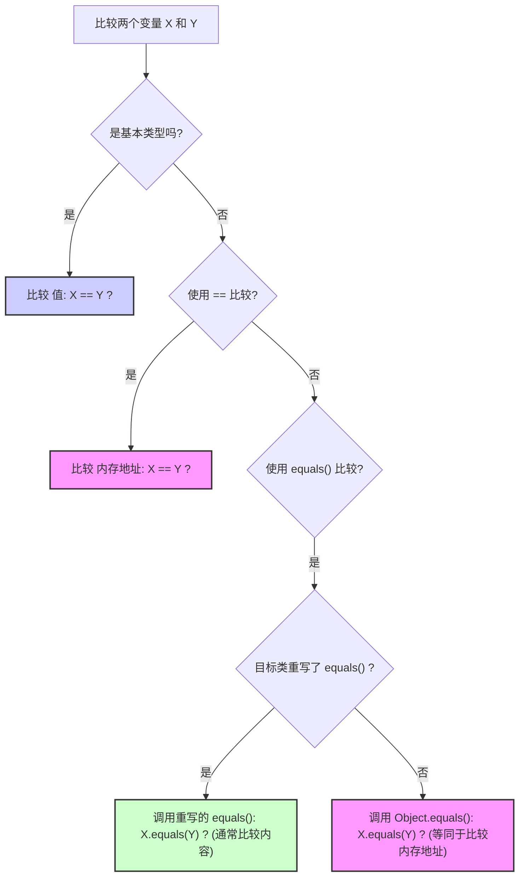

## Java基础

### Object 类的常见方法有哪些？

::: details

Object 类是一个特殊的类，是所有类的父类，主要提供了以下 11 个方法：

```java
/**
 * native 方法，用于返回当前运行时对象的 Class 对象，使用了 final 关键字修饰，故不允许子类重写。
 */
public final native Class<?> getClass()
/**
 * native 方法，用于返回对象的哈希码，主要使用在哈希表中，比如 JDK 中的HashMap。
 */
public native int hashCode()
/**
 * 用于比较 2 个对象的内存地址是否相等，String 类对该方法进行了重写以用于比较字符串的值是否相等。
 */
public boolean equals(Object obj)
/**
 * native 方法，用于创建并返回当前对象的一份拷贝。
 */
protected native Object clone() throws CloneNotSupportedException
/**
 * 返回类的名字实例的哈希码的 16 进制的字符串。建议 Object 所有的子类都重写这个方法。
 */
public String toString()
/**
 * native 方法，并且不能重写。唤醒一个在此对象监视器上等待的线程(监视器相当于就是锁的概念)。如果有多个线程在等待只会任意唤醒一个。
 */
public final native void notify()
/**
 * native 方法，并且不能重写。跟 notify 一样，唯一的区别就是会唤醒在此对象监视器上等待的所有线程，而不是一个线程。
 */
public final native void notifyAll()
/**
 * native方法，并且不能重写。暂停线程的执行。注意：sleep 方法没有释放锁，而 wait 方法释放了锁 ，timeout 是等待时间。
 */
public final native void wait(long timeout) throws InterruptedException
/**
 * 多了 nanos 参数，这个参数表示额外时间（以纳秒为单位，范围是 0-999999）。 所以超时的时间还需要加上 nanos 纳秒。。
 */
public final void wait(long timeout, int nanos) throws InterruptedException
/**
 * 跟之前的2个wait方法一样，只不过该方法一直等待，没有超时时间这个概念
 */
public final void wait() throws InterruptedException
/**
 * 实例被垃圾回收器回收的时候触发的操作
 */
protected void finalize() throws Throwable { }
```

:::

### == 和 equals() 的区别

::: details

**`==`** 对于基本类型和引用类型的作用效果是不同的：

- 对于基本数据类型来说，`==` 比较的是值。
- 对于引用数据类型来说，`==` 比较的是对象的内存地址。

> 因为 Java 只有值传递，所以，对于 == 来说，不管是比较基本数据类型，还是引用数据类型的变量，其本质比较的都是值，只是引用类型变量存的值是对象的地址

`equals()` 方法存在两种使用情况：

- **类没有重写 `equals()`方法**：通过`equals()`比较该类的两个对象时，等价于通过“==”比较这两个对象，使用的默认是 `Object`类`equals()`方法。
- **类重写了 `equals()`方法**：一般我们都重写 `equals()`方法来比较两个对象中的属性是否相等；若它们的属性相等，则返回 true(即，认为这两个对象相等)。



:::

### hashCode() 有什么用？

::: details

`hashCode()` 的作用是获取哈希码（`int` 整数），也称为散列码。这个哈希码的作用是确定该对象在哈希表中的索引位置。


`hashCode()` 定义在 JDK 的 `Object` 类中，这就意味着 Java 中的任何类都包含有 `hashCode()` 函数。另外需要注意的是：`Object` 的 `hashCode()` 方法是本地方法，也就是用 C 语言或 C++ 实现的。

> ⚠️ 注意：该方法在 **Oracle OpenJDK8** 中默认是 "使用线程局部状态来实现 Marsaglia's xor-shift 随机数生成", 并不是 "地址" 或者 "地址转换而来", 不同 JDK/VM 可能不同。在 **Oracle OpenJDK8** 中有六种生成方式 (其中第五种是返回地址), 通过添加 VM 参数: -XX:hashCode=4 启用第五种。参考源码:
>
> - https://hg.openjdk.org/jdk8u/jdk8u/hotspot/file/87ee5ee27509/src/share/vm/runtime/globals.hpp（1127 行）
> - https://hg.openjdk.org/jdk8u/jdk8u/hotspot/file/87ee5ee27509/src/share/vm/runtime/synchronizer.cpp（537 行开始）

散列表存储的是键值对(key-value)，它的特点是：**能根据“键”快速的检索出对应的“值”。这其中就利用到了散列码！（可以快速找到所需要的对象）**

:::

### SPI 和 API 有什么区别？

::: details

API 和 SPI 是两个在软件开发中经常听到但容易混淆的概念。它们都定义了接口，但目的和使用方不同。

**1. API (Application Programming Interface - 应用程序编程接口)**

- **目的**：定义了软件组件或系统**对外提供**的功能以及**如何使用**这些功能。它是一套规则、协议和工具，允许不同的软件应用程序相互通信或交互。
- **使用者**：主要是**应用程序开发者（服务的消费者/调用者）**。开发者通过调用 API 来使用某个库、框架、操作系统或服务提供的功能，而不需要关心其内部实现细节。
- **关注点**：**“我能用它来做什么？”** 以及 **“我该如何调用它？”**
- 例子
  - Java 标准库中的 `java.util.List` 接口。你作为开发者，使用 `list.add()`, `list.get()`, `list.size()` 等方法来操作列表，`List` 就是你使用的 API。你不需要关心它是 `ArrayList` 还是 `LinkedList` 的内部实现。
  - RESTful Web Services 的接口。定义了可以通过 HTTP 访问的 URL、请求/响应格式（如 JSON），开发者调用这些 URL 来获取或操作数据。
  - Spring Boot 框架提供的各种注解（`@RestController`, `@Autowired` 等）和类，开发者用它们来构建应用程序。
- **类比**：餐厅的**菜单**。菜单（API）告诉顾客（开发者）餐厅提供哪些菜品（功能），以及如何点单（方法调用和参数）。顾客不需要知道厨房（内部实现）具体是怎么炒菜的。

**2. SPI (Service Provider Interface - 服务提供者接口)**

- **目的**：定义了一个**框架或系统**期望**第三方实现者（服务提供者）**遵守的契约，以便能够将这些实现**插入（plug-in）**到框架中，扩展或替换框架的某部分功能。它通常由一组接口或抽象类组成。
- **使用者**：主要是**功能的提供者/实现者（扩展开发者）**。他们根据 SPI 的定义来实现具体的服务，然后框架在运行时可以发现并使用这些实现。
- **关注点**：**“我需要实现哪些接口/方法，才能让我的服务被框架所用？”**
- 例子
  - **Java JDBC Driver API (`java.sql.Driver`)**：这是最经典的 SPI 例子。JDBC 规范定义了 `java.sql.Driver` 接口 (SPI)。各个数据库厂商（如 MySQL, PostgreSQL, Oracle）**实现**这个接口，提供具体的数据库驱动。应用程序开发者通常使用 JDBC **API**（如 `Connection`, `Statement`, `ResultSet`），而 `DriverManager`（框架部分）则使用 SPI 在运行时加载并调用厂商实现的 `Driver`，从而让应用程序能与不同数据库通信，而应用程序本身不需要知道驱动的具体实现。
  - **Java `ServiceLoader` (`java.util.ServiceLoader`)**：Java 提供的一个加载服务实现的工具，它本身就是基于 SPI 模式工作的。你定义一个接口（SPI），不同的提供者实现这个接口，并通过在 `META-INF/services/` 目录下放置配置文件来声明实现。`ServiceLoader` 就能发现并加载这些实现。
  - **SLF4J (Simple Logging Facade for Java)**：开发者使用 SLF4J 的 API 进行日志记录。但 SLF4J 本身不实现日志记录逻辑，它定义了一套 SPI。具体的日志框架（如 Logback, Log4j2）提供了对这套 SPI 的实现（称为绑定），SLF4J 在运行时会加载这些绑定。
- **类比**：电源插座的标准。墙上的**插座**（SPI）定义了电器（服务提供者）需要满足的**插头**形状和电压标准（接口/方法），这样任何符合标准的电器（具体实现）都可以插上去并被供电系统（框架）使用。用户（应用程序开发者）关心的是电器提供的功能（API），而不是插头具体怎么符合标准的。

**总结与区别**

| 特性         | API (Application Programming Interface) | SPI (Service Provider Interface)                           |
| ------------ | --------------------------------------- | ---------------------------------------------------------- |
| **目的**     | 定义如何**使用**一个模块/服务的功能     | 定义如何**实现**一个可插拔的模块/服务以供框架使用          |
| **使用者**   | 服务/功能的**消费者**（应用程序开发者） | 服务/功能的**提供者**（扩展开发者/实现者）                 |
| **视角**     | “我（调用者）能调用什么？”              | “我（实现者）需要实现什么？”                               |
| **关注点**   | 功能的调用、交互                        | 功能的实现、扩展、可替换性                                 |
| **耦合**     | 调用者与**接口**耦合                    | 实现者与**接口**耦合，框架与**接口**耦合（与具体实现解耦） |
| **方向**     | 调用者 **调用** API                     | 框架 **调用** SPI 的实现 (通常是反向调用/IoC)              |
| **典型例子** | `java.util.List`, REST API, Servlet API | `java.sql.Driver`, `java.util.ServiceLoader`, SLF4J绑定    |

简单来说：

- **API 是给别人用的。** (How to use me?)
- **SPI 是让别人实现的。** (How to implement for me?)

在很多框架中，API 和 SPI 会同时存在。框架提供 API 给最终用户使用，同时提供 SPI 给扩展开发者来实现特定的、可插拔的功能点。理解它们的区别有助于更好地理解和使用各种框架和库。

:::

### SPI 的优缺点？

::: details

**SPI 的优点：**

1. **高度解耦 (Decoupling):** 这是 SPI 最核心的优势。框架或核心系统只需要依赖于抽象的 SPI 接口，而不需要依赖于任何具体的服务实现。这使得框架本身更加稳定，易于维护，并且与具体的业务实现细节分离。
2. **高可扩展性 (Extensibility / Pluggability):** SPI 允许第三方开发者或者不同的团队为系统提供新的功能实现或替换现有实现，而无需修改核心框架的代码。只需要按照 SPI 规范实现接口，并遵循相应的发现机制（如 `META-INF/services/`），就能被框架自动发现和使用。这极大地增强了系统的灵活性和生命力（例如 JDBC 可以轻松支持新的数据库）。
3. **面向接口编程 (Interface-Oriented Programming):** SPI 强制使用面向接口编程，这是一种良好的设计实践，有助于代码的模块化和标准化。
4. **遵循开闭原则 (Open/Closed Principle):** 系统对扩展是开放的（可以通过增加新的 SPI 实现来扩展功能），对修改是关闭的（不需要修改现有框架代码来支持新功能）。
5. **支持多种实现选择 (Flexibility):** 最终用户或部署者可以根据需要选择不同的服务提供者实现。例如，可以选择不同的日志库实现 (Logback, Log4j2)，不同的数据库驱动 (MySQL, PostgreSQL)，而应用程序代码保持不变。
6. **并行开发 (Parallel Development):** 核心框架和各个服务提供者的实现可以由不同的团队并行开发，只要 SPI 接口保持稳定。

**SPI 的缺点：**

1. **接口设计复杂性 (Interface Design Complexity):** 设计一个良好、稳定且能满足未来扩展需求的 SPI 接口是一项挑战。接口一旦发布，后续修改（尤其是破坏性修改）会影响所有的实现者，需要非常谨慎。
2. **发现机制的开销 (Discovery Overhead):** 服务的发现过程（例如 Java `ServiceLoader` 需要扫描 classpath 下的 `META-INF/services/` 目录并加载类）可能会带来一定的启动性能开销，尤其是在实现众多或 classpath 复杂的情况下。
3. **版本管理问题 (Versioning Issues):** SPI 接口的版本和其实现的版本需要协调。如果框架升级了 SPI 接口（尤其是接口方法变更），旧的实现可能无法工作；反之，如果实现依赖了新版 SPI，但框架使用的是旧版，也会出问题。这可能导致依赖冲突（"Jar Hell"）。
4. **实现质量不可控 (Implementation Quality Variance):** 框架无法保证所有第三方实现的质量（性能、安全性、健壮性）。不同的实现可能水平参差不齐，选择不当可能影响整个应用的稳定性和性能。
5. **调试困难 (Debugging Challenges):** 当出现问题时，可能难以确定是框架调用 SPI 的逻辑有问题，还是具体的 SPI 实现有问题。跨越 SPI 边界进行调试可能比在单一代码库中更复杂。
6. **安全性风险 (Security Risks):** 如果服务发现机制不够安全，可能会加载到恶意或不可信的实现代码，带来安全隐患。需要有机制来控制加载哪些实现。
7. **接口粒度问题 (Interface Granularity):** 如果 SPI 接口定义得过于庞大或复杂，实现起来会很困难；如果定义得太小，可能需要实现很多个小接口才能完成一个功能，增加了管理的复杂度。

**总结:**

SPI 是一种强大的设计模式，特别适用于需要高度可扩展性和解耦的场景，如驱动程序、插件系统、框架扩展点等。它使得系统更加灵活和开放。然而，它也带来了接口设计、版本管理、性能开销和实现质量控制等方面的挑战。在使用或设计 SPI 时，需要仔细权衡这些优缺点。

:::

### 对象头具体都包含哪些内容？

::: details

在 Java HotSpot 虚拟机中，对象头（Object Header）是存储在 Java 对象实例内存布局起始处的一块元数据区域。它不包含对象的实例数据（成员变量），而是存储了对象自身的一些运行时状态信息和指向其类元数据的指针。

对象头的内容和大小会根据 JVM 是32位还是64位，以及是否开启了指针压缩（CompressedOops）而有所不同。通常，对象头包含以下几个部分：

**1. Mark Word (标记字)**

- 这部分是对象头中最复杂的部分，它存储了对象的运行时状态信息，如哈希码（Identity HashCode）、GC年龄（GC Age）、锁状态标记、偏向锁线程ID、偏向锁时间戳（Epoch）等。

- Mark Word 的大小在32位JVM上是4字节（32位），在64位JVM上是8字节（64位）。

- Mark Word 的内容是动态的，会根据对象的状态（未锁定、偏向锁、轻量级锁、重量级锁、GC标记）而改变其存储的比特位含义。

  下面是 Mark Word 在不同锁状态下（以64位JVM为例，低位在前）可能包含的内容：

  - **无锁状态 (Unlocked / Normal):**
    - `unused (25 bits)`: 未使用
    - `identity_hashcode (31 bits)`: 对象的哈希码（延迟计算，首次调用 `System.identityHashCode()` 或 `Object.hashCode()` 默认实现时计算并存入）
    - `unused (1 bit)`: 未使用
    - `age (4 bits)`: GC分代年龄
    - `biased_lock (1 bit)`: 是否为偏向锁标记 (0)
    - `lock (2 bits)`: 锁标记 (01) - 表示无锁或偏向锁（结合biased_lock位判断）
  - **偏向锁状态 (Biased Lock):**
    - `thread_id (54 bits)`: 指向持有偏向锁的线程的指针 (或者线程ID的部分位)
    - `epoch (2 bits)`: 偏向锁的时间戳，用于批量重偏向和撤销
    - `unused (1 bit)`: 未使用
    - `age (4 bits)`: GC分代年龄
    - `biased_lock (1 bit)`: 是否为偏向锁标记 (1)
    - `lock (2 bits)`: 锁标记 (01)
  - **轻量级锁状态 (Lightweight Lock):**
    - `ptr_to_lock_record (62 bits)`: 指向线程栈中锁记录（Lock Record）的指针
    - `lock (2 bits)`: 锁标记 (00)
  - **重量级锁状态 (Heavyweight Lock):**
    - `ptr_to_heavyweight_monitor (62 bits)`: 指向堆中监视器对象（Monitor，即 `ObjectMonitor`）的指针
    - `lock (2 bits)`: 锁标记 (10)
  - **GC标记状态 (Marked for GC):**
    - 这部分空间会被GC算法用来标记对象（例如，标记对象是否存活）。
    - `lock (2 bits)`: 锁标记通常是 (11)，但具体内容由GC算法决定。

**2. Klass Pointer / Type Pointer (类型指针)**

- 这部分是一个指向方法区（JDK 8及以后为 Metaspace，JDK 7及以前为 PermGen）中该对象对应的类元数据（`Klass` 对象）的指针。通过这个指针，JVM 可以获取到对象的实际类型信息，如它有哪些字段、哪些方法等。
- 大小：
  - 在32位JVM上：4字节（32位）。
  - 在64位JVM上：
    - 默认不开启指针压缩 (`-XX:-UseCompressedClassPointers`)：8字节（64位）。
    - 开启指针压缩 (`-XX:+UseCompressedClassPointers`，通常默认开启，与 `-XX:+UseCompressedOops` 一起使用)：4字节（32位）。指针压缩可以将64位的指针压缩到32位，以节省内存，前提是堆大小在一定范围内（例如不超过32GB，但具体取决于压缩策略）。

**3. Array Length (数组长度) - 仅数组对象拥有**

- 如果对象是一个数组，那么对象头中还会包含一个额外的部分用来存储数组的长度。
- **大小：** 通常是4字节（32位），即使在64位JVM上也是如此，因为数组长度是 `int` 类型。

**总结对象头大小：**

- 32位 JVM:
  - 非数组对象：Mark Word (4字节) + Klass Pointer (4字节) = **8字节**
  - 数组对象：Mark Word (4字节) + Klass Pointer (4字节) + Array Length (4字节) = **12字节**
- 64位 JVM (不开启指针压缩):
  - 非数组对象：Mark Word (8字节) + Klass Pointer (8字节) = **16字节**
  - 数组对象：Mark Word (8字节) + Klass Pointer (8字节) + Array Length (4字节) = **20字节**
- 64位 JVM (开启指针压缩 - 默认常见情况):
  - 非数组对象：Mark Word (8字节) + Klass Pointer (4字节) = **12字节**
  - 数组对象：Mark Word (8字节) + Klass Pointer (4字节) + Array Length (4字节) = **16字节**

**可视化 (Mermaid 图):**


理解对象头的构成对于深入分析Java对象内存占用、锁机制以及垃圾回收等JVM底层原理非常重要。

:::

### **final**、**finally**、**finalize**的区别？

::: details

- **final** 用于修饰变量、方法和类：final修饰的类不可被继承；修饰的方法不可被重写；修饰的变量不可变。

- **finally** 作为异常处理的一部分，它只能在 `try/catch` 语句中，并且附带一个语句块表示这段语句 终一定被执行（无论是否抛出异常），经常被用在需要释放资源的情况下，`System.exit (0)` 可以阻断 finally 执行。

- **finalize** 是在 `java.lang.Object` 里定义的方法，也就是说每一个对象都有这么个方法，这个方法在 `gc` 启动，该对象被回收的时候被调用。

一个对象的 finalize 方法只会被调用一次，finalize 被调用不一定会立即回收该对象，所以有可能调用 finalize 后，该对象又不需要被回收了，然后到了真正要被回收的时候，因为前面调用过一次，所以不会再次调用 finalize 了，进而产生问题，因此不推荐使用 finalize 方法。

:::

### **Java** 创建对象有哪几种方式？

::: details

Java中有以下四种创建对象的方式:


- new创建新对象

  ```java
  MyClass obj = new MyClass();
  ```

- 通过反射机制

  ```java
  Class<?> clazz = MyClass.class;
  MyClass obj = (MyClass) clazz.newInstance();
  ```

- 采用clone机制

  ```java
  MyClass obj1 = new MyClass();
  MyClass obj2 = (MyClass) obj1.clone();
  ```

- 通过序列化机制

  ```java
  // 将对象序列化为字节流
  ObjectOutputStream out = new ObjectOutputStream(new
  FileOutputStream("object.dat"));
  out.writeObject(obj);
  // 从字节流反序列化为对象
  ObjectInputStream in = new ObjectInputStream(new
  FileInputStream("object.dat"));
  MyClass obj2 = (MyClass) in.readObject();
  ```

前两种都需要显式地调用构造方法。对于clone机制，需要注意浅拷贝和深拷贝的区 别。对于序列化机制需要明确其实现原理，在Java中序列化可以通过实现 Externalizable或者Serializable来实现。

:::

### 深拷贝和浅拷贝?

::: details

- 浅拷贝 ：仅拷贝被拷贝对象的成员变量的值，也就是基本数据类型变量的值，和引用数据类型变量的地址值，而对于引用类型变量指向的堆中的对象不会拷贝。
- 深拷贝 ：完全拷贝一个对象，拷贝被拷贝对象的成员变量的值，堆中的对象也会拷贝一份。

例如现在有一个order对象，里面有一个products列表，它的浅拷贝和深拷贝的示意图：


因此深拷贝是安全的，浅拷贝的话如果有引用类型，那么拷贝后对象，引用类型变量修改，会影响原对象。

> 浅拷贝如何实现呢？

Object类提供的clone()方法可以非常简单地实现对象的浅拷贝。

> 深拷贝如何实现呢？

- 重写克隆方法：重写克隆方法，引用类型变量单独克隆，这里可能会涉及多层递归。
- 序列化：可以先讲原对象序列化，再反序列化成拷贝对象。

:::

### Java中实现Map接口的有哪些类？

::: details


Java中实现Map接口的常用类有以下几个：

**1.**  HashMap：基于哈希表实现的Map，无序，允许键和值为null。

**2.**  LinkedHashMap：基于哈希表和双向链表实现的Map，保持插入顺序或访问顺序。

**3.**  TreeMap：基于红黑树实现的有序Map，按照键的自然顺序或自定义顺序进行排序。

**4.**  Hashtable：基于哈希表实现的Map，线程安全，不允许键和值为null。

**5.**  ConcurrentHashMap：基于哈希表实现的线程安全的Map，支持高并发操作。

:::

### 遍历**HashMap**的几种方法？

::: details

遍历HashMap可以使用以下几种方法：

1. 使用迭代器遍历：

   ```java
   HashMap<K, V> map = new HashMap<>();
   // 添加元素到map...
   Iterator<Map.Entry<K, V>> iterator =
   map.entrySet().iterator();
   while (iterator.hasNext()) {
   	Map.Entry<K, V> entry = iterator.next();
   	K key = entry.getKey();
   	V value = entry.getValue();
   	// 处理key和value
   }
   ```

2. 使用for-each循环遍历键集合或值集合：

   ```java
   HashMap<K, V> map = new HashMap<>();
   	// 添加元素到map...
   	
   for (K key : map.keySet()) {
   	// 处理key
   }
   
   for (V value : map.values()) {
   	// 处理value
   }
   ```

3. 使用for-each循环遍历键值对：

   ```java
   HashMap<K, V> map = new HashMap<>();
   	// 添加元素到map...
   	
   for (Map.Entry<K, V> entry : map.entrySet()) {
   	K key = entry.getKey();
   	V value = entry.getValue();
   	// 处理key和value
   }
   
   ```

4. 使用Java 8的Stream API遍历：

   ```java
   HashMap<K, V> map = new HashMap<>();
   // 添加元素到map...
   
   map.forEach((key, value) -> {
   	// 处理key和value
   });
   ```

:::

### String 是 Java 基本数据类型吗？可以被继承吗？

::: details

**String是Java基本数据类型吗？**

不是。Java 中的基本数据类型只有8个：byte、short、int、long、float、double、char、boolean；除了基本类型（primitive type），剩下的都是引用类型（reference type）。

String是Java提供的用于表示字符串的类，它是由字符组成的不可变序列。尽管String 在使用时表现得像基本数据类型，但它实际上是一个引用数据类型。当我们创建一个字符串时，实际上是创建了一个String对象，并将字符串的引用赋值给变量。

**String 类可以继承吗？**

不行。String类在Java中被声明为final类，这意味着它不能被继承。

这是因为String类的设计目的是为了表示不可变的字符串，任何对字符串的修改都会创建一个新的String对象。为了保持字符串的不可变性和安全性，Java语言设计者将String类声明为final类，禁止其他类继承它。

这种设计主要是由于这几个原因：

**1.**  字符串的不可变性：String类的不可变性使得它可以被安全地用于多线程环境下，不会出现线程安全问题。

**2.**  字符串常量池的优化：由于字符串是不可变的，Java可以对字符串进行缓存和共享，以提高性能和节省内存。这就是通过字符串常量池来实现的，它存储了所有字符串字面量的唯一实例。

**3.**  安全性和可靠性：String类的不可变性使得它在安全性和可靠性方面更加可靠。例如，它可以被用作Map的键，因为它的哈希值是固定的。

:::

### **String**和**StringBuilder**、**StringBuffer**？

::: details

String、StringBuilder和StringBuffer是Java中用于处理字符串的类，都实现了CharSequence接口，它们有着不同的可变性、线程安全性和性能特点。

| 类名          | 可变性 | 线程安全性 | 性能 |
| ------------- | ------ | ---------- | ---- |
| String        | 不可变 | 线程安全   | 低   |
| StringBuffer  | 可变   | 线程安全   | 低   |
| StringBuilder | 可变   | 非线程安全 | 高   |

**1.**  String类：String是不可变的，使用 `private final char value[]` 来存储字符串，一旦创建就不能修改其值。任何对String的修改都会创建一个新的String对象。String类是线程安全的，因为它的不可变性保证了多个线程可以安全地共享 String对象。然而，由于不可变性的特性，对于频繁的字符串拼接操作，会产生大量的临时对象，影响性能。

**2.**  StringBuffer类：StringBuffer是可变的，使用 `char value[]` 存储字符串，它的值可以被修改。为了保证线程安全性，StringBuffer的方法都使用synchronized关键字进行同步。因此，在多线程环境下，使用StringBuffer可以保证线程安全。然而，由于同步的开销，StringBuffer的性能相对较低。

**3.**  StringBuilder类：StringBuilder是StringBuffer的非线程安全版本，它的方法没有使用synchronized关键字进行同步。因此，在单线程环境下，使用StringBuilder可以获得更好的性能。然而，由于不具备线程安全性，如果在多线程环境下使用StringBuilder，需要自行保证线程安全。

一般来说，在实际使用中：

- 如果操作的数据量较小，可以使用String类。 
- 如果在多线程环境下操作大量的数据，需要保证线程安全，可以使用StringBuffer类。
- 如果在单线程环境下操作大量的数据，可以使用StringBuilder类以，性能更好。

:::

### String str1 = new String("abc")和String str2 = "abc" 和 区别？

::: details

两个语句都会去字符串常量池中检查是否已经存在 “abc”，如果有则直接使用，如果没有则会在常量池中创建 “abc” 对象。


但是不同的是，String str1 = new String("abc") 还会通过 new String() 在堆里创建一个 "abc" 字符串对象实例。所以后者可以理解为被前者包含。

> String s = new String("abc")创建了几个对象？

很明显，一个或两个。如果字符串常量池已经有“abc”，则是一个；否则，两个。 

当字符创常量池没有 “abc”，此时会创建如下两个对象：

- 一个是字符串字面量 "abc" 所对应的、字符串常量池中的实例
- 另一个是通过 new String() 创建并初始化的，内容与"abc"相同的实例，在堆中。

:::

### String不是不可变类吗？字符串拼接是如何实现的？

::: details

String的确是不可变的，“+”的拼接操作，其实是会生成新的对象。 

例如：

```java
String a = "hello ";
String b = "world!";
String ab = a + b;
```

在**jdk1.8**之前，a和b初始化时位于字符串常量池，ab拼接后的对象位于堆中。经过拼接新生成了String对象。如果拼接多次，那么会生成多个中间对象。 

内存如下


在**Java8**时JDK对“+”号拼接进行了优化，上面所写的拼接方式会被优化为基于

StringBuilder的append方法进行处理。Java会在编译期对“+”号进行处理。

下面是通过javap -verbose命令反编译字节码的结果，很显然可以看到StringBuilder的创建和append方法的调用。

```java
stack=2, locals=4, args_size=1
0: ldc           #2                  // String hello
2: astore_1
3: ldc           #3                  // String world!
5: astore_2
6: new           #4                  // class java/lang/StringBuilder
9: dup
10: invokespecial #5                    // Method java/lang/StringBuilder."<init>":()V
13: aload_1
14: invokevirtual #6                  // Method java/lang/StringBuilder.append:(Ljava/lang/String;)Ljava/lang/StringBuilder;
17: aload_2
18: invokevirtual #6                  // Method java/lang/StringBuilder.append:(Ljava/lang/String;)Ljava/lang/StringBuilder;
21: invokevirtual #7                  /// Method java/lang/StringBuilder.toString:()Ljava/lang/String;
24: astore_3
25: return 16

```

也就是说其实上面的代码其实相当于：

```java
String a = "hello ";
String b = "world!";
StringBuilder sb = new StringBuilder();
sb.append(a);
sb.append(b);
String ab = sb.toString();
```

此时，如果再笼统的回答：通过加号拼接字符串会创建多个String对象，因此性能比StringBuilder差，就是错误的了。因为本质上加号拼接的效果最终经过编译器处理之后和StringBuilder是一致的。 

当然，循环里拼接还是建议用StringBuilder，为什么，因为循环一次就会创建一个新的StringBuilder对象，大家可以自行实验。

:::

### intern方法有什么作用？

::: details

JDK源码里已经对这个方法进行了说明：

```java
* <p>
* When the intern method is invoked, if the pool already
contains a
* string equal to this {@code String} object as
determined by
* the {@link #equals(Object)} method, then the string
from the pool is
* returned. Otherwise, this {@code String} object is
added to the
* pool and a reference to this {@code String} object is
returned.
* <p>
```

意思也很好懂：

- 如果当前字符串内容存在于字符串常量池（即equals()方法为true，也就是内容一样），直接返回字符串常量池中的字符串 
- 否则，将此String对象添加到池中，并返回String对象的引用

:::

### Integer a= 127，Integer b = 127；Integer c= 128，Integer d = 128；，相等吗?

::: details

答案是a和b相等，c和d不相等。

- 对于基本数据类型==比较的值

- 对于引用数据类型==比较的是地址

Integer a=127这种赋值，是用到了Integer自动装箱的机制。自动装箱的时候会去缓存池里取Integer对象，没有取到才会创建新的对象。

如果整型字面量的值在-128到127之间，那么自动装箱时不会new新的Integer对象，而是直接引用缓存池中的Integer对象，超过范围 a1==b1的结果是false

```java
public static void main(String[] args) {
	Integer a = 127;
	Integer b = 127;
	Integer b1 = new Integer(127);
	System.out.println(a == b); //true
	System.out.println(b==b1); //false
	Integer c = 128;
	Integer d = 128;
	System.out.println(c == d); //false
}
```

> 什么是Integer缓存？

因为根据实践发现大部分的数据操作都集中在值比较小的范围，因此 Integer 搞了个缓存池，默认范围是 -128 到 127，可以根据通过设置 `JVM-XX:AutoBoxCacheMax=` 来修改缓存的最大值，最小值改不了。

实现的原理是int 在自动装箱的时候会调用Integer.valueOf，进而用到了 IntegerCache。


很简单，就是判断下值是否在缓存范围之内，如果是的话去 IntegerCache 中取，不 是的话就创建一个新的Integer对象。 

IntegerCache是一个静态内部类， 在静态块中会初始化好缓存值。

```java
private static class IntegerCache {
	……
	static {
		//创建Integer对象存储
		for(int k = 0; k < cache.length; k++)
			cache[k] = new Integer(j++);
		……
	}
}
```

:::

### String怎么转成Integer的？原理？

::: details

PS:这道题印象中在一些面经中出场过几次。 

String转成Integer，主要有两个方法：

- `Integer.parseInt(String s)` 
- `Integer.valueOf(String s)`

不管哪一种，最终还是会调用Integer类内中的 `parseInt(String s, int radix)` 方法。 

抛去一些边界之类的看看核心代码：

```java
public static int parseInt(String s, int radix) throws NumberFormatException {
	int result = 0;
	//是否是负数
	boolean negative = false;
	//char字符数组下标和长度
	int i = 0, len = s.length();
	……
	int digit;
	//判断字符长度是否大于0，否则抛出异常
	if (len > 0) {
		……
		while (i < len) {
			// Accumulating negatively avoids surprises near MAX_VALUE
			//返回指定基数中字符表示的数值。（此处是十进制数值）
			digit = Character.digit(s.charAt(i++),radix);
			//进制位乘以数值
			result *= radix;
			result -= digit;
		}
	}
	//根据上面得到的是否负数，返回相应的值
	return negative ? result : -result;
}
```

去掉枝枝蔓蔓（当然这些枝枝蔓蔓可以去看看，源码cover了很多情况），其实剩下 的就是一个简单的字符串遍历计算，不过计算方式有点反常规，是用负的值累减。


:::

### Object 类的常见方法?

::: details

Object 类是一个特殊的类，是所有类的父类，也就是说所有类都可以调用它的方法。它主要提供了以下 11 个方法，大概可以分为六类：


对象比较： 

- `public native int hashCode()` ：native方法，用于返回对象的哈希码，主要使用在 哈希表中，比如JDK中的HashMap。 
- `public boolean equals(Object obj)`：用于比较2个对象的内存地址是否相等，String 类对该方法进行了重写用户比较字符串的值是否相等。

对象拷贝：

- protected native Object clone() throws CloneNotSupportedException：naitive方法，用于创建并返回当前对象的一份拷贝。一般情况下，对于任何对象 x，表达式 x.clone() != x 为true，x.clone().getClass() == x.getClass() 为true。Object本身没有实现Cloneable接口，所以不重写clone方法并且进行调用的话会发生CloneNotSupportedException异常。

对象转字符串：

- public String toString()：返回类的名字@实例的哈希码的16进制的字符串。建议Object所有的子类都重写这个方法。

多线程调度：

- public final native void notify()：native方法，并且不能重写。唤醒一个在此对象监视器上等待的线程(监视器相当于就是锁的概念)。如果有多个线程在等待只会任意唤醒一个。
- public final native void notifyAll()：native方法，并且不能重写。跟notify一样，唯一的区别就是会唤醒在此对象监视器上等待的所有线程，而不是一个线程。
- public final native void wait(long timeout) throws InterruptedException：native方法，并且不能重写。暂停线程的执行。注意：sleep方法没有释放锁，而wait方法释放了锁 。timeout是等待时间。
- public final void wait(long timeout, int nanos) throws InterruptedException：多了 nanos参数，这个参数表示额外时间（以毫微秒为单位，范围是 0-999999）。 所以超时的时间还需要加上nanos毫秒。
- public final void wait() throws InterruptedException：跟之前的2个wait方法一样，只不过该方法一直等待，没有超时时间这个概念

反射：

- public final native Class getClass()：native方法，用于返回当前运行时对象的Class对象，使用了final关键字修饰，故不允许子类重写。

垃圾回收：

- protected void finalize() throws Throwable ：通知垃圾收集器回收对象。

:::

### Java 中异常层级结构?

::: details

Java的异常是分为多层的。


Throwable 是 Java 语言中所有错误或异常的基类。 Throwable 又分为 Error 和 Exception ，其中Error是系统内部错误，比如虚拟机异常，是程序无法处理的。Exception 是程序问题导致的异常，又分为两种：

- CheckedException受检异常：编译器会强制检查并要求处理的异常。
- RuntimeException运行时异常：程序运行中出现异常，比如我们熟悉的空指针、数组下标越界等等

:::

### 异常的处理机制？

::: details

针对异常的处理主要有两种方式：


- 遇到异常不进行具体处理，而是继续抛给调用者 （throw，throws）

  抛出异常有三种形式，一是 throw,一个 throws，还有一种系统自动抛异常。 throws 用在方法上，后面跟的是异常类，可以跟多个；而 throw 用在方法内，后面跟的是异常对象。

- try catch 捕获异常

  在catch语句块中补货发生的异常，并进行处理。

  ```java
  try {
  	//包含可能会出现异常的代码以及声明异常的方法
  }catch(Exception e) {
  	//捕获异常并进行处理
  }finally {
      
  }
  	//可选，必执行的代码
  }
  ```

  try-catch捕获异常的时候还可以选择加上finally语句块，finally语句块不管程序是否正常执行，最终它都会必然执行。

:::

### finally一定会执行吗？

::: details

在一般情况下，finally块中的代码确实会执行。无论try块中是否发生异常，finally块中的代码都会被执行。

然而，有一些情况下finally块可能不会执行，包括以下几种情况：

**1.**  程序还没有进入try语句块就因为异常导致程序终止

**2.**  在try块中调用了System.exit()方法：System.exit()方法会终止Java虚拟机的运行，导致程序直接退出，此时finally块中的代码不会执行。

**3.**  在try块中发生了死循环或无限递归：如果try块中的代码导致了无限循环或无限递归，程序将无法继续执行，finally块中的代码也无法执行。

**4.**  在try块中发生了线程死锁：如果try块中的代码导致了线程死锁，程序将无法继续执行，finally块中的代码也无法执行。

需要注意的是，无论是否发生异常，finally块中的代码都会在try块中的代码执行完毕后执行。如果try块中的代码发生了异常，并且该异常没有被捕获并处理，那么异常会被抛出到上层调用栈，但是在异常被抛出之前，finally块中的代码仍然会被执行。

:::

### 既然有了字节流**,**为什么还要有字符流?

::: details

其实字符流是由 Java 虚拟机将字节转换得到的，问题就出在这个过程还比较耗时，并且，如果我们不知道编码类型就很容易出现乱码问题。

所以， I/O 流就干脆提供了一个直接操作字符的接口，方便我们平时对字符进行流操作。如果音频文件、图片等媒体文件用字节流比较好，如果涉及到字符的话使用字符流比较好。

:::

### **BIO**、**NIO**、**AIO**？

::: details


**BIO**(blocking I/O) ： 就是传统的IO，同步阻塞，服务器实现模式为一个连接一个线程，即客户端有连接请求时服务器端就需要启动一个线程进行处理，如果这个连接不做任何事情会造成不必要的线程开销，可以通过连接池机制改善(实现多个客户连接服务器)。


BIO方式适用于连接数目比较小且固定的架构，这种方式对服务器资源要求比较高，并发局限于应用中，JDK1.4 以前的唯一选择，程序简单易理解。

**NIO** ：全称 java non-blocking IO，是指 JDK 提供的新 API。从JDK1.4开始，Java 提供了一系列改进的输入/输出的新特性，被统称为NIO(即New IO)。

NIO是同步非阻塞的，服务器端用一个线程处理多个连接，客户端发送的连接请求会注册到多路复用器上，多路复用器轮询到连接有IO请求就进行处理：


NIO的数据是面向缓冲区**Buffer**的，必须从Buffer中读取或写入。

可以看出，NIO的运行机制：

- 每个Channel对应一个Buffer。 
- Selector对应一个线程，一个线程对应多个Channel。 
- Selector会根据不同的事件，在各个通道上切换。 
- Buffer是内存块，底层是数据。

**AIO**：JDK 7 引入了 Asynchronous I/O，是异步非阻塞的 IO。在进行 I/O 编程中，

常用到两种模式：Reactor 和 Proactor。Java 的 NIO 就是 Reactor，当有事件触发

时，服务器端得到通知，进行相应的处理，完成后才通知服务端程序启动线程去处理，一般适用于连接数较多且连接时间较长的应用。


Linux IO模型和Java IO模型的对应关系：


:::


## 多线程


## JVM


## MySQL


## Redis


## Spring


## Netty


## 消息队列

### RocketMQ


### Kafka


## Elasticsearch


## 微服务


## Dubbo


## Prometheus

