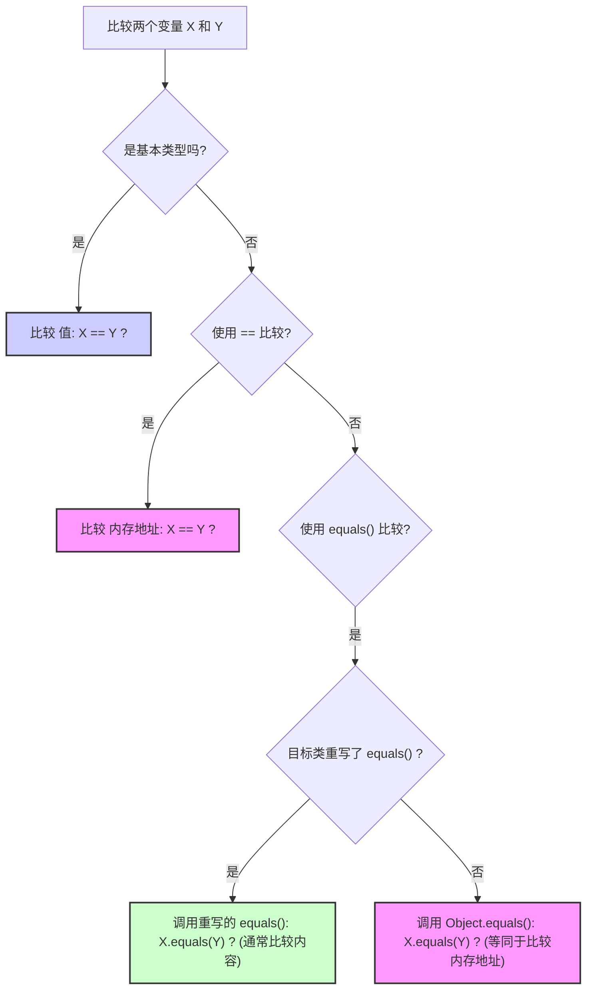

## Java基础

### Object 类的常见方法有哪些？

::: details

Object 类是一个特殊的类，是所有类的父类，主要提供了以下 11 个方法：

```java
/**
 * native 方法，用于返回当前运行时对象的 Class 对象，使用了 final 关键字修饰，故不允许子类重写。
 */
public final native Class<?> getClass()
/**
 * native 方法，用于返回对象的哈希码，主要使用在哈希表中，比如 JDK 中的HashMap。
 */
public native int hashCode()
/**
 * 用于比较 2 个对象的内存地址是否相等，String 类对该方法进行了重写以用于比较字符串的值是否相等。
 */
public boolean equals(Object obj)
/**
 * native 方法，用于创建并返回当前对象的一份拷贝。
 */
protected native Object clone() throws CloneNotSupportedException
/**
 * 返回类的名字实例的哈希码的 16 进制的字符串。建议 Object 所有的子类都重写这个方法。
 */
public String toString()
/**
 * native 方法，并且不能重写。唤醒一个在此对象监视器上等待的线程(监视器相当于就是锁的概念)。如果有多个线程在等待只会任意唤醒一个。
 */
public final native void notify()
/**
 * native 方法，并且不能重写。跟 notify 一样，唯一的区别就是会唤醒在此对象监视器上等待的所有线程，而不是一个线程。
 */
public final native void notifyAll()
/**
 * native方法，并且不能重写。暂停线程的执行。注意：sleep 方法没有释放锁，而 wait 方法释放了锁 ，timeout 是等待时间。
 */
public final native void wait(long timeout) throws InterruptedException
/**
 * 多了 nanos 参数，这个参数表示额外时间（以纳秒为单位，范围是 0-999999）。 所以超时的时间还需要加上 nanos 纳秒。。
 */
public final void wait(long timeout, int nanos) throws InterruptedException
/**
 * 跟之前的2个wait方法一样，只不过该方法一直等待，没有超时时间这个概念
 */
public final void wait() throws InterruptedException
/**
 * 实例被垃圾回收器回收的时候触发的操作
 */
protected void finalize() throws Throwable { }
```

:::

### == 和 equals() 的区别

::: details

**`==`** 对于基本类型和引用类型的作用效果是不同的：

- 对于基本数据类型来说，`==` 比较的是值。
- 对于引用数据类型来说，`==` 比较的是对象的内存地址。

> 因为 Java 只有值传递，所以，对于 == 来说，不管是比较基本数据类型，还是引用数据类型的变量，其本质比较的都是值，只是引用类型变量存的值是对象的地址

`equals()` 方法存在两种使用情况：

- **类没有重写 `equals()`方法**：通过`equals()`比较该类的两个对象时，等价于通过“==”比较这两个对象，使用的默认是 `Object`类`equals()`方法。
- **类重写了 `equals()`方法**：一般我们都重写 `equals()`方法来比较两个对象中的属性是否相等；若它们的属性相等，则返回 true(即，认为这两个对象相等)。



:::

### hashCode() 有什么用？

::: details

`hashCode()` 的作用是获取哈希码（`int` 整数），也称为散列码。这个哈希码的作用是确定该对象在哈希表中的索引位置。


`hashCode()` 定义在 JDK 的 `Object` 类中，这就意味着 Java 中的任何类都包含有 `hashCode()` 函数。另外需要注意的是：`Object` 的 `hashCode()` 方法是本地方法，也就是用 C 语言或 C++ 实现的。

> ⚠️ 注意：该方法在 **Oracle OpenJDK8** 中默认是 "使用线程局部状态来实现 Marsaglia's xor-shift 随机数生成", 并不是 "地址" 或者 "地址转换而来", 不同 JDK/VM 可能不同。在 **Oracle OpenJDK8** 中有六种生成方式 (其中第五种是返回地址), 通过添加 VM 参数: -XX:hashCode=4 启用第五种。参考源码:
>
> - https://hg.openjdk.org/jdk8u/jdk8u/hotspot/file/87ee5ee27509/src/share/vm/runtime/globals.hpp（1127 行）
> - https://hg.openjdk.org/jdk8u/jdk8u/hotspot/file/87ee5ee27509/src/share/vm/runtime/synchronizer.cpp（537 行开始）

散列表存储的是键值对(key-value)，它的特点是：**能根据“键”快速的检索出对应的“值”。这其中就利用到了散列码！（可以快速找到所需要的对象）**

:::

### SPI 和 API 有什么区别？

::: details

API 和 SPI 是两个在软件开发中经常听到但容易混淆的概念。它们都定义了接口，但目的和使用方不同。

**1. API (Application Programming Interface - 应用程序编程接口)**

- **目的**：定义了软件组件或系统**对外提供**的功能以及**如何使用**这些功能。它是一套规则、协议和工具，允许不同的软件应用程序相互通信或交互。
- **使用者**：主要是**应用程序开发者（服务的消费者/调用者）**。开发者通过调用 API 来使用某个库、框架、操作系统或服务提供的功能，而不需要关心其内部实现细节。
- **关注点**：**“我能用它来做什么？”** 以及 **“我该如何调用它？”**
- 例子
  - Java 标准库中的 `java.util.List` 接口。你作为开发者，使用 `list.add()`, `list.get()`, `list.size()` 等方法来操作列表，`List` 就是你使用的 API。你不需要关心它是 `ArrayList` 还是 `LinkedList` 的内部实现。
  - RESTful Web Services 的接口。定义了可以通过 HTTP 访问的 URL、请求/响应格式（如 JSON），开发者调用这些 URL 来获取或操作数据。
  - Spring Boot 框架提供的各种注解（`@RestController`, `@Autowired` 等）和类，开发者用它们来构建应用程序。
- **类比**：餐厅的**菜单**。菜单（API）告诉顾客（开发者）餐厅提供哪些菜品（功能），以及如何点单（方法调用和参数）。顾客不需要知道厨房（内部实现）具体是怎么炒菜的。

**2. SPI (Service Provider Interface - 服务提供者接口)**

- **目的**：定义了一个**框架或系统**期望**第三方实现者（服务提供者）**遵守的契约，以便能够将这些实现**插入（plug-in）**到框架中，扩展或替换框架的某部分功能。它通常由一组接口或抽象类组成。
- **使用者**：主要是**功能的提供者/实现者（扩展开发者）**。他们根据 SPI 的定义来实现具体的服务，然后框架在运行时可以发现并使用这些实现。
- **关注点**：**“我需要实现哪些接口/方法，才能让我的服务被框架所用？”**
- 例子
  - **Java JDBC Driver API (`java.sql.Driver`)**：这是最经典的 SPI 例子。JDBC 规范定义了 `java.sql.Driver` 接口 (SPI)。各个数据库厂商（如 MySQL, PostgreSQL, Oracle）**实现**这个接口，提供具体的数据库驱动。应用程序开发者通常使用 JDBC **API**（如 `Connection`, `Statement`, `ResultSet`），而 `DriverManager`（框架部分）则使用 SPI 在运行时加载并调用厂商实现的 `Driver`，从而让应用程序能与不同数据库通信，而应用程序本身不需要知道驱动的具体实现。
  - **Java `ServiceLoader` (`java.util.ServiceLoader`)**：Java 提供的一个加载服务实现的工具，它本身就是基于 SPI 模式工作的。你定义一个接口（SPI），不同的提供者实现这个接口，并通过在 `META-INF/services/` 目录下放置配置文件来声明实现。`ServiceLoader` 就能发现并加载这些实现。
  - **SLF4J (Simple Logging Facade for Java)**：开发者使用 SLF4J 的 API 进行日志记录。但 SLF4J 本身不实现日志记录逻辑，它定义了一套 SPI。具体的日志框架（如 Logback, Log4j2）提供了对这套 SPI 的实现（称为绑定），SLF4J 在运行时会加载这些绑定。
- **类比**：电源插座的标准。墙上的**插座**（SPI）定义了电器（服务提供者）需要满足的**插头**形状和电压标准（接口/方法），这样任何符合标准的电器（具体实现）都可以插上去并被供电系统（框架）使用。用户（应用程序开发者）关心的是电器提供的功能（API），而不是插头具体怎么符合标准的。

**总结与区别**

| 特性         | API (Application Programming Interface) | SPI (Service Provider Interface)                           |
| ------------ | --------------------------------------- | ---------------------------------------------------------- |
| **目的**     | 定义如何**使用**一个模块/服务的功能     | 定义如何**实现**一个可插拔的模块/服务以供框架使用          |
| **使用者**   | 服务/功能的**消费者**（应用程序开发者） | 服务/功能的**提供者**（扩展开发者/实现者）                 |
| **视角**     | “我（调用者）能调用什么？”              | “我（实现者）需要实现什么？”                               |
| **关注点**   | 功能的调用、交互                        | 功能的实现、扩展、可替换性                                 |
| **耦合**     | 调用者与**接口**耦合                    | 实现者与**接口**耦合，框架与**接口**耦合（与具体实现解耦） |
| **方向**     | 调用者 **调用** API                     | 框架 **调用** SPI 的实现 (通常是反向调用/IoC)              |
| **典型例子** | `java.util.List`, REST API, Servlet API | `java.sql.Driver`, `java.util.ServiceLoader`, SLF4J绑定    |

简单来说：

- **API 是给别人用的。** (How to use me?)
- **SPI 是让别人实现的。** (How to implement for me?)

在很多框架中，API 和 SPI 会同时存在。框架提供 API 给最终用户使用，同时提供 SPI 给扩展开发者来实现特定的、可插拔的功能点。理解它们的区别有助于更好地理解和使用各种框架和库。

:::

### SPI 的优缺点？

::: details

**SPI 的优点：**

1. **高度解耦 (Decoupling):** 这是 SPI 最核心的优势。框架或核心系统只需要依赖于抽象的 SPI 接口，而不需要依赖于任何具体的服务实现。这使得框架本身更加稳定，易于维护，并且与具体的业务实现细节分离。
2. **高可扩展性 (Extensibility / Pluggability):** SPI 允许第三方开发者或者不同的团队为系统提供新的功能实现或替换现有实现，而无需修改核心框架的代码。只需要按照 SPI 规范实现接口，并遵循相应的发现机制（如 `META-INF/services/`），就能被框架自动发现和使用。这极大地增强了系统的灵活性和生命力（例如 JDBC 可以轻松支持新的数据库）。
3. **面向接口编程 (Interface-Oriented Programming):** SPI 强制使用面向接口编程，这是一种良好的设计实践，有助于代码的模块化和标准化。
4. **遵循开闭原则 (Open/Closed Principle):** 系统对扩展是开放的（可以通过增加新的 SPI 实现来扩展功能），对修改是关闭的（不需要修改现有框架代码来支持新功能）。
5. **支持多种实现选择 (Flexibility):** 最终用户或部署者可以根据需要选择不同的服务提供者实现。例如，可以选择不同的日志库实现 (Logback, Log4j2)，不同的数据库驱动 (MySQL, PostgreSQL)，而应用程序代码保持不变。
6. **并行开发 (Parallel Development):** 核心框架和各个服务提供者的实现可以由不同的团队并行开发，只要 SPI 接口保持稳定。

**SPI 的缺点：**

1. **接口设计复杂性 (Interface Design Complexity):** 设计一个良好、稳定且能满足未来扩展需求的 SPI 接口是一项挑战。接口一旦发布，后续修改（尤其是破坏性修改）会影响所有的实现者，需要非常谨慎。
2. **发现机制的开销 (Discovery Overhead):** 服务的发现过程（例如 Java `ServiceLoader` 需要扫描 classpath 下的 `META-INF/services/` 目录并加载类）可能会带来一定的启动性能开销，尤其是在实现众多或 classpath 复杂的情况下。
3. **版本管理问题 (Versioning Issues):** SPI 接口的版本和其实现的版本需要协调。如果框架升级了 SPI 接口（尤其是接口方法变更），旧的实现可能无法工作；反之，如果实现依赖了新版 SPI，但框架使用的是旧版，也会出问题。这可能导致依赖冲突（"Jar Hell"）。
4. **实现质量不可控 (Implementation Quality Variance):** 框架无法保证所有第三方实现的质量（性能、安全性、健壮性）。不同的实现可能水平参差不齐，选择不当可能影响整个应用的稳定性和性能。
5. **调试困难 (Debugging Challenges):** 当出现问题时，可能难以确定是框架调用 SPI 的逻辑有问题，还是具体的 SPI 实现有问题。跨越 SPI 边界进行调试可能比在单一代码库中更复杂。
6. **安全性风险 (Security Risks):** 如果服务发现机制不够安全，可能会加载到恶意或不可信的实现代码，带来安全隐患。需要有机制来控制加载哪些实现。
7. **接口粒度问题 (Interface Granularity):** 如果 SPI 接口定义得过于庞大或复杂，实现起来会很困难；如果定义得太小，可能需要实现很多个小接口才能完成一个功能，增加了管理的复杂度。

**总结:**

SPI 是一种强大的设计模式，特别适用于需要高度可扩展性和解耦的场景，如驱动程序、插件系统、框架扩展点等。它使得系统更加灵活和开放。然而，它也带来了接口设计、版本管理、性能开销和实现质量控制等方面的挑战。在使用或设计 SPI 时，需要仔细权衡这些优缺点。

:::

### 对象头具体都包含哪些内容？

::: details

在 Java HotSpot 虚拟机中，对象头（Object Header）是存储在 Java 对象实例内存布局起始处的一块元数据区域。它不包含对象的实例数据（成员变量），而是存储了对象自身的一些运行时状态信息和指向其类元数据的指针。

对象头的内容和大小会根据 JVM 是32位还是64位，以及是否开启了指针压缩（CompressedOops）而有所不同。通常，对象头包含以下几个部分：

**1. Mark Word (标记字)**

- 这部分是对象头中最复杂的部分，它存储了对象的运行时状态信息，如哈希码（Identity HashCode）、GC年龄（GC Age）、锁状态标记、偏向锁线程ID、偏向锁时间戳（Epoch）等。

- Mark Word 的大小在32位JVM上是4字节（32位），在64位JVM上是8字节（64位）。

- Mark Word 的内容是动态的，会根据对象的状态（未锁定、偏向锁、轻量级锁、重量级锁、GC标记）而改变其存储的比特位含义。

  下面是 Mark Word 在不同锁状态下（以64位JVM为例，低位在前）可能包含的内容：

  - **无锁状态 (Unlocked / Normal):**
    - `unused (25 bits)`: 未使用
    - `identity_hashcode (31 bits)`: 对象的哈希码（延迟计算，首次调用 `System.identityHashCode()` 或 `Object.hashCode()` 默认实现时计算并存入）
    - `unused (1 bit)`: 未使用
    - `age (4 bits)`: GC分代年龄
    - `biased_lock (1 bit)`: 是否为偏向锁标记 (0)
    - `lock (2 bits)`: 锁标记 (01) - 表示无锁或偏向锁（结合biased_lock位判断）
  - **偏向锁状态 (Biased Lock):**
    - `thread_id (54 bits)`: 指向持有偏向锁的线程的指针 (或者线程ID的部分位)
    - `epoch (2 bits)`: 偏向锁的时间戳，用于批量重偏向和撤销
    - `unused (1 bit)`: 未使用
    - `age (4 bits)`: GC分代年龄
    - `biased_lock (1 bit)`: 是否为偏向锁标记 (1)
    - `lock (2 bits)`: 锁标记 (01)
  - **轻量级锁状态 (Lightweight Lock):**
    - `ptr_to_lock_record (62 bits)`: 指向线程栈中锁记录（Lock Record）的指针
    - `lock (2 bits)`: 锁标记 (00)
  - **重量级锁状态 (Heavyweight Lock):**
    - `ptr_to_heavyweight_monitor (62 bits)`: 指向堆中监视器对象（Monitor，即 `ObjectMonitor`）的指针
    - `lock (2 bits)`: 锁标记 (10)
  - **GC标记状态 (Marked for GC):**
    - 这部分空间会被GC算法用来标记对象（例如，标记对象是否存活）。
    - `lock (2 bits)`: 锁标记通常是 (11)，但具体内容由GC算法决定。

**2. Klass Pointer / Type Pointer (类型指针)**

- 这部分是一个指向方法区（JDK 8及以后为 Metaspace，JDK 7及以前为 PermGen）中该对象对应的类元数据（`Klass` 对象）的指针。通过这个指针，JVM 可以获取到对象的实际类型信息，如它有哪些字段、哪些方法等。
- 大小：
  - 在32位JVM上：4字节（32位）。
  - 在64位JVM上：
    - 默认不开启指针压缩 (`-XX:-UseCompressedClassPointers`)：8字节（64位）。
    - 开启指针压缩 (`-XX:+UseCompressedClassPointers`，通常默认开启，与 `-XX:+UseCompressedOops` 一起使用)：4字节（32位）。指针压缩可以将64位的指针压缩到32位，以节省内存，前提是堆大小在一定范围内（例如不超过32GB，但具体取决于压缩策略）。

**3. Array Length (数组长度) - 仅数组对象拥有**

- 如果对象是一个数组，那么对象头中还会包含一个额外的部分用来存储数组的长度。
- **大小：** 通常是4字节（32位），即使在64位JVM上也是如此，因为数组长度是 `int` 类型。

**总结对象头大小：**

- 32位 JVM:
  - 非数组对象：Mark Word (4字节) + Klass Pointer (4字节) = **8字节**
  - 数组对象：Mark Word (4字节) + Klass Pointer (4字节) + Array Length (4字节) = **12字节**
- 64位 JVM (不开启指针压缩):
  - 非数组对象：Mark Word (8字节) + Klass Pointer (8字节) = **16字节**
  - 数组对象：Mark Word (8字节) + Klass Pointer (8字节) + Array Length (4字节) = **20字节**
- 64位 JVM (开启指针压缩 - 默认常见情况):
  - 非数组对象：Mark Word (8字节) + Klass Pointer (4字节) = **12字节**
  - 数组对象：Mark Word (8字节) + Klass Pointer (4字节) + Array Length (4字节) = **16字节**

**可视化 (Mermaid 图):**


理解对象头的构成对于深入分析Java对象内存占用、锁机制以及垃圾回收等JVM底层原理非常重要。

:::

### final、finally、finalize的区别？

::: details

- **final** 用于修饰变量、方法和类：final修饰的类不可被继承；修饰的方法不可被重写；修饰的变量不可变。

- **finally** 作为异常处理的一部分，它只能在 `try/catch` 语句中，并且附带一个语句块表示这段语句 终一定被执行（无论是否抛出异常），经常被用在需要释放资源的情况下，`System.exit (0)` 可以阻断 finally 执行。

- **finalize** 是在 `java.lang.Object` 里定义的方法，也就是说每一个对象都有这么个方法，这个方法在 `gc` 启动，该对象被回收的时候被调用。

一个对象的 finalize 方法只会被调用一次，finalize 被调用不一定会立即回收该对象，所以有可能调用 finalize 后，该对象又不需要被回收了，然后到了真正要被回收的时候，因为前面调用过一次，所以不会再次调用 finalize 了，进而产生问题，因此不推荐使用 finalize 方法。

:::

### Java 创建对象有哪几种方式？

::: details

Java中有以下四种创建对象的方式:


- new创建新对象

  ```java
  MyClass obj = new MyClass();
  ```

- 通过反射机制

  ```java
  Class<?> clazz = MyClass.class;
  MyClass obj = (MyClass) clazz.newInstance();
  ```

- 采用clone机制

  ```java
  MyClass obj1 = new MyClass();
  MyClass obj2 = (MyClass) obj1.clone();
  ```

- 通过序列化机制

  ```java
  // 将对象序列化为字节流
  ObjectOutputStream out = new ObjectOutputStream(new
  FileOutputStream("object.dat"));
  out.writeObject(obj);
  // 从字节流反序列化为对象
  ObjectInputStream in = new ObjectInputStream(new
  FileInputStream("object.dat"));
  MyClass obj2 = (MyClass) in.readObject();
  ```

前两种都需要显式地调用构造方法。对于clone机制，需要注意浅拷贝和深拷贝的区 别。对于序列化机制需要明确其实现原理，在Java中序列化可以通过实现 Externalizable或者Serializable来实现。

:::

### 深拷贝和浅拷贝?

::: details

- 浅拷贝 ：仅拷贝被拷贝对象的成员变量的值，也就是基本数据类型变量的值，和引用数据类型变量的地址值，而对于引用类型变量指向的堆中的对象不会拷贝。
- 深拷贝 ：完全拷贝一个对象，拷贝被拷贝对象的成员变量的值，堆中的对象也会拷贝一份。

例如现在有一个order对象，里面有一个products列表，它的浅拷贝和深拷贝的示意图：


因此深拷贝是安全的，浅拷贝的话如果有引用类型，那么拷贝后对象，引用类型变量修改，会影响原对象。

> 浅拷贝如何实现呢？

Object类提供的clone()方法可以非常简单地实现对象的浅拷贝。

> 深拷贝如何实现呢？

- 重写克隆方法：重写克隆方法，引用类型变量单独克隆，这里可能会涉及多层递归。
- 序列化：可以先讲原对象序列化，再反序列化成拷贝对象。

:::

### Java中实现Map接口的有哪些类？

::: details


Java中实现Map接口的常用类有以下几个：

**1.**  HashMap：基于哈希表实现的Map，无序，允许键和值为null。

**2.**  LinkedHashMap：基于哈希表和双向链表实现的Map，保持插入顺序或访问顺序。

**3.**  TreeMap：基于红黑树实现的有序Map，按照键的自然顺序或自定义顺序进行排序。

**4.**  Hashtable：基于哈希表实现的Map，线程安全，不允许键和值为null。

**5.**  ConcurrentHashMap：基于哈希表实现的线程安全的Map，支持高并发操作。

:::

### 遍历HashMap的几种方法？

::: details

遍历HashMap可以使用以下几种方法：

1. 使用迭代器遍历：

   ```java
   HashMap<K, V> map = new HashMap<>();
   // 添加元素到map...
   Iterator<Map.Entry<K, V>> iterator =
   map.entrySet().iterator();
   while (iterator.hasNext()) {
   	Map.Entry<K, V> entry = iterator.next();
   	K key = entry.getKey();
   	V value = entry.getValue();
   	// 处理key和value
   }
   ```

2. 使用for-each循环遍历键集合或值集合：

   ```java
   HashMap<K, V> map = new HashMap<>();
   	// 添加元素到map...
   	
   for (K key : map.keySet()) {
   	// 处理key
   }
   
   for (V value : map.values()) {
   	// 处理value
   }
   ```

3. 使用for-each循环遍历键值对：

   ```java
   HashMap<K, V> map = new HashMap<>();
   	// 添加元素到map...
   	
   for (Map.Entry<K, V> entry : map.entrySet()) {
   	K key = entry.getKey();
   	V value = entry.getValue();
   	// 处理key和value
   }
   
   ```

4. 使用Java 8的Stream API遍历：

   ```java
   HashMap<K, V> map = new HashMap<>();
   // 添加元素到map...
   
   map.forEach((key, value) -> {
   	// 处理key和value
   });
   ```

:::

### String 是 Java 基本数据类型吗？可以被继承吗？

::: details

**String是Java基本数据类型吗？**

不是。Java 中的基本数据类型只有8个：byte、short、int、long、float、double、char、boolean；除了基本类型（primitive type），剩下的都是引用类型（reference type）。

String是Java提供的用于表示字符串的类，它是由字符组成的不可变序列。尽管String 在使用时表现得像基本数据类型，但它实际上是一个引用数据类型。当我们创建一个字符串时，实际上是创建了一个String对象，并将字符串的引用赋值给变量。

**String 类可以继承吗？**

不行。String类在Java中被声明为final类，这意味着它不能被继承。

这是因为String类的设计目的是为了表示不可变的字符串，任何对字符串的修改都会创建一个新的String对象。为了保持字符串的不可变性和安全性，Java语言设计者将String类声明为final类，禁止其他类继承它。

这种设计主要是由于这几个原因：

**1.**  字符串的不可变性：String类的不可变性使得它可以被安全地用于多线程环境下，不会出现线程安全问题。

**2.**  字符串常量池的优化：由于字符串是不可变的，Java可以对字符串进行缓存和共享，以提高性能和节省内存。这就是通过字符串常量池来实现的，它存储了所有字符串字面量的唯一实例。

**3.**  安全性和可靠性：String类的不可变性使得它在安全性和可靠性方面更加可靠。例如，它可以被用作Map的键，因为它的哈希值是固定的。

:::

### String和StringBuilder、StringBuffer？

::: details

String、StringBuilder和StringBuffer是Java中用于处理字符串的类，都实现了CharSequence接口，它们有着不同的可变性、线程安全性和性能特点。

| 类名          | 可变性 | 线程安全性 | 性能 |
| ------------- | ------ | ---------- | ---- |
| String        | 不可变 | 线程安全   | 低   |
| StringBuffer  | 可变   | 线程安全   | 低   |
| StringBuilder | 可变   | 非线程安全 | 高   |

**1.**  String类：String是不可变的，使用 `private final char value[]` 来存储字符串，一旦创建就不能修改其值。任何对String的修改都会创建一个新的String对象。String类是线程安全的，因为它的不可变性保证了多个线程可以安全地共享 String对象。然而，由于不可变性的特性，对于频繁的字符串拼接操作，会产生大量的临时对象，影响性能。

**2.**  StringBuffer类：StringBuffer是可变的，使用 `char value[]` 存储字符串，它的值可以被修改。为了保证线程安全性，StringBuffer的方法都使用synchronized关键字进行同步。因此，在多线程环境下，使用StringBuffer可以保证线程安全。然而，由于同步的开销，StringBuffer的性能相对较低。

**3.**  StringBuilder类：StringBuilder是StringBuffer的非线程安全版本，它的方法没有使用synchronized关键字进行同步。因此，在单线程环境下，使用StringBuilder可以获得更好的性能。然而，由于不具备线程安全性，如果在多线程环境下使用StringBuilder，需要自行保证线程安全。

一般来说，在实际使用中：

- 如果操作的数据量较小，可以使用String类。 
- 如果在多线程环境下操作大量的数据，需要保证线程安全，可以使用StringBuffer类。
- 如果在单线程环境下操作大量的数据，可以使用StringBuilder类以，性能更好。

:::

### String str1 = new String("abc")和String str2 = "abc" 和 区别？

::: details

两个语句都会去字符串常量池中检查是否已经存在 “abc”，如果有则直接使用，如果没有则会在常量池中创建 “abc” 对象。


但是不同的是，String str1 = new String("abc") 还会通过 new String() 在堆里创建一个 "abc" 字符串对象实例。所以后者可以理解为被前者包含。

> String s = new String("abc")创建了几个对象？

很明显，一个或两个。如果字符串常量池已经有“abc”，则是一个；否则，两个。 

当字符创常量池没有 “abc”，此时会创建如下两个对象：

- 一个是字符串字面量 "abc" 所对应的、字符串常量池中的实例
- 另一个是通过 new String() 创建并初始化的，内容与"abc"相同的实例，在堆中。

:::

### String不是不可变类吗？字符串拼接是如何实现的？

::: details

String的确是不可变的，“+”的拼接操作，其实是会生成新的对象。 

例如：

```java
String a = "hello ";
String b = "world!";
String ab = a + b;
```

在**jdk1.8**之前，a和b初始化时位于字符串常量池，ab拼接后的对象位于堆中。经过拼接新生成了String对象。如果拼接多次，那么会生成多个中间对象。 

内存如下


在**Java8**时JDK对“+”号拼接进行了优化，上面所写的拼接方式会被优化为基于

StringBuilder的append方法进行处理。Java会在编译期对“+”号进行处理。

下面是通过javap -verbose命令反编译字节码的结果，很显然可以看到StringBuilder的创建和append方法的调用。

```java
stack=2, locals=4, args_size=1
0: ldc           #2                  // String hello
2: astore_1
3: ldc           #3                  // String world!
5: astore_2
6: new           #4                  // class java/lang/StringBuilder
9: dup
10: invokespecial #5                    // Method java/lang/StringBuilder."<init>":()V
13: aload_1
14: invokevirtual #6                  // Method java/lang/StringBuilder.append:(Ljava/lang/String;)Ljava/lang/StringBuilder;
17: aload_2
18: invokevirtual #6                  // Method java/lang/StringBuilder.append:(Ljava/lang/String;)Ljava/lang/StringBuilder;
21: invokevirtual #7                  /// Method java/lang/StringBuilder.toString:()Ljava/lang/String;
24: astore_3
25: return 16

```

也就是说其实上面的代码其实相当于：

```java
String a = "hello ";
String b = "world!";
StringBuilder sb = new StringBuilder();
sb.append(a);
sb.append(b);
String ab = sb.toString();
```

此时，如果再笼统的回答：通过加号拼接字符串会创建多个String对象，因此性能比StringBuilder差，就是错误的了。因为本质上加号拼接的效果最终经过编译器处理之后和StringBuilder是一致的。 

当然，循环里拼接还是建议用StringBuilder，为什么，因为循环一次就会创建一个新的StringBuilder对象，大家可以自行实验。

:::

### intern方法有什么作用？

::: details

JDK源码里已经对这个方法进行了说明：

```java
* <p>
* When the intern method is invoked, if the pool already
contains a
* string equal to this {@code String} object as
determined by
* the {@link #equals(Object)} method, then the string
from the pool is
* returned. Otherwise, this {@code String} object is
added to the
* pool and a reference to this {@code String} object is
returned.
* <p>
```

意思也很好懂：

- 如果当前字符串内容存在于字符串常量池（即equals()方法为true，也就是内容一样），直接返回字符串常量池中的字符串 
- 否则，将此String对象添加到池中，并返回String对象的引用

:::

### Integer a= 127，Integer b = 127；Integer c= 128，Integer d = 128；，相等吗?

::: details

答案是a和b相等，c和d不相等。

- 对于基本数据类型==比较的值

- 对于引用数据类型==比较的是地址

Integer a=127这种赋值，是用到了Integer自动装箱的机制。自动装箱的时候会去缓存池里取Integer对象，没有取到才会创建新的对象。

如果整型字面量的值在-128到127之间，那么自动装箱时不会new新的Integer对象，而是直接引用缓存池中的Integer对象，超过范围 a1==b1的结果是false

```java
public static void main(String[] args) {
	Integer a = 127;
	Integer b = 127;
	Integer b1 = new Integer(127);
	System.out.println(a == b); //true
	System.out.println(b==b1); //false
	Integer c = 128;
	Integer d = 128;
	System.out.println(c == d); //false
}
```

> 什么是Integer缓存？

因为根据实践发现大部分的数据操作都集中在值比较小的范围，因此 Integer 搞了个缓存池，默认范围是 -128 到 127，可以根据通过设置 `JVM-XX:AutoBoxCacheMax=` 来修改缓存的最大值，最小值改不了。

实现的原理是int 在自动装箱的时候会调用Integer.valueOf，进而用到了 IntegerCache。


很简单，就是判断下值是否在缓存范围之内，如果是的话去 IntegerCache 中取，不 是的话就创建一个新的Integer对象。 

IntegerCache是一个静态内部类， 在静态块中会初始化好缓存值。

```java
private static class IntegerCache {
	……
	static {
		//创建Integer对象存储
		for(int k = 0; k < cache.length; k++)
			cache[k] = new Integer(j++);
		……
	}
}
```

:::

### String怎么转成Integer的？原理？

::: details

PS:这道题印象中在一些面经中出场过几次。 

String转成Integer，主要有两个方法：

- `Integer.parseInt(String s)` 
- `Integer.valueOf(String s)`

不管哪一种，最终还是会调用Integer类内中的 `parseInt(String s, int radix)` 方法。 

抛去一些边界之类的看看核心代码：

```java
public static int parseInt(String s, int radix) throws NumberFormatException {
	int result = 0;
	//是否是负数
	boolean negative = false;
	//char字符数组下标和长度
	int i = 0, len = s.length();
	……
	int digit;
	//判断字符长度是否大于0，否则抛出异常
	if (len > 0) {
		……
		while (i < len) {
			// Accumulating negatively avoids surprises near MAX_VALUE
			//返回指定基数中字符表示的数值。（此处是十进制数值）
			digit = Character.digit(s.charAt(i++),radix);
			//进制位乘以数值
			result *= radix;
			result -= digit;
		}
	}
	//根据上面得到的是否负数，返回相应的值
	return negative ? result : -result;
}
```

去掉枝枝蔓蔓（当然这些枝枝蔓蔓可以去看看，源码cover了很多情况），其实剩下 的就是一个简单的字符串遍历计算，不过计算方式有点反常规，是用负的值累减。


:::

### Object 类的常见方法?

::: details

Object 类是一个特殊的类，是所有类的父类，也就是说所有类都可以调用它的方法。它主要提供了以下 11 个方法，大概可以分为六类：


对象比较： 

- `public native int hashCode()` ：native方法，用于返回对象的哈希码，主要使用在 哈希表中，比如JDK中的HashMap。 
- `public boolean equals(Object obj)`：用于比较2个对象的内存地址是否相等，String 类对该方法进行了重写用户比较字符串的值是否相等。

对象拷贝：

- protected native Object clone() throws CloneNotSupportedException：naitive方法，用于创建并返回当前对象的一份拷贝。一般情况下，对于任何对象 x，表达式 x.clone() != x 为true，x.clone().getClass() == x.getClass() 为true。Object本身没有实现Cloneable接口，所以不重写clone方法并且进行调用的话会发生CloneNotSupportedException异常。

对象转字符串：

- public String toString()：返回类的名字@实例的哈希码的16进制的字符串。建议Object所有的子类都重写这个方法。

多线程调度：

- public final native void notify()：native方法，并且不能重写。唤醒一个在此对象监视器上等待的线程(监视器相当于就是锁的概念)。如果有多个线程在等待只会任意唤醒一个。
- public final native void notifyAll()：native方法，并且不能重写。跟notify一样，唯一的区别就是会唤醒在此对象监视器上等待的所有线程，而不是一个线程。
- public final native void wait(long timeout) throws InterruptedException：native方法，并且不能重写。暂停线程的执行。注意：sleep方法没有释放锁，而wait方法释放了锁 。timeout是等待时间。
- public final void wait(long timeout, int nanos) throws InterruptedException：多了 nanos参数，这个参数表示额外时间（以毫微秒为单位，范围是 0-999999）。 所以超时的时间还需要加上nanos毫秒。
- public final void wait() throws InterruptedException：跟之前的2个wait方法一样，只不过该方法一直等待，没有超时时间这个概念

反射：

- public final native Class getClass()：native方法，用于返回当前运行时对象的Class对象，使用了final关键字修饰，故不允许子类重写。

垃圾回收：

- protected void finalize() throws Throwable ：通知垃圾收集器回收对象。

:::

### Java 中异常层级结构?

::: details

Java的异常是分为多层的。


Throwable 是 Java 语言中所有错误或异常的基类。 Throwable 又分为 Error 和 Exception ，其中Error是系统内部错误，比如虚拟机异常，是程序无法处理的。Exception 是程序问题导致的异常，又分为两种：

- CheckedException受检异常：编译器会强制检查并要求处理的异常。
- RuntimeException运行时异常：程序运行中出现异常，比如我们熟悉的空指针、数组下标越界等等

:::

### 异常的处理机制？

::: details

针对异常的处理主要有两种方式：


- 遇到异常不进行具体处理，而是继续抛给调用者 （throw，throws）

  抛出异常有三种形式，一是 throw,一个 throws，还有一种系统自动抛异常。 throws 用在方法上，后面跟的是异常类，可以跟多个；而 throw 用在方法内，后面跟的是异常对象。

- try catch 捕获异常

  在catch语句块中补货发生的异常，并进行处理。

  ```java
  try {
  	//包含可能会出现异常的代码以及声明异常的方法
  }catch(Exception e) {
  	//捕获异常并进行处理
  }finally {
      
  }
  	//可选，必执行的代码
  }
  ```

  try-catch捕获异常的时候还可以选择加上finally语句块，finally语句块不管程序是否正常执行，最终它都会必然执行。

:::

### finally一定会执行吗？

::: details

在一般情况下，finally块中的代码确实会执行。无论try块中是否发生异常，finally块中的代码都会被执行。

然而，有一些情况下finally块可能不会执行，包括以下几种情况：

**1.**  程序还没有进入try语句块就因为异常导致程序终止

**2.**  在try块中调用了System.exit()方法：System.exit()方法会终止Java虚拟机的运行，导致程序直接退出，此时finally块中的代码不会执行。

**3.**  在try块中发生了死循环或无限递归：如果try块中的代码导致了无限循环或无限递归，程序将无法继续执行，finally块中的代码也无法执行。

**4.**  在try块中发生了线程死锁：如果try块中的代码导致了线程死锁，程序将无法继续执行，finally块中的代码也无法执行。

需要注意的是，无论是否发生异常，finally块中的代码都会在try块中的代码执行完毕后执行。如果try块中的代码发生了异常，并且该异常没有被捕获并处理，那么异常会被抛出到上层调用栈，但是在异常被抛出之前，finally块中的代码仍然会被执行。

:::

### 既然有了字节流,为什么还要有字符流?

::: details

其实字符流是由 Java 虚拟机将字节转换得到的，问题就出在这个过程还比较耗时，并且，如果我们不知道编码类型就很容易出现乱码问题。

所以， I/O 流就干脆提供了一个直接操作字符的接口，方便我们平时对字符进行流操作。如果音频文件、图片等媒体文件用字节流比较好，如果涉及到字符的话使用字符流比较好。

:::

### BIO、NIO、AIO？

::: details


**BIO**(blocking I/O) ： 就是传统的IO，同步阻塞，服务器实现模式为一个连接一个线程，即客户端有连接请求时服务器端就需要启动一个线程进行处理，如果这个连接不做任何事情会造成不必要的线程开销，可以通过连接池机制改善(实现多个客户连接服务器)。


BIO方式适用于连接数目比较小且固定的架构，这种方式对服务器资源要求比较高，并发局限于应用中，JDK1.4 以前的唯一选择，程序简单易理解。

**NIO** ：全称 java non-blocking IO，是指 JDK 提供的新 API。从JDK1.4开始，Java 提供了一系列改进的输入/输出的新特性，被统称为NIO(即New IO)。

NIO是同步非阻塞的，服务器端用一个线程处理多个连接，客户端发送的连接请求会注册到多路复用器上，多路复用器轮询到连接有IO请求就进行处理：


NIO的数据是面向缓冲区**Buffer**的，必须从Buffer中读取或写入。

可以看出，NIO的运行机制：

- 每个Channel对应一个Buffer。 
- Selector对应一个线程，一个线程对应多个Channel。 
- Selector会根据不同的事件，在各个通道上切换。 
- Buffer是内存块，底层是数据。

**AIO**：JDK 7 引入了 Asynchronous I/O，是异步非阻塞的 IO。在进行 I/O 编程中，

常用到两种模式：Reactor 和 Proactor。Java 的 NIO 就是 Reactor，当有事件触发

时，服务器端得到通知，进行相应的处理，完成后才通知服务端程序启动线程去处理，一般适用于连接数较多且连接时间较长的应用。


Linux IO模型和Java IO模型的对应关系：


:::

### 什么是序列化？什么是反序列化？

::: details

什么是序列化，序列化就是把**Java**对象转为二进制流，方便存储和传输。

所以反序列化就是把二进制流恢复成对象。


类比我们生活中一些大件物品的运输，运输的时候把它拆了打包，用的时候再拆包组装。

> **Serializable**接口有什么用？

Serializable接口是Java提供的一个标记接口，用于标识类可以被序列化。实现Serializable接口的类可以将对象转换为字节流进行传输和存储，实现数据的持久化和跨平台的数据交换。

> **serialVersionUID** 又有什么用？

```java
private static final long serialVersionUID = 1L;
```

serialVersionUID是Java中用于序列化和反序列化的一个特殊字段。它是一个静态常量，用于标识序列化类的版本号。

serialVersionUID的作用主要有两个：

1. 版本控制 ：当一个类被序列化后，如果后续对该类进行了修改，例如添加、删除或修改了类的属性、方法等，那么序列化和反序列化时可能会出现版本不一致的问题。为了避免这种问题，可以在类中显式地定义serialVersionUID字段，并确保在类的修改后，serialVersionUID的值保持不变。当反序列化时，会比较序列化类的版本号和当前类的版本号是否一致，如果不一致，则会抛出InvalidClassException异常。

2. 兼容性 ：当一个类的实例被序列化后，如果在后续的版本中对该类进行了修改，但是仍然希望能够反序列化之前的序列化数据，那么可以通过显式地指定serialVersionUID来保持兼容性。如果新版本的类和旧版本的类具有相同的serialVersionUID，那么即使类的结构发生了变化，仍然可以成功反序列化之前的序列化数据。

需要注意的是，serialVersionUID的值是一个64位的long类型数字，可以手动指定，也可以自动生成。如果不显式地指定serialVersionUID，Java会根据类的结构自动生成一个值。但是建议在类中显式地定义serialVersionUID，以确保版本控制和兼容性。

> **Java** 序列化不包含静态变量？

Java序列化只会保存对象的非静态成员变量，不包含静态变量。静态变量属于类的状态信息，在序列化时不需要保存。虽然静态变量不会被序列化，但是它们的值在反序列化后会被恢复。

> 如果有些变量不想序列化，怎么办？

对于不想进行序列化的变量，使用 `transient` 关键字修饰。`transient` 关键字的作用是：阻止实例中那些用此关键字修饰的的变量序列化；当对象被反序列化时，被 `transient` 修饰的变量值不会被持久化和恢复。`transient` 只能修饰变量，不能修饰类和方法。

:::

### 说说有哪些常见的序列化方式？

::: details

Java中常见的序列化方式有以下几种：


1. Java对象流序列化（Java Serialization） ：Java对象流序列化是Java标准库提供的

一种序列化方式，通过实现Serializable接口和Externalizable接口来实现对象的序

列化和反序列化。Java序列化可以将对象序列化为字节流，也可以将对象序列化

为JSON、XML等格式。

2. JSON序列化 ：JSON（JavaScript Object Notation）是一种轻量级的数据交换格

式，常用于Web应用中。Java中可以使用第三方库，如Jackson、Gson等，将对象

序列化为JSON格式，也可以将JSON格式的数据反序列化为Java对象。

3. XML序列化 ：XML（Extensible Markup Language）是一种标记语言，常用于

Web应用中。Java中可以使用第三方库，如JAXB、XStream等，将对象序列化为

XML格式，也可以将XML格式的数据反序列化为Java对象。

4. Protobuf序列化 ：Protobuf（Protocol Buffers）是Google开发的一种高效的序列化

协议，可以将结构化的数据序列化为紧凑的二进制格式。Java中可以使用Google

提供的protobuf-java库，将对象序列化为Protobuf格式，也可以将Protobuf格式的

数据反序列化为Java对象。

5. Hessian序列化 ：Hessian是一种基于HTTP的轻量级二进制序列化协议，可以将

Java对象序列化为二进制格式，并通过HTTP协议进行传输。Java中可以使用第三

方库，如Hessian、Dubbo等，将对象序列化为Hessian格式，也可以将Hessian格式

的数据反序列化为Java对象。

:::

### Java 泛型了解么？什么是类型擦除？介绍一下常用的通配符？

::: details

> 什么是泛型？

Java泛型是Java 5引入的一个特性，用于在编译时期提供类型安全的参数化类型。通过使用泛型，可以在编写代码时指定类、接口或方法的参数和返回值的类型，从而增加代码的可读性和安全性。

```java
List<Integer> list = new ArrayList<>();
list.add(12);
//这里直接添加会报错
list.add("a");
Class<? extends List> clazz = list.getClass();
Method add = clazz.getDeclaredMethod("add", Object.class);
//但是通过反射添加，是可以的
add.invoke(list, "kl");
System.out.println(list);
```

泛型一般有三种使用方式:泛型类、泛型接口、泛型方法。


1. 泛型类：

   ```java
   //此处T可以随便写为任意标识，常见的如T、E、K、V等形式的参数常用于表示泛型
   //在实例化泛型类时，必须指定T的具体类型
   public class Generic<T>{
   	private T key;
   	public Generic(T key) {
   		this.key = key;
   	}
       
   	public T getKey(){
   		return key;
   	}
   }
   ```

   如何实例化泛型类：

   ```java
   Generic<Integer> genericInteger = new Generic<Integer>(123456);
   ```

2. 泛型接口：

   ```java
   class GeneratorImpl<T> implements Generator<T>{
   	@Override
   	public T method() {
   		return null;
   	}
   }
   ```

   实现泛型接口，指定类型：

   ```java
   class GeneratorImpl<T> implements Generator<String>{
   	@Override
   	public String method() {
   		return "hello";
   	}
   }
   ```

3. 泛型方法：

   ```java
   public static < E > void printArray( E[] inputArray ){
   	for ( E element : inputArray ){
   		System.out.printf( "%s ", element );
   	}
   	System.out.println();
   }
   ```

   使用：

   ```java
   // 创建不同类型数组： Integer, Double 和 Character
   Integer[] intArray = { 1, 2, 3 };
   String[] stringArray = { "Hello", "World" };
   printArray(intArray);
   printArray(stringArray);
   ```

> 泛型常用的通配符有哪些？

常用的通配符为： **T**，**E**，**K**，**V**，？

- ？ 表示不确定的 java 类型
- T (type) 表示具体的一个 java 类型
- K V (key value) 分别代表 java 键值中的 Key Value
- E (element) 代表 Element

> 什么是泛型擦除？

所谓的泛型擦除，官方名叫“类型擦除”。Java 的泛型是伪泛型，这是因为 Java 在编译期间，所有的类型信息都会被擦掉。也就是说，在运行的时候是没有泛型的。

例如这段代码，往一群猫里放条狗：

```java
LinkedList<Cat> cats = new LinkedList<Cat>();
LinkedList list = cats; // 注意我在这里把范型去掉了，但是list和cats是同一个链表！
list.add(new Dog()); // 完全没问题！
```

因为Java的范型只存在于源码里，编译的时候给你静态地检查一下范型类型是否正确，而到了运行时就不检查了。上面这段代码在JRE（Java运行环境）看来和下面这段没区别：

```java
LinkedList cats = new LinkedList(); // 注意：没有范型！
LinkedList list = cats;
list.add(new Dog());
```

为什么要类型擦除呢？

主要是为了向下兼容，因为JDK5之前是没有泛型的，为了让JVM保持向下兼容，就出了类型擦除这个策略。

:::

## Java集合

### 说说有哪些常见集合？

::: details

集合相关类和接口都在java.util中，主要分为3种：List（列表）、Map（映射）、Set(集)


其中 `Collection` 是集合 `List` 、 `Set` 的父接口，它主要有两个子接口：

- List ：存储的元素有序，可重复。

- Set ：存储的元素无序，不可重复。

`Map` 是另外的接口，是键值对映射结构的集合。

:::

### ArrayList和LinkedList有什么区别？

::: details

1. 数据结构不同

   - ArrayList基于数组实现

   - LinkedList基于双向链表实现

   

2.  多数情况下，ArrayList更利于查找，LinkedList更利于增删

   - ArrayList基于数组实现，get(int index)可以直接通过数组下标获取，时间复杂度是O(1)；LinkedList基于链表实现，get(int index)需要遍历链表，时间复杂度是O(n)；当然，get(E element)这种查找，两种集合都需要遍历，时间复杂度都是O(n)。

   - ArrayList增删如果是数组末尾的位置，直接插入或者删除就可以了，但是如果插入中间的位置，就需要把插入位置后的元素都向前或者向后移动，甚至还有可能触发扩容；双向链表的插入和删除只需要改变前驱节点、后继节点和插入节点的指向就行了，不需要移动元素。

     

     

     > 注意，这个地方可能会出陷阱，LinkedList更利于增删更多是体现在平均步长上，不是体现在时间复杂度上，二者增删的时间复杂度都是O(n)

3. 是否支持随机访问

   - ArrayList基于数组，所以它可以根据下标查找，支持随机访问，当然，它也实现了RandmoAccess 接口，这个接口只是用来标识是否支持随机访问。
   - LinkedList基于链表，所以它没法根据序号直接获取元素，它没有实现RandmoAccess 接口，标记不支持随机访问。

4. 内存占用，ArrayList基于数组，是一块连续的内存空间，LinkedList基于链表，内存空间不连续，它们在空间占用上都有一些额外的消耗：

   - ArrayList是预先定义好的数组，可能会有空的内存空间，存在一定空间浪费
   - LinkedList每个节点，需要存储前驱和后继，所以每个节点会占用更多的空间

:::

### ArrayList的扩容机制了解吗？

::: details

ArrayList是基于数组的集合，数组的容量是在定义的时候确定的，如果数组满了，再插入，就会数组溢出。所以在插入时候，会先检查是否需要扩容，如果当前容量+1超过数组长度，就会进行扩容。

ArrayList的扩容是创建一个**1.5**倍的新数组，然后把原数组的值拷贝过去。


:::

### ArrayList怎么序列化的知道吗？ 为什么用transient修饰数组？

::: details

ArrayList的序列化不太一样，它使用 `transient` 修饰存储元素的 `elementData` 的数组， `transient` 关键字的作用是让被修饰的成员属性不被序列化。

**为什么ArrayList不直接序列化元素数组呢？**

出于效率的考虑，数组可能长度100，但实际只用了50，剩下的50不用其实不用序列化，这样可以提高序列化和反序列化的效率，还可以节省内存空间。

**那ArrayList怎么序列化呢？**

ArrayList通过两个方法**readObject**、**writeObject**自定义序列化和反序列化策略，实际直接使用两个流 `ObjectOutputStream` 和 `ObjectInputStream` 来进行序列化和反序列化。


:::

### 快速失败(fail-fast)和安全失败(fail-safe)了解吗？

::: details

**快速失败（fail—fast）** ：快速失败是Java集合的一种错误检测机制

- 在用迭代器遍历一个集合对象时，如果线程A遍历过程中，线程B对集合对象的内容进行了修改（增加、删除、修改），则会抛出`Concurrent Modification Exception`。
- 原理：迭代器在遍历时直接访问集合中的内容，并且在遍历过程中使用一个modCount 变量。集合在被遍历期间如果内容发生变化，就会改变 `modCount`的值。每当迭代器使用`hashNext()/next()`遍历下一个元素之前，都会检测`modCount`变量是否为`expectedmodCount`值，是的话就返回遍历；否则抛出异常，终止遍历。

- 注意：这里异常的抛出条件是检测到 `modCount!=expectedmodCount` 这个条件。如果集合发生变化时修改`modCount`值刚好又设置为了`expectedmodCount`值，则异常不会抛出。因此，不能依赖于这个异常是否抛出而进行并发操作的编程，这个异常只建议用于检测并发修改的bug。

- 场景：**java.util包下的集合类都是快速失败的**，不能在多线程下发生并发修改（迭代过程中被修改），比如ArrayList 类。

**安全失败（fail—safe）**

- 采用安全失败机制的集合容器，在遍历时不是直接在集合内容上访问的，而是先复制原有集合内容，在拷贝的集合上进行遍历。
- 原理：由于迭代时是对原集合的拷贝进行遍历，所以在遍历过程中对原集合所作的修改并不能被迭代器检测到，所以不会触发`Concurrent Modification Exception`。
- 缺点：基于拷贝内容的优点是避免了`Concurrent Modification Exception`，但同样地，迭代器并不能访问到修改后的内容，即：迭代器遍历的是开始遍历那一刻拿到的集合拷贝，在遍历期间原集合发生的修改迭代器是不知道的。
- 场景：**java.util.concurrent包下的容器都是安全失败**，可以在多线程下并发使用，并发修改，比如`CopyOnWriteArrayList`类。

:::

### 实现ArrayList线程安全有哪几种方法？

::: details

ArrayList本身不是线程安全地，为了保证ArrayList的线程安全，可以采用下面几种方案：

1. 用Vector代替ArrayList ：Vector是一个线程安全的动态数组类，可以直接使用它来替代ArrayList。Vector的所有方法都是同步的，因此在并发环境下可以安全地进行读写操作。但它的性能很低，不推荐使用。

2. 使用Collections.synchronizedList包装ArrayList ：可以使用Collections工具类的synchronizedList方法将ArrayList转换为线程安全的List。该方法返回一个包装后的线程安全List，对该List的所有操作都会进行同步处理，确保线程安全。

3. 使用CopyOnWriteArrayList代替ArrayList ：CopyOnWriteArrayList是一种线程安全的并发List，它通过在修改时创建副本来实现并发访问。由于读操作不需要加锁，因此在读多写少的场景中，CopyOnWriteArrayList具有较高的性能。

4. 使用同步机制控制ArrayList的读写 ：在使用ArrayList时，可以通过同步机制（如使用synchronized关键字或Lock）来控制对ArrayList的读写操作，以确保线程安全。

:::

### CopyOnWriteArrayList了解多少？

::: details

CopyOnWriteArrayList就是线程安全版本的ArrayList，它的名字叫 CopyOnWrite——写时复制，已经明示了它的原理。

它的主要特点包括：

1. 线程安全性 ：CopyOnWriteArrayList通过创建副本的方式实现线程安全，因此可以在多线程环境下安全地进行读操作，而不需要额外的同步措施。

2. 读写分离 ：CopyOnWriteArrayList适合在读多写少的场景中使用，因为每次写操作都会创建一个新的副本，会带来一定的内存开销。但在读操作频繁、写操作较少的情况下，可以获得较高的读取性能。

3.  迭代器的弱一致性 ：由于CopyOnWriteArrayList在写操作时会创建副本，因此在遍历集合时使用的迭代器可能不反映最新的修改。迭代器提供的是一个一致性视图，即迭代器创建时的集合状态。

   

由于CopyOnWriteArrayList在每次写操作时都会创建副本，因此适用于写操作较少、读操作频繁且对实时性要求不高的场景。如果写操作频繁或对实时性要求较高，可能会带来较高的内存开销和延迟。

> **数据拷贝的过程中，有其它线程写入数据怎么办？**

`CopyOnWriteArrayList` 的核心思想就是“写时复制”（Copy-On-Write）。当有线程要对列表进行修改（例如 `add`, `remove`, `set` 等操作）时，它不会直接在原始数据上操作，而是会创建一个原始数据的副本，然后在副本上进行修改。完成修改后，再将指向原始数据的引用切换到指向新的副本。

现在我们来分析你提出的问题：当线程1执行写操作创建副本的过程中，线程2也要执行写操作，会发生什么？

**关键点：锁（Lock）的使用**

`CopyOnWriteArrayList` 内部使用了一个可重入锁（`ReentrantLock`）来保证写操作的原子性和线程安全。这意味着：

1. **写操作是互斥的**：当一个线程（比如线程1）正在执行写操作（包括拷贝副本和修改副本的过程）时，它会持有这个锁。其他任何想要执行写操作的线程（比如线程2）在尝试获取锁时会被阻塞，直到线程1释放锁。
2. **不会在“原始数据”上同时拷贝**：由于锁的存在，线程2 不可能在线程1正在拷贝和修改副本的过程中，**同时**也从“原始数据”拷贝副本。线程2必须等待线程1完成其整个写操作（包括拷贝、修改、以及将内部数组引用指向新数组）。
3. **后续写操作基于最新的数据**：当线程1完成写操作并释放锁后，线程2才能获取锁并开始执行写操作。此时，线程2看到的“原始数据”已经是线程1修改后的那个新数组了。因此，线程2会基于线程1修改后的数据来创建它自己的副本。

:::

### 能说一下HashMap的数据结构吗？

::: details

JDK1.7的数据结构是 数组 + 链表 ，JDK1.7还有人在用？不会吧……

JDK1.8的数据结构是 数组 + 链表 + 红黑树 。

数据结构示意图如下：


几个关键点：

- 存储结构 ：HashMap内部使用一个数组（Entry[]）来存储数据。数组中的每个元素称为一个桶（Bucket），每个桶存储一个键值对（Entry）。

- 哈希函数 ：HashMap使用键的哈希码（hash code）来计算存储位置。每个键值对根据哈希函数计算得到一个桶的索引，然后将键值对存储在该桶中。

- 冲突处理 ：由于哈希函数的计算结果可能会出现冲突，即不同的键计算得到相同的桶索引。HashMap使用链表或红黑树来解决冲突。当桶中的元素较少时，使用链表存储键值对；当桶中的元素较多时，将链表转换为红黑树，以提高查找、插入和删除的效率。

:::

### 你对红黑树了解多少？为什么不用二叉树/平衡树呢？

::: details

> **什么是红黑树？**

红黑树是一种自平衡的二叉搜索树，它具有以下特点：

1. 二叉搜索树性质 ：左子节点的值小于等于当前节点的值，右子节点的值大于等于当前节点的值。

2. 节点颜色 ：每个节点要么是红色，要么是黑色。

3. 根节点和叶子节点 ：根节点是黑色的，叶子节点（NIL节点）是黑色的。

4. 红色节点限制 ：红色节点的子节点必须是黑色的。

5. 黑色节点计数 ：从任一节点到其每个叶子节点的路径上，黑色节点的数量是相同的。


> **为什么不用二叉树？**

红黑树相对于普通的二叉搜索树的优势在于它能够保持良好的平衡，性能更加优秀和稳定。

普通的二叉搜索树在最坏情况下可能会退化成链表，导致插入、删除和查找操作的时间复杂度变为O(n)。

而红黑树通过自平衡的特性，避免了这种退化情况，保证了操作的最坏时间复杂度为O(log n)，其中n是树中节点的数量。

> **为什么不用平衡二叉树？**

相比于平衡二叉树，红黑树在保持平衡的过程中旋转的次数较少，提高了插入和删除操作的效率。

红黑树通过引入节点颜色和特定性质，保证了树的相对平衡，而平衡二叉树要求更严格的平衡条件，需要更多的旋转操作来保持平衡，导致插入和删除操作的效率较低。因此，红黑树是一种更常用和广泛应用的平衡树结构。

:::

### 红黑树怎么保持平衡的知道吗？

::: details

红黑树有两种方式保持平衡： 旋转 和 染色 。

- 旋转：旋转分为两种，左旋和右旋

​	

​	

- 染⾊：

  

:::

### HashMap的put流程知道吗？

::: details


1. 首先进行哈希值的扰动，获取一个新的哈希值。 (key == null) ? 0 : (h = key.hashCode()) ^ (h >>> 16);

2. 判断tab是否位空或者长度为0，如果是则进行扩容操作。

   ```java
   if ((tab = table) == null || (n = tab.length) == 0)
   	n = (tab = resize()).length;
   ```

3. 根据哈希值计算下标，如果对应小标正好没有存放数据，则直接插入即可否则需要覆盖。 `tab[i = (n - 1) & hash])`

4. 判断tab[i]是否为树节点，否则向链表中插入数据，是则向树中插入节点。

5. 如果链表中插入节点的时候，链表长度大于等于8，则需要把链表转换为红黑树。 `treeifyBin(tab, hash);`

6. 最后所有元素处理完成后，判断是否超过阈值； `threshold` ，超过则扩容。

:::

### HashMap怎么查找元素的呢？

::: details


HashMap的查找就简单很多：

1. 使用扰动函数，获取新的哈希值

2. 计算数组下标，获取节点

3. 当前节点和key匹配，直接返回

4. 否则，当前节点是否为树节点，查找红黑树

5. 否则，遍历链表查找

:::

### HashMap的哈希**/**扰动函数是怎么设计的**?**

::: details

HashMap的哈希函数是先通过 hashCode() 获取到key的哈希值，哈希值是一个32位的int类型的数值，然后再将哈希值右移16位（高位），然后与哈希值本身异或，达到高位与低位混合的效果。

```java
static final int hash(Object key) {
	int h;
	// key的hashCode和key的hashCode右移16位做异或运算
	return (key == null) ? 0 : (h = key.hashCode()) ^ (h >>> 16);
}
```

这样的设计增加了哈希值的随机性，降低了哈希冲突的概率。异或操作使得低位的特征影响到高位，减少了相同低位的哈希值导致相同索引位置的情况。

:::

### 为什么哈希**/**扰动函数能降hash碰撞？

::: details

因为 key.hashCode() 函数调用的是 key 键值类型自带的哈希函数，返回 int 型散列值。int 值范围为 **-2147483648~2147483647**，加起来大概 40 亿的映射空间。

只要哈希函数映射得比较均匀松散，一般应用是很难出现碰撞的。但问题是一个 40亿长度的数组，内存是放不下的。

假如 HashMap 数组的初始大小才 16，就需要用之前需要对数组的长度取模运算，得到的余数才能用来访问数组下标。

源码中模运算就是把散列值和数组长度 - 1 做一个 " `与&` " 操作，位运算比取余 % 运算要快

```java
bucketIndex = indexFor(hash, table.length);
static int indexFor(int h, int length) {
	return h & (length-1);
}
```

顺便说一下，这也正好解释了为什么 HashMap 的数组长度要取 2 的整数幂。因为这样（数组长度 - 1）正好相当于一个 “低位掩码”。 `与` 操作的结果就是散列值的高位全部归零，只保留低位值，用来做数组下标访问。以初始长度 16 为例，16-1=15。2进制表示是 `0000 0000 0000 0000 0000 0000 0000 1111` 。和某个散列值做`与` 操作如下，结果就是截取了最低的四位值。


这样是要快捷一些，但是新的问题来了，就算散列值分布再松散，要是只取最后几位的话，碰撞也会很严重。如果散列本身做得不好，分布上成等差数列的漏洞，如果正好让最后几个低位呈现规律性重复，那就更难搞了。

这时候 `扰动函数` 的价值就体现出来了，看一下扰动函数的示意图：


右移 16 位，正好是 32bit 的一半，自己的高半区和低半区做异或，就是为了混合原始哈希码的高位和低位，以此来加大低位的随机性。而且混合后的低位掺杂了高位的部分特征，这样高位的信息也被变相保留下来。

:::

为什么HashMap的容量是2的倍数呢？

::: details

- 第一个原因是为了方便哈希取余：

  将元素放在table数组上面，是用hash值%数组大小定位位置，而HashMap是用hash值&(数组大小-1)，却能和前面达到一样的效果，这就得益于HashMap的大小是2的倍数，2的倍数意味着该数的二进制位只有一位为1，而该数-1就可以得到二进制位上1变成0，后面的0变成1，再通过&运算，就可以得到和%一样的效果，并且位运算比%的效率高得多

  HashMap的容量是2的n次幂时，(n-1)的2进制也就是1111111***111这样形式的，这样与添加元素的hash值进行位运算时，能够充分的散列，使得添加的元素均匀分布在HashMap的每个位置上，减少hash碰撞。

- 第二个方面是在扩容时，利用扩容后的大小也是2的倍数，将已经产生hash碰撞的元素完美的转移到新的table中去

  我们可以简单看看HashMap的扩容机制，HashMap中的元素在超过 `负载因子*HashMap` 大小时就会产生扩容。

  

:::

### 如果初始化HashMap，传一个17的值 new HashMap<> ，它会怎么处理？

::: details

简单来说，就是初始化时，传的不是2的倍数时，HashMap会向上寻找 `离得最近的2的倍数` ，所以传入17，但HashMap的实际容量是32。

我们来看看详情，在HashMap的初始化中，有这样⼀段⽅法；

```java
public HashMap(int initialCapacity, float loadFactor) {
	...
	this.loadFactor = loadFactor;
	this.threshold = tableSizeFor(initialCapacity);
}
```

- 阀值 threshold ，通过⽅法 `tableSizeFor` 进⾏计算，是根据初始化传的参数来计算的。

- 同时，这个⽅法也要要寻找⽐初始值⼤的，最⼩的那个2进制数值。⽐如传了17，我应该找到的是32。

  ```java
  static final int tableSizeFor(int cap) {
  	int n = cap - 1;
  	n |= n >>> 1;
  	n |= n >>> 2;
  	n |= n >>> 4;
  	n |= n >>> 8;
  	n |= n >>> 16;
  	return (n < 0) ? 1 : (n >= MAXIMUM_CAPACITY) ? MAXIMUM_CAPACITY : n + 1; 
  }
  ```

- MAXIMUM_CAPACITY = 1 << 30，这个是临界范围，也就是最⼤的Map集合。

- 计算过程是向右移位1、2、4、8、16，和原来的数做 | 运算，这主要是为了把⼆进制的各个位置都填上1，当⼆进制的各个位置都是1以后，就是⼀个标准的2的倍数减1了，最后把结果加1再返回即可。

以17为例，看一下初始化计算table容量的过程：


:::

### 解决哈希冲突有哪些方法呢？

::: details

我们到现在已经知道，HashMap使用链表的原因为了处理哈希冲突，这种方法就是所谓的：

- 链地址法 ：在冲突的位置拉一个链表，把冲突的元素放进去。

除此之外，还有一些常见的解决冲突的办法：

- 开放定址法：开放定址法就是从冲突的位置再接着往下找，给冲突元素找个空位。

  找到空闲位置的方法也有很多种：

  - 线行探查法: 从冲突的位置开始，依次判断下一个位置是否空闲，直至找到空闲位置
  - 平方探查法: 从冲突的位置x开始，第一次增加 1^2 个位置，第二次增加2^2 …，直至找到空闲的位置
  - ……


- 再哈希法 ：换种哈希函数，重新计算冲突元素的地址。
- 建立公共溢出区 ：再建一个数组，把冲突的元素放进去。

:::

### 为什么HashMap链表转红黑树的阈值为8呢？

::: details

树化发生在table数组的长度大于64，且链表的长度大于8的时候。

为什么是8呢？源码的注释也给出了答案。


红黑树节点的大小大概是普通节点大小的两倍，所以转红黑树，牺牲了空间换时间，更多的是一种兜底的策略，保证极端情况下的查找效率。

阈值为什么要选8呢？和统计学有关。理想情况下，使用随机哈希码，链表里的节点符合泊松分布，出现节点个数的概率是递减的，节点个数为8的情况，发生概率仅为0.00000006 。

至于红黑树转回链表的阈值为什么是6，而不是8？是因为如果这个阈值也设置成8，假如发生碰撞，节点增减刚好在8附近，会发生链表和红黑树的不断转换，导致资源浪费。

:::

### 扩容在什么时候呢？为什么扩容因子是0.75？

::: details

为了减少哈希冲突发生的概率，当当前HashMap的元素个数达到一个临界值的时候，就会触发扩容，把所有元素rehash之后再放在扩容后的容器中，这是一个相当耗时的操作。


而这个 临界值threshold 就是由加载因子和当前容器的容量大小来确定的，假如采用默认的构造方法：

> 临界值（threshold ）= 默认容量（DEFAULT_INITIAL_CAPACITY） * 默认扩容因子（DEFAULT_LOAD_FACTOR）


那就是大于 16x0.75=12 时，就会触发扩容操作。

> **那么为什么选择了0.75作为HashMap的默认加载因子呢？**

简单来说，这是对 `空间` 成本和 `时间` 成本平衡的考虑。

在HashMap中有这样一段注释：


我们都知道，HashMap的散列构造方式是Hash取余，负载因子决定元素个数达到多少时候扩容。

假如我们设的比较大，元素比较多，空位比较少的时候才扩容，那么发生哈希冲突的概率就增加了，查找的时间成本就增加了。

我们设的比较小的话，元素比较少，空位比较多的时候就扩容了，发生哈希碰撞的概率就降低了，查找时间成本降低，但是就需要更多的空间去存储元素，空间成本就增加了。

:::

### HashMap扩容机制了解吗？

::: details

HashMap是基于数组+链表和红黑树实现的，但用于存放key值的桶数组的长度是固定的，由初始化参数确定。

那么，随着数据的插入数量增加以及负载因子的作用下，就需要扩容来存放更多的数据。而扩容中有一个非常重要的点，就是jdk1.8中的优化操作，可以不需要再重新计算每一个元素的哈希值。

因为HashMap的初始容量是2的次幂，扩容之后的长度是原来的二倍，新的容量也是2的次幂，所以，元素，要么在原位置，要么在原位置再移动2的次幂。

看下这张图，n为table的长度，图 `a` 表示扩容前的key1和key2两种key确定索引的位置，图 `b` 表示扩容后key1和key2两种key确定索引位置。


元素在重新计算hash之后，因为n变为2倍，那么n-1的mask范围在高位多1bit(红色)，因此新的index就会发生这样的变化：


所以在扩容时，只需要看原来的hash值新增的那一位是0还是1就行了，是0的话索引没变，是1的化变成 原索引+oldCap ，看看如16扩容为32的示意图：


扩容节点迁移主要逻辑：


:::

### JDK1.8对HashMap主要做了哪些优化呢？为什么？

::: details

JDK1.8的HashMap主要有五点优化：

1. 数据结构 ：在JDK 1.8中，当哈希冲突较多时，HashMap会将链表转换为红黑树，以提高查找、插入和删除操作的效率。这种优化是为了解决在极端情况下链表过长导致的性能问题。红黑树的平均时间复杂度为O(log n)，相比于链表的O(n)更高效。

2. 哈希碰撞优化 ：JDK 1.8对哈希碰撞的处理进行了优化。当发生哈希碰撞时，HashMap会使用更加均匀的哈希函数来计算索引位置，减少碰撞的概率。此外，JDK 1.8还引入了"树化阈值"和"链表转树阈值"的概念，动态调整链表和红黑树的阈值，以平衡性能和空间的消耗。

3. 链表插入方式 ：在JDK 1.8中，当插入新的键值对时，HashMap采用了尾插法（将新键值对插入链表或红黑树末尾），而不是头插法。这样做可以减少链表或红黑树的重新排序次数，提高插入操作的效率。

4. 扩容优化 ：JDK 1.8对HashMap的扩容操作进行了优化。在扩容时，HashMap采用了"渐进式扩容"的策略，将扩容操作分散到多次进行，避免了一次性重新计算所有键的哈希值和索引位置，减少了扩容操作的时间和资源消耗。

:::

### HashMap 是线程安全的吗？多线程下会有什么问题？

::: details

HashMap不是线程安全的，可能会发生这些问题：

1. 多线程下扩容死循环：在JDK1.7中，HashMap使用头插法插入元素，当多个线程

同时进行扩容操作时，可能会导致环形链表的出现，从而形成死循环。为了解决

这个问题，JDK1.8中的HashMap改为使用尾插法插入元素，在扩容时保持链表元

素原本的顺序，避免了环形链表的问题。

2. 多线程的put可能导致元素的丢失：当多个线程同时执行put操作时，如果计算出

来的索引位置相同，就会导致后一个key覆盖前一个key，从而导致元素的丢失。

这个问题在JDK1.7和JDK1.8中都存在。

3. put和get并发时，可能导致get为null：当一个线程执行put操作导致扩容时，另一

个线程同时执行get操作，由于扩容过程中元素迁移的不可见性，可能导致get操

作返回null。这个问题在JDK1.7和JDK1.8中都存在。

:::

### 有什么办法能解决HashMap线程不安全的问题呢？

::: details

为了在多线程环境下安全地使用HashMap，可以采取以下措施：

1. 使用线程安全的包装类 ：可以使用 `Collections.synchronizedMap()` 方法将HashMap包装成线程安全的Map。这个方法返回一个线程安全的Map对象，对该对象的操作会自动进行同步，从而保证线程安全。

2. 使用同步机制 ：可以使用 `synchronized` 关键字或其他同步机制（如`ReentrantLock` ）对HashMap进行加锁，确保在多线程环境下的操作是互斥的，从而保证线程安全。

3. 使用线程安全的并发容器 ：可以使用 `ConcurrentHashMap` 代替HashMap。`ConcurrentHashMap` 是Java提供的线程安全的哈希表实现，通过使用锁分段技术和CAS操作来实现高效的并发性能。

:::

### 能说一下ConcurrentHashmap的具体实现吗？

::: details

ConcurrentHashmap线程安全在jdk1.7版本是基于 `分段锁` 实现，在jdk1.8是基于`CAS+synchronized` 实现。

> **JDK1.7：分段锁**

从结构上说，JDK1.7版本的ConcurrentHashMap采用分段锁机制，里面包含一个Segment数组，Segment继承于ReentrantLock，Segment则包含HashEntry的数组，HashEntry本身就是一个链表的结构，具有保存key、value的能力能指向下一个节点的指针。

实际上就是相当于每个Segment都是一个HashMap，默认的Segment长度是16，也就是支持16个线程的并发写，Segment之间相互不会受到影响。


**put流程**

整个流程和HashMap非常类似，只不过是先定位到具体的Segment，然后通过ReentrantLock去操作而已，后面的流程，就和HashMap基本上是一样的。

1. 计算hash，定位到segment，segment如果是空就先初始化

2. 使用ReentrantLock加锁，如果获取锁失败则尝试自旋，自旋超过次数就阻塞获取，保证一定获取锁成功

3. 遍历HashEntry，就是和HashMap一样，数组中key和hash一样就直接替换，不存在就再插入链表，链表同样操作

**get流程**

get也很简单，key通过hash定位到segment，再遍历链表定位到具体的元素上，需要注意的是value是volatile的，所以get是不需要加锁的。

> **JDK1.8：CAS+synchronized**

JDK1.8实现线程安全不是在数据结构上下功夫，它的数据结构和HashMap是一样的，数组+链表+红黑树。它实现线程安全的关键点在于put流程。

**put流程**

1. 首先计算hash，遍历node数组，如果node是空的话，就通过CAS+自旋的方式初始化

   ```java
   tab = initTable();
   ```

   node数组初始化：

   ```java
   private final Node<K,V>[] initTable() {
   	Node<K,V>[] tab; int sc;
   	while ((tab = table) == null || tab.length == 0) {
   		//如果正在初始化或者扩容
   		if ((sc = sizeCtl) < 0)
   		//等待
   		Thread.yield(); // lost initialization race;just spin
   		else if (U.compareAndSwapInt(this, SIZECTL, sc, -1)) { //CAS操作
   			try {
   				if ((tab = table) == null || tab.length == 0) {
   					int n = (sc > 0) ? sc :DEFAULT_CAPACITY;
   					@SuppressWarnings("unchecked")
   					Node<K,V>[] nt = (Node<K,V>[])new Node<?,?>[n];
   					table = tab = nt;
   					sc = n - (n >>> 2);
   				}
   			} finally {
   				sizeCtl = sc;
   			}
   			break;
   		}
   	}
   	return tab;
   }
   ```

2. 如果当前数组位置是空则直接通过CAS自旋写入数据

   ```java
   static final <K,V> boolean casTabAt(Node<K,V>[] tab, inti, Node<K,V> c, Node<K,V> v) {
   	return U.compareAndSwapObject(tab, ((long)i << ASHIFT) + ABASE, c, v);
   }
   ```

3. 如果hash==MOVED，说明需要扩容，执行扩容

   ```java
   else if ((fh = f.hash) == MOVED)
   	tab = helpTransfer(tab, f)
   ```

   ```java
   final Node<K,V>[] helpTransfer(Node<K,V>[] tab, Node<K,V> f) {
   	Node<K,V>[] nextTab; int sc;
   	if (tab != null && (f instanceof ForwardingNode) && (nextTab = ((ForwardingNode<K,V>)f).nextTable) != null) {
   		int rs = resizeStamp(tab.length);
   		while (nextTab == nextTable && table == tab && (sc = sizeCtl) < 0) {
               if ((sc >>> RESIZE_STAMP_SHIFT) != rs || sc == rs + 1 || sc == rs + MAX_RESIZERS || transferIndex <= 0)
                   break;
               if (U.compareAndSwapInt(this, SIZECTL, sc, sc + 1)) { 
                   transfer(tab, nextTab);
                   break;
               }
           }
           return nextTab;
       }
       return table;
   }
   ```

4. 如果都不满足，就使用synchronized写入数据，写入数据同样判断链表、红黑树，链表写入和HashMap的方式一样，key hash一样就覆盖，反之就尾插法，链表长度超过8就转换成红黑树

   ```java
   synchronized (f){
   	……
   }
   ```

   

**get查询**

get很简单，无锁化读取，和HashMap的get流程基本相同，通过key计算位置，table数组中该位置key相同就返回，如果节点是红黑树按照红黑树获取，否则就遍历链表获取。

get查询同样也是线程安全的，因为写入是通过CAS+自旋，它会比较当前节点的值和预期值是否相等，如果相等则更新节点值，否则重试。

:::

### 讲讲 LinkedHashMap 怎么实现有序的？

::: details

LinkedHashMap在 HashMap 的基础上维护了一个双向链表，用于记录元素的插入顺序或访问顺序。通过这个链表， LinkedHashMap 可以按照插入顺序或访问顺序进行遍历。


可以实现按插入的顺序或访问顺序排序。


:::

### 讲讲 TreeMap 怎么实现有序的？

::: details

TreeMap 是基于红黑树实现的，是一种有序的的集合。在 TreeMap 中，元素是按照是按照 Key 的自然顺序或者 Comprator 的顺序进行排序，因此可以通过键值来遍历集合中的元素。

```java
public class TreeMapExample {
    public static void main(String[] args) {
        // 创建一个 TreeMap 对象，使用自定义的比较器进行排序
        TreeMap<String, Integer> treeMap = new TreeMap<>(new MyComparator());
        // 向 TreeMap 中添加元素
        treeMap.put("apple", 1);
        treeMap.put("banana", 2);
        treeMap.put("orange", 3);
        // 遍历 TreeMap 中的元素
        for (String key : treeMap.keySet()) {
            System.out.println(key + " => " + treeMap.get(key));
        }
    }
}
// 自定义比较器，按照键的长度进行排序
class MyComparator implements Comparator<String> {
    @Override
    public int compare(String s1, String s2) {
        return s1.length() - s2.length();
    }
}
```

TreeMap 的底层是通过红黑树来实现的，红黑树是一种自平衡二叉查找树，它可以保证插入、删除、查找等操作的时间复杂度都是 O(log n)。


:::

### 讲讲HashSet的底层实现？

::: details

HashSet 底层就是基于 HashMap 实现的。（ HashSet 的源码⾮常⾮常少，因为除了clone() 、 writeObject() 、 readObject() 是 HashSet⾃⼰不得不实现之外，其他⽅法都是直接调⽤ HashMap 中的⽅法。

HashSet的add方法，直接调用HashMap的put方法，将添加的元素作为key，new一个Object作为value，直接调用HashMap的put方法，它会根据返回值是否为空来判断是否插入元素成功。

```java
public boolean add(E e) {
	return map.put(e, PRESENT)==null;
}
```


而在HashMap的putVal方法中，进行了一系列判断，最后的结果是，只有在key在table数组中不存在的时候，才会返回插入的值。

```java
if (e != null) { // existing mapping for key
	V oldValue = e.value;
	if (!onlyIfAbsent || oldValue == null)
        e.value = value;
    afterNodeAccess(e);
	return oldValue;
}
```

:::

## 多线程

### 说说什么是进程和线程？

::: details

要说线程，必须得先说说进程。

- 进程：进程是代码在数据集合上的一次运行活动，是系统进行资源分配和调度的基本单位。

- 线程：线程是进程的一个执行路径，一个进程中至少有一个线程，进程中的多个线程共享进程的资源。

操作系统在分配资源时是把资源分配给进程的， 但是 CPU 资源比较特殊，它是被分配到线程的，因为真正要占用CPU运行的是线程，所以也说线程是 CPU分配的基本单位。

比如在Java中，当我们启动 main 函数其实就启动了一个JVM进程，而 main 函数在的线程就是这个进程中的一个线程，也称主线程。


一个进程中有多个线程，多个线程共用进程的堆和方法区资源，但是每个线程有自己的程序计数器和栈。

:::

### 说说线程有几种创建方式？

::: details

Java中创建线程主要有三种方式，分别为继承Thread类、实现Runnable接口、实现Callable接口。


- 继承Thread类，重写run()方法，调用start()方法启动线程

  ```java
  public class ThreadTest {
  	/**
  	* 继承Thread类
  	*/
  	public static class MyThread extends Thread {
          @Override
          public void run() {
              System.out.println("This is child thread");
          }
      }
      public static void main(String[] args) {
          MyThread thread = new MyThread();
          thread.start();
      }
  }
  ```

- 实现 Runnable 接口，重写run()方法

  ```java
  public class RunnableTask implements Runnable {
      public void run() {
          System.out.println("Runnable!");
      }
      public static void main(String[] args) {
          RunnableTask task = new RunnableTask();
          new Thread(task).start();
      }
  }
  ```

上面两种都是没有返回值的，但是如果我们需要获取线程的执行结果，该怎么办呢？

- 实现Callable接口，重写call()方法，这种方式可以通过FutureTask获取任务执行的返回值

  ```java
  public class CallerTask implements Callable<String> {
      public String call() throws Exception {
          return "Hello,i am running!";
      }
      public static void main(String[] args) {
          //创建异步任务
          FutureTask<String> task=new FutureTask<String>(new CallerTask());
          //启动线程
          new Thread(task).start();
          try {
              //等待执行完成，并获取返回结果
              String result=task.get();
              System.out.println(result);
          } catch (InterruptedException e) {
              e.printStackTrace();
          } catch (ExecutionException e) {
              e.printStackTrace();
          }
      }
  }
  ```

:::

### 为什么调用start()方法时会执行run()方法，那怎么不直接调用run()方法？

::: details

JVM执行start方法，会先创建一条线程，由创建出来的新线程去执行thread的run方法，这才起到多线程的效果。


**为什么我们不能直接调用run()方法？** 也很清楚， 如果直接调用Thread的run()方法，那么run方法还是运行在主线程中，相当于顺序执行，就起不到多线程的效果。

:::

### 守护线程了解吗？

::: details

Java中的线程分为两类，分别为 daemon 线程（守护线程）和 user 线程（用户线程）。

在JVM 启动时会调用 main 函数，main函数所在的钱程就是一个用户线程。其实在JVM 内部同时还启动了很多守护线程， 比如垃圾回收线程。

那么守护线程和用户线程有什么区别呢？区别之一是当最后一个非守护线程束时，JVM会正常退出，而不管当前是否存在守护线程，也就是说守护线程是否结束并不影响 JVM退出。换而言之，只要有一个用户线程还没结束，正常情况下JVM就不会退出。

:::

### 线程间有哪些通信方式？

::: details


- volatile和synchronized关键字

  关键字volatile可以用来修饰字段（成员变量），就是告知程序任何对该变量的访问均需要从共享内存中获取，而对它的改变必须同步刷新回共享内存，它能保证所有线程对变量访问的可见性。

  关键字synchronized可以修饰方法或者以同步块的形式来进行使用，它主要确保多个线程在同一个时刻，只能有一个线程处于方法或者同步块中，它保证了线程对变量访问的可见性和排他性。

- 等待/通知机制

  可以通过Java内置的等待/通知机制（wait()/notify()）实现一个线程修改一个对象的值，而另一个线程感知到了变化，然后进行相应的操作。

- 管道输入/输出流

  管道输入/输出流和普通的文件输入/输出流或者网络输入/输出流不同之处在于，它主要用于线程之间的数据传输，而传输的媒介为内存。

  管道输入/输出流主要包括了如下4种具体实现：PipedOutputStream、PipedInputStream、 PipedReader和PipedWriter，前两种面向字节，而后两种面向字符。

- 使用Thread.join()

  如果一个线程A执行了thread.join()语句，其含义是：当前线程A等待thread线程终止之后才从thread.join()返回。。线程Thread除了提供join()方法之外，还提供了join(longmillis)和join(long millis,int nanos)两个具备超时特性的方法。

- 使用ThreadLocal

  ThreadLocal，即线程变量，是一个以ThreadLocal对象为键、任意对象为值的存储结构。这个结构被附带在线程上，也就是说一个线程可以根据一个ThreadLocal对象查询到绑定在这个线程上的一个值。

  可以通过set(T)方法来设置一个值，在当前线程下再通过get()方法获取到原先设置的值。

:::

### ThreadLocal怎么实现的呢？

::: details

我们看一下ThreadLocal的set(T)方法，发现先获取到当前线程，再获取`ThreadLocalMap` ，然后把元素存到这个map中。

```java
public void set(T value) {
	//获取当前线程
	Thread t = Thread.currentThread();
	//获取ThreadLocalMap
	ThreadLocalMap map = getMap(t);
	//讲当前元素存入map
	if (map != null)
		map.set(this, value);
	else
		createMap(t, value);
}
```

ThreadLocal实现的秘密都在这个 ThreadLocalMap 了，可以Thread类中定义了一个类型为 ThreadLocal.ThreadLocalMap 的成员变量 threadLocals 。

```java
public class Thread implements Runnable {
	//ThreadLocal.ThreadLocalMap是Thread的属性
	ThreadLocal.ThreadLocalMap threadLocals = null;
}
```

ThreadLocalMap既然被称为Map，那么毫无疑问它是<key,value>型的数据结构。我们都知道map的本质是一个个<key,value>形式的节点组成的数组，那ThreadLocalMap的节点是什么样的呢？

```java
static class Entry extends WeakReference<ThreadLocal<?>> {
	/** The value associated with this ThreadLocal.
	*/
	Object value;
	//节点类
	Entry(ThreadLocal<?> k, Object v) {
		//key赋值
		super(k);
		//value赋值
		value = v;
	}
}
```

这里的节点，key可以简单低视作ThreadLocal，value为代码中放入的值，当然实际上key并不是ThreadLocal本身，而是它的一个弱引用，可以看到Entry的key继承了WeakReference（弱引用），再来看一下key怎么赋值的：

```java
public WeakReference(T referent) {
	super(referent);
}
```

key的赋值，使用的是WeakReference的赋值。


> 所以，怎么回答ThreadLocal原理？要答出这几个点：

- Thread类有一个类型为ThreadLocal.ThreadLocalMap的实例变量threadLocals，每个线程都有一个属于自己的ThreadLocalMap。

- ThreadLocalMap内部维护着Entry数组，每个Entry代表一个完整的对象，key是ThreadLocal的弱引用，value是ThreadLocal的泛型值。

- 每个线程在往ThreadLocal里设置值的时候，都是往自己的ThreadLocalMap里存，读也是以某个ThreadLocal作为引用，在自己的map里找对应的key，从而实现了线程隔离。

- ThreadLocal本身不存储值，它只是作为一个key来让线程往ThreadLocalMap里存取值。

:::

### ThreadLocal 内存泄露是怎么回事？

::: details

我们先来分析一下使用ThreadLocal时的内存，我们都知道，在JVM中，栈内存线程私有，存储了对象的引用，堆内存线程共享，存储了对象实例。

所以呢，栈中存储了ThreadLocal、Thread的引用，堆中存储了它们的具体实例。


ThreadLocalMap中使用的 key 为 ThreadLocal 的弱引用

> “弱引用：只要垃圾回收机制一运行，不管JVM的内存空间是否充足，都会回收该对象占用的内存。”

那么现在问题就来了，弱引用很容易被回收，如果ThreadLocal（ThreadLocalMap的Key）被垃圾回收器回收了，但是ThreadLocalMap生命周期和Thread是一样的，它这时候如果不被回收，就会出现这种情况：ThreadLocalMap的key没了，value还在，这就会造成了**内存泄漏问题**。

**那怎么解决内存泄漏问题呢？**

很简单，使用完ThreadLocal后，及时调用remove()方法释放内存空间。

```java
ThreadLocal<String> localVariable = new ThreadLocal();
try {
	localVariable.set("鄙人三某”);
	……
} finally {
	localVariable.remove();
}
```

**为什么key还要设计成弱引用？**

key设计成弱引用同样是为了防止内存泄漏问题。

在ThreadLocal中，每个ThreadLocal实例都对应着一个ThreadLocalMap对象，而ThreadLocalMap使用ThreadLocal实例作为键，用于存储线程局部变量的值。如果将ThreadLocal实例作为强引用存储在ThreadLocalMap中，那么即使线程不再使用某个ThreadLocal实例，该实例也无法被垃圾回收，从而可能导致内存泄漏。

:::

### ThreadLocalMap的结构了解吗？

::: details

ThreadLocalMap虽然被叫做Map，其实它是没有实现Map接口的，但是结构还是和HashMap比较类似的，主要关注的是两个要素： `元素数组` 和 `散列方法` 。


- 元素数组

  一个table数组，存储Entry类型的元素，Entry是ThreaLocal弱引用作为key，Object作为value的结构。

  ```java
  private Entry[] table;
  ```

- 散列方法

  散列方法就是怎么把对应的key映射到table数组的相应下标，ThreadLocalMap用的是哈希取余法，取出key的threadLocalHashCode，然后和table数组长度减一&运算（相当于取余）。

  ```java
  int i = key.threadLocalHashCode & (table.length - 1);
  ```

  这里的threadLocalHashCode计算有点东西，每创建一个ThreadLocal对象，它就会新增 0x61c88647 ，这个值很特殊，它是斐波那契数 也叫 黄金分割数。 hash 增量为 这个数字，带来的好处就是 hash 分布非常均匀。

  ```java
  private static final int HASH_INCREMENT = 0x61c88647;
  private static int nextHashCode() {
  	return nextHashCode.getAndAdd(HASH_INCREMENT);
  }
  ```

:::

### ThreadLocalMap怎么解决Hash冲突的？

::: details

我们可能都知道HashMap使用了链表来解决冲突，也就是所谓的链地址法。

ThreadLocalMap没有使用链表，自然也不是用链地址法来解决冲突了，它用的是另外一种方式—— **开放定址法** 。开放定址法是什么意思呢？简单来说，就是这个坑被人占了，那就接着去找空着的坑。


如上图所示，如果我们插入一个value=27的数据，通过 hash计算后应该落入第 4 个槽位中，而槽位 4 已经有了 Entry数据，而且Entry数据的key和当前不相等。此时就会线性向后查找，一直找到 Entry为 null的槽位才会停止查找，把元素放到空的槽中。

在get的时候，也会根据ThreadLocal对象的hash值，定位到table中的位置，然后判断该槽位Entry对象中的key是否和get的key一致，如果不一致，就判断下一个位置。

:::

### ThreadLocalMap扩容机制了解吗？

::: details

在ThreadLocalMap.set()方法的最后，如果执行完启发式清理工作后，未清理到任何数据，且当前散列数组中 `Entry` 的数量已经达到了列表的扩容阈值 `(len*2/3)` ，就开始执行 `rehash()` 逻辑：

```java
if (!cleanSomeSlots(i, sz) && sz >= threshold)
	rehash();
```

再着看rehash()具体实现：这里会先去清理过期的Entry，然后还要根据条件判断`size >= threshold - threshold / 4` 也就是 `size >= threshold* 3/4` 来决定是否需要扩容。

```java
private void rehash() {
	//清理过期Entry
	expungeStaleEntries();
	//扩容
	if (size >= threshold - threshold / 4)
		resize();
}

//清理过期Entry
private void expungeStaleEntries() {
	Entry[] tab = table;
	int len = tab.length;
	for (int j = 0; j < len; j++) {
		Entry e = tab[j];
		if (e != null && e.get() == null)
			expungeStaleEntry(j);
	}
}
```

接着看看具体的 `resize()` 方法，扩容后的 `newTab` 的大小为老数组的两倍，然后遍历老的table数组，散列方法重新计算位置，开放地址解决冲突，然后放到新的`newTab` ，遍历完成之后， `oldTab` 中所有的 `entry` 数据都已经放入到 `newTab` 中了，然后table引用指向 `newTab`


具体代码：


:::

### 父子线程怎么共享数据？

::: details

父线程能用ThreadLocal来给子线程传值吗？毫无疑问，不能。那该怎么办？

这时候可以用到另外一个类—— InheritableThreadLocal 。

使用起来很简单，在主线程的InheritableThreadLocal实例设置值，在子线程中就可以拿到了。

```java
public class InheritableThreadLocalTest {
    public static void main(String[] args) {
        final ThreadLocal threadLocal = new
            InheritableThreadLocal();
        // 主线程
        threadLocal.set("不擅技术");
        //子线程
        Thread t = new Thread() {
            @Override
            public void run() {
                super.run();
                System.out.println("鄙人三某 ，" + threadLocal.get());
            }
        };
        t.start();
    }
}
```

> **InheritableThreadLocal 原理是什么呢？**

原理很简单，在Thread类里还有另外一个变量：

```java
ThreadLocal.ThreadLocalMap inheritableThreadLocals = null;
```

在Thread.init的时候，如果父线程的 inheritableThreadLocals 不为空，就把它赋给当前线程（子线程）的 inheritableThreadLocals 。

```java
if (inheritThreadLocals && parent.inheritableThreadLocals != null)
	this.inheritableThreadLocals = ThreadLocal.createInheritedMap(parent.inheritableThreadLocals);
```

> **还有什么其它办法？TTL？**

`TransmittableThreadLocal（TTL）` 是阿里巴巴开源的基于`InheritableThreadLocal` 的增强版，解决了线程池等场景下`InheritableThreadLocal` 的值传递问题。TTL通过重写 `ThreadLocal` 的方法和使用特定的数据结构，确保子线程能够正确获取父线程最新的值。它还提供了自定义初始化方法和支持传递不可序列化对象的功能。

:::

### 说一下你对Java内存模型（JMM）的理解？

::: details

Java内存模型（Java Memory Model，JMM），是一种抽象的模型，被定义出来屏蔽各种硬件和操作系统的内存访问差异。

JMM定义了线程和主内存之间的抽象关系：线程之间的共享变量存储在 主内存（Main Memory）中，每个线程都有一个私有的 本地内存 （Local Memory），本地内存中存储了该线程以读/写共享变量的副本。

Java内存模型的抽象图：


本地内存是JMM的 一个抽象概念，并不真实存在。实际的线程工作模型如下图所示，其中每个线程都有自己的控制器和运算器，以及一级缓存。有些架构还有一个共享的二级缓存。这些硬件组件对应着JMM中的工作内存。


Java内存模型通过定义内存间的交互操作规则，例如读取、写入和同步操作，来确保多线程程序的可见性、有序性和原子性。开发人员需要了解JMM的规范和原则，合理使用同步机制，以确保程序的正确性和可靠性。

:::

### 说说你对原子性、可见性、有序性的理解？

::: details

原子性、有序性、可见性是并发编程中非常重要的基础概念，用于描述多线程环境下的内存访问行为，JMM的很多技术都是围绕着这三大特性展开。


- 原子性（Atomicity） ：原子性是指一个操作是不可分割的，要么完全执行，要么不执行。在多线程环境下，原子性保证了对共享变量的操作是原子的，不会被其他线程中断。
- 可见性（Visibility） ：可见性是指当一个线程对共享变量进行修改后，其他线程能够立即看到这个修改。在多线程环境下，由于每个线程都有自己的本地内存，线程之间对共享变量的修改不一定能够及时同步到主内存和其他线程的本地内存中。可见性保证了共享变量的修改对其他线程是可见的，即能够正确读取到最新的值。
- 有序性（Ordering） ：是指程序执行的顺序与代码的顺序一致。在多线程环境下，由于指令重排序和编译器优化的存在，代码的执行顺序可能与代码的编写顺序不一致。有序性保证了程序的执行顺序与代码的顺序一致，即保证了代码的串行语义。

为了保证原子性、可见性和有序性，我们可以使用同步机制（如锁、volatile关键字、synchronized关键字等）来控制线程的访问和操作。

**分析下面几行代码的原子性？**

```java
int i = 2;
int j = i;
i++;
i = i + 1;
```

- 第1句是基本类型赋值，是原子性操作。

- 第2句先读i的值，再赋值到j，两步操作，不能保证原子性。

- 第3和第4句其实是等效的，先读取i的值，再+1，最后赋值到i，三步操作了，不能保证原子性。

**原子性、可见性、有序性都应该怎么保证呢？**

- 原子性：使用同步机制，如synchronized关键字、Lock接口、Atomic类等，来控制对共享变量的访问和操作，确保操作是不可分割的。

- 可见性：J使用volatile关键字或者同步机制，如synchronized关键字、Lock接口等，来保证对共享变量的修改对其他线程是可见的。

- 有序性：使用volatile关键字或者同步机制，如synchronized关键字、Lock接口等，来保证程序执行的顺序与代码的顺序一致。

:::

### 那说说什么是指令重排？

::: details

在执行程序时，为了提高性能，编译器和处理器常常会对指令做重排序。重排序分3种类型。

1. 编译器优化的重排序。编译器在不改变单线程程序语义的前提下，可以重新安排语句的执行顺序。

2. 指令级并行的重排序。现代处理器采用了指令级并行技术（Instruction-LevelParallelism，ILP）来将多条指令重叠执行。如果不存在数据依赖性，处理器可以改变语句对应 机器指令的执行顺序。

3. 内存系统的重排序。由于处理器使用缓存和读/写缓冲区，这使得加载和存储操作看上去可能是在乱序执行。

从Java源代码到最终实际执行的指令序列，会分别经历下面3种重排序，如图：


我们比较熟悉的双重校验单例模式就是一个经典的指令重排的例子， `Singleton instance=new Singleton()；` 对应的JVM指令分为三步：分配内存空间-->初始化对象--->对象指向分配的内存空间，但是经过了编译器的指令重排序，第二步和第三步就可能会重排序。


JMM属于语言级的内存模型，它确保在不同的编译器和不同的处理器平台之上，通过禁止特定类型的编译器重排序和处理器重排序，为程序员提供一致的内存可见性保证。

:::

### 指令重排有限制吗？happens-before了解吗？

::: details

指令重排也是有一些限制的，有两个规则 `happens-before` 和 `as-if-serial` 来约束。

happens-before的定义：

- 如果一个操作happens-before另一个操作，那么第一个操作的执行结果将对第二个操作可见，而且第一个操作的执行顺序排在第二个操作之前。

- 两个操作之间存在happens-before关系，并不意味着Java平台的具体实现必须要按照 happens-before关系指定的顺序来执行。如果重排序之后的执行结果，与按happens-before关系来执行的结果一致，那么这种重排序并不非法

happens-before和我们息息相关的有六大规则：


- 程序顺序规则 ：一个线程中的每个操作，happens-before于该线程中的任意后续操作。

- 监视器锁规则 ：对一个锁的解锁，happens-before于随后对这个锁的加锁。

- volatile变量规则 ：对一个volatile域的写，happens-before于任意后续对这个volatile域的读。

- 传递性 ：如果A happens-before B，且B happens-before C，那么A happens-before C。
- start()规则 ：如果线程A执行操作ThreadB.start()（启动线程B），那么A线程的ThreadB.start()操作happens-before于线程B中的任意操作。

- join()规则 ：如果线程A执行操作ThreadB.join()并成功返回，那么线程B中的任意操作 happens-before于线程A从ThreadB.join()操作成功返回。

:::

## JVM


## MySQL


## Redis


## Spring


## Netty


## 消息队列

### RocketMQ


### Kafka


## Elasticsearch


## 微服务


## Dubbo


## Prometheus

