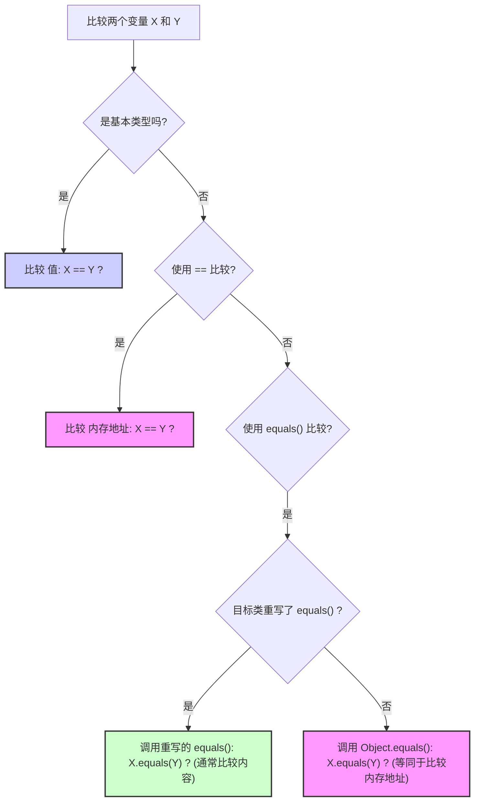

## Java基础

### Object 类的常见方法有哪些？

::: details

Object 类是一个特殊的类，是所有类的父类，主要提供了以下 11 个方法：

```java
/**
 * native 方法，用于返回当前运行时对象的 Class 对象，使用了 final 关键字修饰，故不允许子类重写。
 */
public final native Class<?> getClass()
/**
 * native 方法，用于返回对象的哈希码，主要使用在哈希表中，比如 JDK 中的HashMap。
 */
public native int hashCode()
/**
 * 用于比较 2 个对象的内存地址是否相等，String 类对该方法进行了重写以用于比较字符串的值是否相等。
 */
public boolean equals(Object obj)
/**
 * native 方法，用于创建并返回当前对象的一份拷贝。
 */
protected native Object clone() throws CloneNotSupportedException
/**
 * 返回类的名字实例的哈希码的 16 进制的字符串。建议 Object 所有的子类都重写这个方法。
 */
public String toString()
/**
 * native 方法，并且不能重写。唤醒一个在此对象监视器上等待的线程(监视器相当于就是锁的概念)。如果有多个线程在等待只会任意唤醒一个。
 */
public final native void notify()
/**
 * native 方法，并且不能重写。跟 notify 一样，唯一的区别就是会唤醒在此对象监视器上等待的所有线程，而不是一个线程。
 */
public final native void notifyAll()
/**
 * native方法，并且不能重写。暂停线程的执行。注意：sleep 方法没有释放锁，而 wait 方法释放了锁 ，timeout 是等待时间。
 */
public final native void wait(long timeout) throws InterruptedException
/**
 * 多了 nanos 参数，这个参数表示额外时间（以纳秒为单位，范围是 0-999999）。 所以超时的时间还需要加上 nanos 纳秒。。
 */
public final void wait(long timeout, int nanos) throws InterruptedException
/**
 * 跟之前的2个wait方法一样，只不过该方法一直等待，没有超时时间这个概念
 */
public final void wait() throws InterruptedException
/**
 * 实例被垃圾回收器回收的时候触发的操作
 */
protected void finalize() throws Throwable { }
```

:::

### == 和 equals() 的区别

::: details

**`==`** 对于基本类型和引用类型的作用效果是不同的：

- 对于基本数据类型来说，`==` 比较的是值。
- 对于引用数据类型来说，`==` 比较的是对象的内存地址。

> 因为 Java 只有值传递，所以，对于 == 来说，不管是比较基本数据类型，还是引用数据类型的变量，其本质比较的都是值，只是引用类型变量存的值是对象的地址

`equals()` 方法存在两种使用情况：

- **类没有重写 `equals()`方法**：通过`equals()`比较该类的两个对象时，等价于通过“==”比较这两个对象，使用的默认是 `Object`类`equals()`方法。
- **类重写了 `equals()`方法**：一般我们都重写 `equals()`方法来比较两个对象中的属性是否相等；若它们的属性相等，则返回 true(即，认为这两个对象相等)。



:::

### hashCode() 有什么用？

::: details

`hashCode()` 的作用是获取哈希码（`int` 整数），也称为散列码。这个哈希码的作用是确定该对象在哈希表中的索引位置。


`hashCode()` 定义在 JDK 的 `Object` 类中，这就意味着 Java 中的任何类都包含有 `hashCode()` 函数。另外需要注意的是：`Object` 的 `hashCode()` 方法是本地方法，也就是用 C 语言或 C++ 实现的。

> ⚠️ 注意：该方法在 **Oracle OpenJDK8** 中默认是 "使用线程局部状态来实现 Marsaglia's xor-shift 随机数生成", 并不是 "地址" 或者 "地址转换而来", 不同 JDK/VM 可能不同。在 **Oracle OpenJDK8** 中有六种生成方式 (其中第五种是返回地址), 通过添加 VM 参数: -XX:hashCode=4 启用第五种。参考源码:
>
> - https://hg.openjdk.org/jdk8u/jdk8u/hotspot/file/87ee5ee27509/src/share/vm/runtime/globals.hpp（1127 行）
> - https://hg.openjdk.org/jdk8u/jdk8u/hotspot/file/87ee5ee27509/src/share/vm/runtime/synchronizer.cpp（537 行开始）

散列表存储的是键值对(key-value)，它的特点是：**能根据“键”快速的检索出对应的“值”。这其中就利用到了散列码！（可以快速找到所需要的对象）**

:::

### SPI 和 API 有什么区别？

::: details

API 和 SPI 是两个在软件开发中经常听到但容易混淆的概念。它们都定义了接口，但目的和使用方不同。

**1. API (Application Programming Interface - 应用程序编程接口)**

- **目的**：定义了软件组件或系统**对外提供**的功能以及**如何使用**这些功能。它是一套规则、协议和工具，允许不同的软件应用程序相互通信或交互。
- **使用者**：主要是**应用程序开发者（服务的消费者/调用者）**。开发者通过调用 API 来使用某个库、框架、操作系统或服务提供的功能，而不需要关心其内部实现细节。
- **关注点**：**“我能用它来做什么？”** 以及 **“我该如何调用它？”**
- 例子
  - Java 标准库中的 `java.util.List` 接口。你作为开发者，使用 `list.add()`, `list.get()`, `list.size()` 等方法来操作列表，`List` 就是你使用的 API。你不需要关心它是 `ArrayList` 还是 `LinkedList` 的内部实现。
  - RESTful Web Services 的接口。定义了可以通过 HTTP 访问的 URL、请求/响应格式（如 JSON），开发者调用这些 URL 来获取或操作数据。
  - Spring Boot 框架提供的各种注解（`@RestController`, `@Autowired` 等）和类，开发者用它们来构建应用程序。
- **类比**：餐厅的**菜单**。菜单（API）告诉顾客（开发者）餐厅提供哪些菜品（功能），以及如何点单（方法调用和参数）。顾客不需要知道厨房（内部实现）具体是怎么炒菜的。

**2. SPI (Service Provider Interface - 服务提供者接口)**

- **目的**：定义了一个**框架或系统**期望**第三方实现者（服务提供者）**遵守的契约，以便能够将这些实现**插入（plug-in）**到框架中，扩展或替换框架的某部分功能。它通常由一组接口或抽象类组成。
- **使用者**：主要是**功能的提供者/实现者（扩展开发者）**。他们根据 SPI 的定义来实现具体的服务，然后框架在运行时可以发现并使用这些实现。
- **关注点**：**“我需要实现哪些接口/方法，才能让我的服务被框架所用？”**
- 例子
  - **Java JDBC Driver API (`java.sql.Driver`)**：这是最经典的 SPI 例子。JDBC 规范定义了 `java.sql.Driver` 接口 (SPI)。各个数据库厂商（如 MySQL, PostgreSQL, Oracle）**实现**这个接口，提供具体的数据库驱动。应用程序开发者通常使用 JDBC **API**（如 `Connection`, `Statement`, `ResultSet`），而 `DriverManager`（框架部分）则使用 SPI 在运行时加载并调用厂商实现的 `Driver`，从而让应用程序能与不同数据库通信，而应用程序本身不需要知道驱动的具体实现。
  - **Java `ServiceLoader` (`java.util.ServiceLoader`)**：Java 提供的一个加载服务实现的工具，它本身就是基于 SPI 模式工作的。你定义一个接口（SPI），不同的提供者实现这个接口，并通过在 `META-INF/services/` 目录下放置配置文件来声明实现。`ServiceLoader` 就能发现并加载这些实现。
  - **SLF4J (Simple Logging Facade for Java)**：开发者使用 SLF4J 的 API 进行日志记录。但 SLF4J 本身不实现日志记录逻辑，它定义了一套 SPI。具体的日志框架（如 Logback, Log4j2）提供了对这套 SPI 的实现（称为绑定），SLF4J 在运行时会加载这些绑定。
- **类比**：电源插座的标准。墙上的**插座**（SPI）定义了电器（服务提供者）需要满足的**插头**形状和电压标准（接口/方法），这样任何符合标准的电器（具体实现）都可以插上去并被供电系统（框架）使用。用户（应用程序开发者）关心的是电器提供的功能（API），而不是插头具体怎么符合标准的。

**总结与区别**

| 特性         | API (Application Programming Interface) | SPI (Service Provider Interface)                           |
| ------------ | --------------------------------------- | ---------------------------------------------------------- |
| **目的**     | 定义如何**使用**一个模块/服务的功能     | 定义如何**实现**一个可插拔的模块/服务以供框架使用          |
| **使用者**   | 服务/功能的**消费者**（应用程序开发者） | 服务/功能的**提供者**（扩展开发者/实现者）                 |
| **视角**     | “我（调用者）能调用什么？”              | “我（实现者）需要实现什么？”                               |
| **关注点**   | 功能的调用、交互                        | 功能的实现、扩展、可替换性                                 |
| **耦合**     | 调用者与**接口**耦合                    | 实现者与**接口**耦合，框架与**接口**耦合（与具体实现解耦） |
| **方向**     | 调用者 **调用** API                     | 框架 **调用** SPI 的实现 (通常是反向调用/IoC)              |
| **典型例子** | `java.util.List`, REST API, Servlet API | `java.sql.Driver`, `java.util.ServiceLoader`, SLF4J绑定    |

简单来说：

- **API 是给别人用的。** (How to use me?)
- **SPI 是让别人实现的。** (How to implement for me?)

在很多框架中，API 和 SPI 会同时存在。框架提供 API 给最终用户使用，同时提供 SPI 给扩展开发者来实现特定的、可插拔的功能点。理解它们的区别有助于更好地理解和使用各种框架和库。

:::

### SPI 的优缺点？

::: details

**SPI 的优点：**

1. **高度解耦 (Decoupling):** 这是 SPI 最核心的优势。框架或核心系统只需要依赖于抽象的 SPI 接口，而不需要依赖于任何具体的服务实现。这使得框架本身更加稳定，易于维护，并且与具体的业务实现细节分离。
2. **高可扩展性 (Extensibility / Pluggability):** SPI 允许第三方开发者或者不同的团队为系统提供新的功能实现或替换现有实现，而无需修改核心框架的代码。只需要按照 SPI 规范实现接口，并遵循相应的发现机制（如 `META-INF/services/`），就能被框架自动发现和使用。这极大地增强了系统的灵活性和生命力（例如 JDBC 可以轻松支持新的数据库）。
3. **面向接口编程 (Interface-Oriented Programming):** SPI 强制使用面向接口编程，这是一种良好的设计实践，有助于代码的模块化和标准化。
4. **遵循开闭原则 (Open/Closed Principle):** 系统对扩展是开放的（可以通过增加新的 SPI 实现来扩展功能），对修改是关闭的（不需要修改现有框架代码来支持新功能）。
5. **支持多种实现选择 (Flexibility):** 最终用户或部署者可以根据需要选择不同的服务提供者实现。例如，可以选择不同的日志库实现 (Logback, Log4j2)，不同的数据库驱动 (MySQL, PostgreSQL)，而应用程序代码保持不变。
6. **并行开发 (Parallel Development):** 核心框架和各个服务提供者的实现可以由不同的团队并行开发，只要 SPI 接口保持稳定。

**SPI 的缺点：**

1. **接口设计复杂性 (Interface Design Complexity):** 设计一个良好、稳定且能满足未来扩展需求的 SPI 接口是一项挑战。接口一旦发布，后续修改（尤其是破坏性修改）会影响所有的实现者，需要非常谨慎。
2. **发现机制的开销 (Discovery Overhead):** 服务的发现过程（例如 Java `ServiceLoader` 需要扫描 classpath 下的 `META-INF/services/` 目录并加载类）可能会带来一定的启动性能开销，尤其是在实现众多或 classpath 复杂的情况下。
3. **版本管理问题 (Versioning Issues):** SPI 接口的版本和其实现的版本需要协调。如果框架升级了 SPI 接口（尤其是接口方法变更），旧的实现可能无法工作；反之，如果实现依赖了新版 SPI，但框架使用的是旧版，也会出问题。这可能导致依赖冲突（"Jar Hell"）。
4. **实现质量不可控 (Implementation Quality Variance):** 框架无法保证所有第三方实现的质量（性能、安全性、健壮性）。不同的实现可能水平参差不齐，选择不当可能影响整个应用的稳定性和性能。
5. **调试困难 (Debugging Challenges):** 当出现问题时，可能难以确定是框架调用 SPI 的逻辑有问题，还是具体的 SPI 实现有问题。跨越 SPI 边界进行调试可能比在单一代码库中更复杂。
6. **安全性风险 (Security Risks):** 如果服务发现机制不够安全，可能会加载到恶意或不可信的实现代码，带来安全隐患。需要有机制来控制加载哪些实现。
7. **接口粒度问题 (Interface Granularity):** 如果 SPI 接口定义得过于庞大或复杂，实现起来会很困难；如果定义得太小，可能需要实现很多个小接口才能完成一个功能，增加了管理的复杂度。

**总结:**

SPI 是一种强大的设计模式，特别适用于需要高度可扩展性和解耦的场景，如驱动程序、插件系统、框架扩展点等。它使得系统更加灵活和开放。然而，它也带来了接口设计、版本管理、性能开销和实现质量控制等方面的挑战。在使用或设计 SPI 时，需要仔细权衡这些优缺点。

:::

### 对象头具体都包含哪些内容？

::: details

在 Java HotSpot 虚拟机中，对象头（Object Header）是存储在 Java 对象实例内存布局起始处的一块元数据区域。它不包含对象的实例数据（成员变量），而是存储了对象自身的一些运行时状态信息和指向其类元数据的指针。

对象头的内容和大小会根据 JVM 是32位还是64位，以及是否开启了指针压缩（CompressedOops）而有所不同。通常，对象头包含以下几个部分：

**1. Mark Word (标记字)**

- 这部分是对象头中最复杂的部分，它存储了对象的运行时状态信息，如哈希码（Identity HashCode）、GC年龄（GC Age）、锁状态标记、偏向锁线程ID、偏向锁时间戳（Epoch）等。

- Mark Word 的大小在32位JVM上是4字节（32位），在64位JVM上是8字节（64位）。

- Mark Word 的内容是动态的，会根据对象的状态（未锁定、偏向锁、轻量级锁、重量级锁、GC标记）而改变其存储的比特位含义。

  下面是 Mark Word 在不同锁状态下（以64位JVM为例，低位在前）可能包含的内容：

  - **无锁状态 (Unlocked / Normal):**
    - `unused (25 bits)`: 未使用
    - `identity_hashcode (31 bits)`: 对象的哈希码（延迟计算，首次调用 `System.identityHashCode()` 或 `Object.hashCode()` 默认实现时计算并存入）
    - `unused (1 bit)`: 未使用
    - `age (4 bits)`: GC分代年龄
    - `biased_lock (1 bit)`: 是否为偏向锁标记 (0)
    - `lock (2 bits)`: 锁标记 (01) - 表示无锁或偏向锁（结合biased_lock位判断）
  - **偏向锁状态 (Biased Lock):**
    - `thread_id (54 bits)`: 指向持有偏向锁的线程的指针 (或者线程ID的部分位)
    - `epoch (2 bits)`: 偏向锁的时间戳，用于批量重偏向和撤销
    - `unused (1 bit)`: 未使用
    - `age (4 bits)`: GC分代年龄
    - `biased_lock (1 bit)`: 是否为偏向锁标记 (1)
    - `lock (2 bits)`: 锁标记 (01)
  - **轻量级锁状态 (Lightweight Lock):**
    - `ptr_to_lock_record (62 bits)`: 指向线程栈中锁记录（Lock Record）的指针
    - `lock (2 bits)`: 锁标记 (00)
  - **重量级锁状态 (Heavyweight Lock):**
    - `ptr_to_heavyweight_monitor (62 bits)`: 指向堆中监视器对象（Monitor，即 `ObjectMonitor`）的指针
    - `lock (2 bits)`: 锁标记 (10)
  - **GC标记状态 (Marked for GC):**
    - 这部分空间会被GC算法用来标记对象（例如，标记对象是否存活）。
    - `lock (2 bits)`: 锁标记通常是 (11)，但具体内容由GC算法决定。

**2. Klass Pointer / Type Pointer (类型指针)**

- 这部分是一个指向方法区（JDK 8及以后为 Metaspace，JDK 7及以前为 PermGen）中该对象对应的类元数据（`Klass` 对象）的指针。通过这个指针，JVM 可以获取到对象的实际类型信息，如它有哪些字段、哪些方法等。
- 大小：
  - 在32位JVM上：4字节（32位）。
  - 在64位JVM上：
    - 默认不开启指针压缩 (`-XX:-UseCompressedClassPointers`)：8字节（64位）。
    - 开启指针压缩 (`-XX:+UseCompressedClassPointers`，通常默认开启，与 `-XX:+UseCompressedOops` 一起使用)：4字节（32位）。指针压缩可以将64位的指针压缩到32位，以节省内存，前提是堆大小在一定范围内（例如不超过32GB，但具体取决于压缩策略）。

**3. Array Length (数组长度) - 仅数组对象拥有**

- 如果对象是一个数组，那么对象头中还会包含一个额外的部分用来存储数组的长度。
- **大小：** 通常是4字节（32位），即使在64位JVM上也是如此，因为数组长度是 `int` 类型。

**总结对象头大小：**

- 32位 JVM:
  - 非数组对象：Mark Word (4字节) + Klass Pointer (4字节) = **8字节**
  - 数组对象：Mark Word (4字节) + Klass Pointer (4字节) + Array Length (4字节) = **12字节**
- 64位 JVM (不开启指针压缩):
  - 非数组对象：Mark Word (8字节) + Klass Pointer (8字节) = **16字节**
  - 数组对象：Mark Word (8字节) + Klass Pointer (8字节) + Array Length (4字节) = **20字节**
- 64位 JVM (开启指针压缩 - 默认常见情况):
  - 非数组对象：Mark Word (8字节) + Klass Pointer (4字节) = **12字节**
  - 数组对象：Mark Word (8字节) + Klass Pointer (4字节) + Array Length (4字节) = **16字节**

**可视化 (Mermaid 图):**


理解对象头的构成对于深入分析Java对象内存占用、锁机制以及垃圾回收等JVM底层原理非常重要。

:::


## 多线程


## JVM


## MySQL


## Redis


## Spring


## Netty


## 消息队列

### RocketMQ


### Kafka


## Elasticsearch


## 微服务


## Dubbo


## Prometheus

